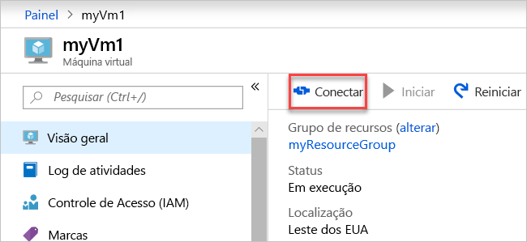

# <a name="quickstart-create-a-virtual-network-using-the-azure-portal"></a>Início Rápido: Criar uma Rede Virtual usando o portal do Azure

Uma rede virtual permite que recursos do Azure, como VMs (máquinas virtuais), comuniquem-se em modo privado e com a Internet. Neste início rápido, você aprende como criar uma rede virtual. Após criar uma rede virtual, você implantará duas VMs na rede virtual. Você fará a conexão com as VMs usando a Internet e executará a comunicação entre duas VMs em modo privado.

Caso não tenha uma assinatura do Azure, crie uma [conta gratuita](https://azure.microsoft.com/free/?WT.mc_id=A261C142F) agora.

## <a name="sign-in-to-azure"></a>Entrar no Azure

Entre no [Portal do Azure](https://portal.azure.com).

## <a name="create-a-virtual-network"></a>Criar uma rede virtual

1. No canto superior esquerdo da tela, selecione **Criar um recurso** > **Rede** > **Rede virtual**.

1. Em **Criar rede virtual**, insira ou selecione estas informações:

    | Configuração | Valor |
    | ------- | ----- |
    | NOME | Insira *myVirtualNetwork*. |
    | Espaço de endereço | Insira *10.1.0.0/16*. |
    | Assinatura | Selecione sua assinatura.|
    | Grupo de recursos | Selecione **Criar novo** e insira *myResourceGroup*, depois selecione **OK**. |
    | Local padrão | Selecione **Leste dos EUA**.|
    | Sub-rede – Nome | Insira *myVirtualSubnet*. |
    | Sub-rede – Intervalo de endereços | Insira *10.1.0.0/24*. |

1. Deixe o restante dos padrões e selecione **Criar**.

## <a name="create-virtual-machines"></a>Criar máquinas virtuais

Crie duas VMs na rede virtual:

### <a name="create-the-first-vm"></a>Criar a primeira VM

1. No canto superior esquerdo da tela, selecione **Criar um recurso** > **Computação** > **Windows Server 2016 Datacenter**.

1. Em **Criar uma máquina virtual – Noções básicas**, insira ou selecione estas informações:

    | Configuração | Valor |
    | ------- | ----- |
    | **DETALHES DO PROJETO** | |
    | Assinatura | Selecione sua assinatura. |
    | Grupo de recursos | Selecione **MyResourceGroup**. Você criou na última seção. |
    | **DETALHES DA INSTÂNCIA** |  |
    | Nome da máquina virtual | Insira *myVm1*. |
    | Região | Selecione **Leste dos EUA**. |
    | Opções de disponibilidade | Deixe o padrão **Nenhuma redundância de infraestrutura necessária**. |
    | Imagem | Deixe o padrão **Datacenter do Windows Server 2016**. |
    | Tamanho | Deixe o padrão **Standard DS1 v2**. |
    | **CONTA DE ADMINISTRADOR** |  |
    | Nome de Usuário | Insira um nome de usuário de sua escolha. |
    | Senha | Insira uma senha de sua escolha. A senha deve ter no mínimo 12 caracteres e atender a [requisitos de complexidade definidos](../virtual-machines/windows/faq.md?toc=%2fazure%2fvirtual-network%2ftoc.json#what-are-the-password-requirements-when-creating-a-vm).|
    | Confirmar Senha | Reinsira a senha. |
    | **REGRAS DE PORTA DE ENTRADA** |  |
    | Porta de entrada públicas | Deixar o padrão **Nenhum**. |
    | **ECONOMIZE DINHEIRO** |  |
    | Já tem uma licença do Windows? | Deixe o padrão **Não**. |

1. Selecione **Avançar: Discos**.

1. Em **Criar uma máquina virtual – Discos**, mantenha os padrões e selecione **Avançar: Rede**.

1. Em **Criar uma máquina virtual – Rede**, selecione estas informações:

    | Configuração | Valor |
    | ------- | ----- |
    | Rede virtual | Deixe o padrão **myVirtualNetwork**. |
    | Sub-rede | Deixe o padrão **myVirtualSubnet (10.1.0.0/24)**. |
    | IP público | Deixe o padrão **(novo) myVm-ip**. |
    | Portas de segurança de rede | Selecione **Permitir portas selecionadas**. |
    | Selecione as portas de entrada | Selecione **HTTP** e **RDP**.

1. Selecione **Avançar: Gerenciamento**.

1. Em **Criar uma máquina virtual – Gerenciamento**, para **Conta de armazenamento de diagnóstico**, selecione **Criar novo**.

1. Em **Criar conta de armazenamento**, insira ou selecione estas informações:

    | Configuração | Valor |
    | ------- | ----- |
    | NOME | Insira *myvmstorageaccount*. |
    | Tipo de conta | Deixe o padrão **Armazenamento (uso geral v1)**. |
    | Desempenho | Deixe o padrão **Standard**. |
    | Replicação | Deixe o padrão **LRS (Armazenamento com redundância local)**. |

1. Selecione **OK**

1. Selecione **Examinar + criar**. Você é levado até a página **Examinar + criar** e o Azure valida sua configuração.

1. Quando você vir **Validação aprovada**, selecione **Criar**.

### <a name="create-the-second-vm"></a>Criar a segunda VM

1. Conclua as etapas 1 e 9 acima.

    > [!NOTE]
    > Na etapa 2, para o **Nome da máquina virtual**, insira *myVm2*.
    >
    > Na etapa 7, para **Conta de armazenamento de diagnóstico**, certifique-se de selecionar **myvmstorageaccount**.

1. Selecione **Examinar + criar**. Você é levado até a página **Examinar + criar** e o Azure valida sua configuração.

1. Quando você vir **Validação aprovada**, selecione **Criar**.

## <a name="connect-to-a-vm-from-the-internet"></a>Conecte uma VM a partir da Internet

Depois de criar *myVm1*, conecte-se a ela pela Internet.

1. Na barra de pesquisa do portal, insira *myVm1*.

1. Selecione o botão **Conectar**.

    

    Depois de selecionar o botão **Conectar**, **Conectar-se à máquina virtual** abre.

1. Selecione **Baixar Arquivo RDP**. O Azure cria um arquivo *.rdp* (protocolo RDP) e ele é baixado no computador.

1. Abra o arquivo *.rdp* baixado.

    1. Se solicitado, selecione **Conectar**.

    1. Insira o nome de usuário e senha que você especificou ao criar a VM.

        > [!NOTE]
        > Talvez seja necessário selecionar **Mais escolhas** > **Usar uma conta diferente** para especificar as credenciais inseridas durante a criação da VM.

1. Selecione **OK**.

1. Você pode receber um aviso de certificado durante o processo de entrada. Se você receber um aviso de certificado, selecione **Sim** ou **Continuar**.

1. Depois que a área de trabalho da VM for exibida, minimize-a para voltar para sua área de trabalho local.

## <a name="communicate-between-vms"></a>Comunicação entre VMs

1. Na Área de Trabalho Remota do *myVm1*, abra o PowerShell.

1. Digite `ping myVm2`.

    Você obterá algo parecido com esta mensagem:

    ```powershell
    Pinging myVm2.0v0zze1s0uiedpvtxz5z0r0cxg.bx.internal.clouda
    Request timed out.
    Request timed out.
    Request timed out.
    Request timed out.

    Ping statistics for 10.1.0.5:
    Packets: Sent = 4, Received = 0, Lost = 4 (100% loss),
    ```

    O `ping` falha, pois `ping` usa o ICMP (Internet Control Message Protocol). Por padrão, o ICMP não é permitido pelo Firewall do Windows.

1. Para permitir que *myVm2* execute o ping *myVm1* em uma etapa posterior, digite este comando:

    ```powershell
    New-NetFirewallRule –DisplayName “Allow ICMPv4-In” –Protocol ICMPv4
    ```

    Esse comando permite a entrada ICMP pelo Firewall do Windows:

1. Feche a conexão da área de trabalho remota para *myVm1*.

1. Complete as etapas em [Conecte uma VM a partir da Internet](#connect-to-a-vm-from-the-internet) novamente, mas conecte para *myVm2*.

1. Em um prompt de comando, insira `ping myvm1`.

    Você obterá algo parecido com esta mensagem:

    ```powershell
    Pinging myVm1.0v0zze1s0uiedpvtxz5z0r0cxg.bx.internal.cloudapp.net [10.1.0.4] with 32 bytes of data:
    Reply from 10.1.0.4: bytes=32 time=1ms TTL=128
    Reply from 10.1.0.4: bytes=32 time<1ms TTL=128
    Reply from 10.1.0.4: bytes=32 time<1ms TTL=128
    Reply from 10.1.0.4: bytes=32 time<1ms TTL=128

    Ping statistics for 10.1.0.4:
        Packets: Sent = 4, Received = 4, Lost = 0 (0% loss),
    Approximate round trip times in milli-seconds:
        Minimum = 0ms, Maximum = 1ms, Average = 0ms
    ```

    Você recebe respostas de *myVm1*, porque você permitiu ICMP através do firewall do Windows na VM *myVm1* em uma etapa anterior.

1. Feche a conexão da área de trabalho remota para *myVm2*.

## <a name="clean-up-resources"></a>Limpar recursos

Quando tiver terminado com a rede virtual e as VMs, exclua o grupo de recursos e todos os recursos que ele contém:

1. Insira *myResourceGroup* na caixa **Pesquisar** na parte superior do portal.

1. Quando aparecer **myResourceGroup** nos resultados da pesquisa, selecione-o.

1. Selecione **Excluir grupo de recursos**.

1. Insira *myResourceGroup* para **DIGITAR O NOME DO GRUPO DE RECURSOS:** e selecione **Excluir**.

## <a name="next-steps"></a>Próximas etapas

Neste início rápido, você criou uma rede virtual padrão e duas VMs. Você se conectou a uma VM pela Internet e executou uma comunicação entre duas VMs em modo privado. Para saber mais sobre configurações de rede virtual, consulte [Gerenciar uma rede virtual](manage-virtual-network.md).

Por padrão, o Azure permite comunicação privada irrestrita entre VMs. Por outro lado, ele só permite conexões de área de trabalho remota de entrada para VMs do Windows da Internet. Para saber mais sobre como configurar diferentes tipos de comunicações de rede de VMs, acesse o tutorial [Filtrar o tráfego de rede](tutorial-filter-network-traffic.md).