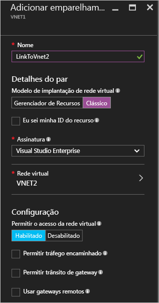
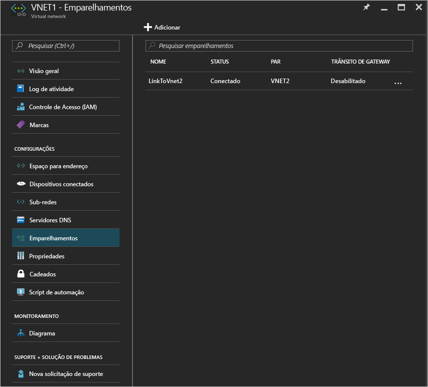

# Criar um emparelhamento de rede virtual usando o Portal do Azure
[!INCLUDE [virtual-networks-create-vnet-selectors-arm-include](../../includes/virtual-networks-create-vnetpeering-selectors-arm-include.md)]

[!INCLUDE [virtual-networks-create-vnet-intro](../../includes/virtual-networks-create-vnetpeering-intro-include.md)]

[!INCLUDE [virtual-networks-create-vnet-scenario-basic-include](../../includes/virtual-networks-create-vnetpeering-scenario-basic-include.md)]

Para criar um emparelhamento de VNet com base no cenário usando o portal do Azure, conclua as seguintes etapas:

1. Em um navegador, navegue até http://portal.azure.com e, se necessário, entre com sua conta do Azure.
2. Para estabelecer o emparelhamento de VNet, você precisa criar dois links, um para cada direção, entre duas VNets. Primeiro, você pode criar links de emparelhamento de VNet para VNet à VNet2. No portal do Azure, clique em **Procurar** > **Escolher redes virtuais**

    
3. Na folha **Redes virtuais**, escolha *VNET1*, clique em **Emparelhamentos** e clique em **Adicionar**, conforme mostrado na seguinte figura:

    
4. Na folha **Adicionar Emparelhamento**, digite *LinkToVnet2* para **Nome**, escolha uma assinatura e o par **Rede Virtual** *VNET2* e clique em **OK**.

    
5. Após a criação do link de emparelhamento da VNet, você verá o estado do link, conforme mostrado na seguinte figura:

    
6. Crie o link de emparelhamento de rede virtual para VNET2 a VNET1. Na folha **Redes Virtuais**, escolha *VNET2*, clique em **Emparelhamentos** e clique em **Adicionar**, conforme mostrado na seguinte figura:

    
7. Na folha **Adicionar emparelhamento**, insira *LinkToVnet1* para **Nome**, escolha a assinatura, selecione *VNET1* para **Rede virtual** e clique em **OK**.

    
8. Após a criação do link de emparelhamento da VNet, você verá o estado do link, conforme mostrado na seguinte figura:

    
9. Verifique o estado de **LinkToVnet2**, que também foi alterado para *Conectado*.  
    
    

    > [!NOTE]
    > O emparelhamento VNET somente será estabelecido se ambos os links estiverem conectados.
    > 
    > 

Há algumas propriedades configuráveis para cada link:

| Opção | Descrição | Padrão |
|:--- |:--- |:--- |
| AllowVirtualNetworkAccess |Se o espaço de endereço da VNet emparelhada deve ser incluído como parte da marca Virtual_network |Sim |
| AllowForwardedTraffic |Se o tráfego não originado em uma VNet emparelhada é aceito ou descartado |Não |
| AllowGatewayTransit |Permite que a VNet emparelhada use seu gateway de VNet |Não |
| UseRemoteGateways |Use o gateway de sua VNet emparelhada. A VNet emparelhada deve ter um gateway configurado com AllowGatewayTransit selecionado. Não será possível usar essa opção se você tiver um gateway configurado. |Não |

Cada link em uma rede virtual emparelhamento tem o conjunto anterior de propriedades. No portal, você pode clicar no link **Emparelhamento de VNet** e alterar as opções disponíveis e clicar em **Salvar** para aplicar as alterações.

[!INCLUDE [virtual-networks-create-vnet-scenario-crosssub-include](../../includes/virtual-networks-create-vnetpeering-scenario-crosssub-include.md)]

1. Em um navegador, navegue até http://portal.azure.com e, se necessário, entre com sua conta do Azure.
2. Neste exemplo, UserA tem permissões administrativas para SubscriptionA e UserB tem permissões administrativas para SubscriptionB.
3. No portal, clique em **Procurar** e escolha **Redes virtuais**. Clique na rede virtual para a qual você deseja configurar o emparelhamento.
4. Na folha da VNet que você selecionou, clique em **Controle de acesso** e clique em **Adicionar**, conforme mostrado na seguinte figura:

    
4. Na folha **Adicionar acesso**, clique em uma função e escolha **Colaborador de Rede**, clique em **Adicionar usuários**, digite o nome de entrada do UserB e clique em OK.

    

5. Faça logon no portal do Azure como UserB, que é o usuário com privilégios para SubscriptionB. Siga as etapas anteriores para adicionar o UserA à função de Colaborador de Rede, conforme mostrado na seguinte figura:

    

    > [!NOTE]
    > Você pode fazer logoff e logon nas duas sessões de usuário no navegador assegurar a ativação da autorização.
    >
    >

    > [!IMPORTANT]
    > Se estiver criando o emparelhamento entre duas redes virtuais criadas por meio do modelo de implantação do Azure Resource Manager, prossiga para as etapas restantes desta seção. Se as duas redes virtuais tiverem sido criadas por meio de diferentes modelos de implantação, ignore as etapas restantes desta seção e conclua as etapas da seção [Emparelhamento de redes virtuais criado por meio de modelos de implantação diferentes](#x-model) deste artigo.

6. Faça logon no portal como UserA, navegue até a folha VNET3, clique em **Emparelhamento**, marque a caixa de seleção **Sei minha ID de recurso** e digite a ID de recurso para VNET5 no formato mostrado no seguinte exemplo:
   
    /subscriptions/{SubscriptionID}/resourceGroups/{ResourceGroupName}/providers/Microsoft.Network/virtualNetworks/{VNETname}
   
    
7. Faça logon no portal como UserB e siga as etapas anteriores para criar um link de emparelhamento de VNET5 para VNet3.
   
    
8. O emparelhamento será estabelecida. Qualquer VM conectada à VNet3 deve ser capaz de se comunicar com qualquer VM conectada à VNet5.

[!INCLUDE [virtual-networks-create-vnet-scenario-transit-include](../../includes/virtual-networks-create-vnetpeering-scenario-transit-include.md)]

1. Como primeira etapa, links de emparelhamento VNET da HubVnet para a VNET1. Observe que a opção Permitir Tráfego Encaminhado não está selecionada para o link.
   
    
2. Na próxima etapa, é possível criar links de emparelhamento da VNET1 para a HubVnet. Observe que a opção Permitir tráfego encaminhado está selecionada.
   
    
3. Após o estabelecimento de emparelhamento, consulte este [artigo](virtual-network-create-udr-arm-ps.md) e defina a UDR(Rota definida pelo usuário) para redirecionar o tráfego da VNet1 por meio de um dispositivo virtual para usar seus recursos. Quando você especifica o endereço de Próximo Salto na rota, você pode usar o endereço IP do dispositivo virtual no emparelhamento VNet HubVNet

[!INCLUDE [virtual-networks-create-vnet-scenario-asmtoarm-include](../../includes/virtual-networks-create-vnetpeering-scenario-asmtoarm-include.md)]

1. Em um navegador, navegue até http://portal.azure.com e, se necessário, entre com sua conta do Azure.
2. Se estiver criando um emparelhamento entre redes virtuais implantadas por meio de modelos de implantação diferentes na *mesma* assinatura, vá para a etapa 3. A capacidade de criar um emparelhamento entre redes virtuais implantadas por meio de modelos de implantação diferentes em assinaturas *diferentes* está em versão de **visualização**. Os recursos de versão de visualização não têm o mesmo nível de confiabilidade e o contrato de nível de serviço de recursos de versões gerais. Se estiver criando um emparelhamento entre redes virtuais implantadas por meio de modelos de implantação diferentes em assinaturas diferentes, primeiro deverá concluir as seguintes tarefas:
    - Registre a funcionalidade de visualização em sua assinatura do Azure digitando os seguintes comandos do PowerShell: `Register-AzureRmProviderFeature -FeatureName AllowClassicCrossSubscriptionPeering -ProviderNamespace Microsoft.Network` e `Register-AzureRmResourceProvider -ProviderNamespace Microsoft.Network` Não é possível concluir esta etapa no Portal.
    - Conclua as etapas 1 a 6 da seção [Emparelhamento entre assinaturas](#x-sub) deste artigo.
3. Para estabelecer o emparelhamento de VNET nesse cenário, você precisa criar apenas um link, da rede virtual no Azure Resource Manager até o clássico. Ou seja, da **VNET1** para a **VNET2**. No portal, clique em **Procurar** e escolha **Redes Virtuais**
4. Na folha Redes virtuais, escolha **VNET1**. Clique em **Emparelhamentos**e clique em **Adicionar**.
5. Na folha **Adicionar Emparelhamento**, dê um nome para seu link. Aqui, ele é chamado de **LinkToVNet2**. Em Detalhes do par, selecione **Clássico**.
6. Escolha a assinatura e a Rede Virtual par **VNET2**. Em seguida, clique em OK.

    
7. Após a criação desse link de emparelhamento de VNet, as duas redes virtuais serão emparelhadas e você poderá ver o seguinte:

    

## Remover emparelhamento VNet
1. Em um navegador, navegue até http://portal.azure.com e, se necessário, entre com sua conta do Azure.
2. Acesse a folha Rede virtual, clique em Emparelhamentos, clique no Link que você deseja remover e clique em **Excluir**.

    
3. Quando você remove um link no emparelhamento VNet, o estado do link de emparelhamento passará a Desconectado.

    
4. Nesse estado, não é possível recriar o link até que o estado do link de emparelhamento mude para Iniciado. Recomendamos a remoção dos dois links antes de recriar o emparelhamento VNet.

