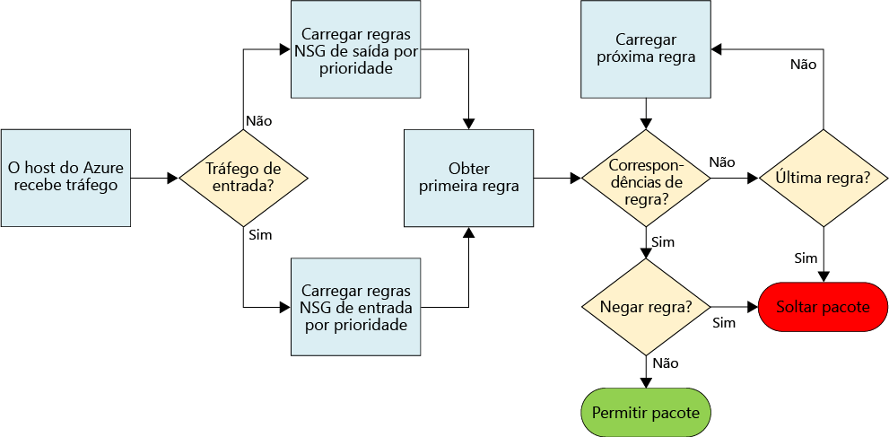
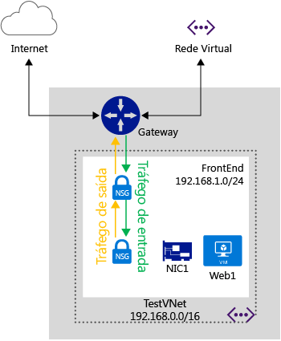
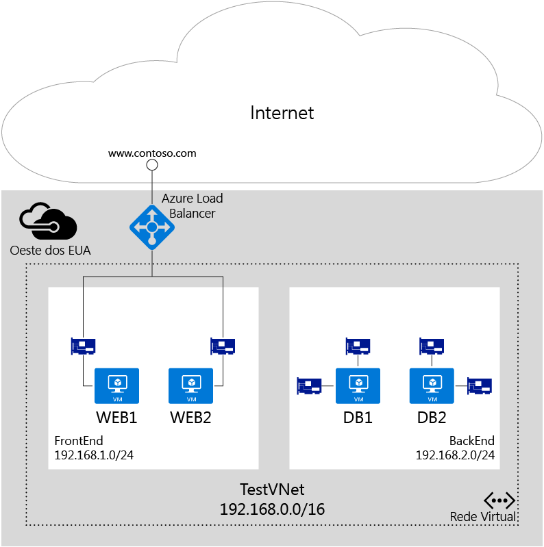

# O que é um NSG (grupo de segurança de rede)?
O NSG (Grupo de segurança de rede) contém uma lista de regras de ACL (Lista de Controle de Acesso) que permitem ou negam o tráfego de rede para suas instâncias de VM em uma Rede Virtual. Os NSGs podem ser associados a sub-redes ou instâncias de VM individuais dentro dessa sub-rede. Quando um NSG é associado uma sub-rede, as regras de ACL se aplicam a todas as instâncias de VM na sub-rede. Além disso, o tráfego para uma VM individual pode ser restrito ainda mais por meio da associação de um NSG diretamente à VM.

## Recurso NSG
Os NSGs contêm as propriedades a seguir.

| Propriedade | Descrição | Restrições | Considerações |
| --- | --- | --- | --- |
| Nome |Nome do NSG |Deve ser exclusivo na região Pode conter letras, números, sublinhados, pontos e hifens Deve começar com uma letra ou com um número Deve terminar com uma letra, com um número ou com um sublinhado Pode ter até 80 caracteres |Como talvez seja necessário criar vários NSGs, use uma convenção de nomenclatura que facilite a identificação da função dos seus NSGs |
| Região |A região do Azure em que o NSG está hospedado |Os NSGs só podem ser aplicados aos recursos na região em que são criados |Consulte os [limites](#Limits) abaixo para entender quantos NSGs você pode ter em uma região |
| Grupo de recursos |O grupo de recursos ao qual o NSG pertence |Embora um NSG pertença a um grupo de recursos, ele pode ser associado a recursos em qualquer grupo de recursos, desde que o recurso faça parte da mesma região do Azure que o NSG |Os grupos de recursos são usados para gerenciar vários recursos juntos, como uma unidade de implantação Você pode considerar o agrupamento do NSG com recursos ao qual ele está associado |
| Regras |As regras que definem qual tráfego é permitido ou negado | |Consulte [Regras NSG](#Nsg-rules) abaixo |

> [!NOTE]
> Não há suporte para grupos de segurança de rede e ACLs baseadas em ponto de extremidade na mesma instância de VM. Se você quiser usar um NSG e já tiver uma ACL de ponto de extremidade à disposição, primeiro remova a ACL de ponto de extremidade. Para saber mais sobre como fazer isso, confira [Gerenciando listas de controle de acesso (ACLs) para pontos de extremidade usando o PowerShell](virtual-networks-acl-powershell.md).
> 
> 

### Regras NSG
As regras NSG contêm as propriedades a seguir.

| Propriedade | Descrição | Restrições | Considerações |
| --- | --- | --- | --- |
| **Nome** |Nome para a regra |Deve ser exclusivo na região Pode conter letras, números, sublinhados, pontos e hifens Deve começar com uma letra ou com um número Deve terminar com uma letra, com um número ou com um sublinhado Pode ter até 80 caracteres |Você pode ter várias regras em um NSG, portanto, siga uma convenção de nomenclatura que permita a identificação da função da sua regra. |
| **Protocolo** |Protocolo para fazer a correspondência da regra |TCP, UDP ou * |O uso do * como um protocolo inclui ICMP (apenas tráfego Leste-Oeste), bem como UDP e TCP, pode reduzir o número de regras necessárias Ao mesmo tempo, o uso do * pode ser uma abordagem muito ampla. Portanto, use-o quando for realmente necessário |
| **Intervalo de portas de origem** |Intervalo de portas de origem para fazer a correspondência da regra |Número de porta única de 1 a 65535, intervalo de portas (ou seja , 1 a 65635) ou * (para todas as portas) |As portas de origem pode ser efêmeras. A menos que o programa cliente esteja usando uma porta específica, use "*" na maioria dos casos.  Tente usar o máximo possível de intervalos de portas para evitar a necessidade de várias regras  Várias portas ou intervalos de portas não podem ser agrupados por uma vírgula |
| **Intervalo de portas de destino** |Intervalo de portas de destino para fazer a correspondência da regra |Número de porta única de 1 a 65535, intervalo de portas (ou seja, 1 a 65535) ou * (para todas as portas) |Tente usar o máximo possível de intervalos de portas para evitar a necessidade de várias regras Várias portas ou intervalos de portas não podem ser agrupados por uma vírgula |
| **Prefixo de endereço de origem** |Prefixo ou marca de endereço de origem para fazer a correspondência da regra |Endereço IP único (ou seja, 10.10.10.10), sub-rede IP (ou seja, 192.168.1.0/24), [marca padrão](#default-tags) ou * (para todos os endereços) |Considere o uso de intervalos, marcas padrão e * para reduzir o número de regras |
| **Prefixo de endereço de destino** |Prefixo ou marca de endereço de destino para fazer a correspondência da regra |endereço IP único (ou seja, 10.10.10.10), sub-rede IP (ou seja, 192.168.1.0/24), [marca padrão](#default-tags) ou * (para todos os endereços) |Considere o uso de intervalos, marcas padrão e * para reduzir o número de regras |
| **Direção** |Direção do tráfego para fazer a correspondência da regra |entrada ou saída |Regras de entrada e saída são processadas separadamente, com base na direção |
| **Prioridade** |As regras são verificadas em ordem de prioridade, e depois que uma regra é aplicada, nenhuma outra é testada quanto à correspondência |Número entre 100 e 4096 |Considere a criação de regras que pulem prioridades, a cada 100 para cada regra, para deixar espaço para novas regras que surgem entre as existentes |
| **Access** |Tipo de acesso a ser aplicado se a regra for correspondente |permitir ou negar |Lembre-se, se uma regra de permissão não for encontrada para um pacote, ele será descartado |

Os NSGs contêm dois conjuntos de regras: entrada e saída. A prioridade de uma regra deve ser exclusiva em cada conjunto.

A figura acima mostra como as regras NSG são processadas.

### Marcas padrão
Marcas padrão são identificadores fornecidos pelo sistema para atender a uma categoria de endereços IP. Você pode usar marcas padrão nas propriedades **prefixo de endereço de origem** e **prefixo de endereço de destino** de qualquer regra. Há três marcas padrão que você pode usar.

* **REDE\_VIRTUAL:** essa marca padrão indica todo o espaço de endereço de rede. Ela inclui o espaço de endereço da rede virtual (intervalos de CIDR definidos no Azure), bem como todos os espaços de endereço locais conectados e redes virtuais do Azure conectadas (redes locais).
* **BALANCEADORDECARGA\_AZURE:** essa marca padrão denota o balanceador de carga de infraestrutura do Azure. Significa um IP de datacenter do Azure de onde se originam as investigações de integridade do Azure.
* **INTERNET:** essa marca padrão denota o espaço de endereço IP fora da rede virtual e que pode ser acessado por meio da Internet pública. Esse intervalo também inclui o [espaço de IP público de propriedade do Azure](https://www.microsoft.com/download/details.aspx?id=41653).

### Regras padrão
Todos os NSGs contêm um conjunto de regras padrão. As regras padrão não podem ser excluídas, mas como recebem a prioridade mais baixa, elas podem ser substituídas pelas regras que você criar.

Como ilustrado pelas regras padrão abaixo, o tráfego que começa e termina em uma rede virtual é permitido tanto na Entrada quanto na Saída. Enquanto a conectividade com a Internet é permitida na Saída, ela é por padrão bloqueada na Entrada. Há uma regra padrão para permitir que o balanceador de carga do Azure investigue a integridade das VMs e instâncias de função. Se não estiver usando um conjunto com balanceamento de carga, você poderá substituir essa regra.

**Regras de entrada padrão**

| Nome | Prioridade | IP de origem | Porta de origem | IP de destino | Porta de destino | Protocolo | Access |
| --- | --- | --- | --- | --- | --- | --- | --- |
| PERMITIR A ENTRADA DA VNET |65000 |REDE\_VIRTUAL |* |REDE\_VIRTUAL |* |* |PERMITIR |
| PERMITIR A ENTRADA DO BALANCEADOR DE CARGA DO AZURE |65001 |BALANCEADORDECARGA\_AZURE |* |* |* |* |PERMITIR |
| NEGAR TODAS AS ENTRADAS |65500 |* |* |* |* |* |NEGAR |

**Regras de saída padrão**

| Nome | Prioridade | IP de origem | Porta de origem | IP de destino | Porta de destino | Protocolo | Access |
| --- | --- | --- | --- | --- | --- | --- | --- |
| PERMITIR SAÍDA DA VNET |65000 |REDE\_VIRTUAL |* |REDE\_VIRTUAL |* |* |PERMITIR |
| PERMITIR SAÍDA DA INTERNET |65001 |* |* |INTERNET |* |* |PERMITIR |
| NEGAR TODAS AS SAÍDAS |65500 |* |* |* |* |* |NEGAR |

## Associando NSGs
Você pode associar um NSG a VMs, NICs e sub-redes, dependendo do modelo de implantação que estiver usando.

[!INCLUDE [learn-about-deployment-models-both-include.md](../../includes/learn-about-deployment-models-both-include.md)]

* **Associando um NSG a uma VM (apenas para implantações clássicas).** Quando um NSG é associado a uma VM, as regras de acesso à rede no NSG as regras são aplicadas a todo o tráfego de entrada e saída na VM.
* **Associando um NSG a uma NIC (apenas implantações do Gerenciador de Recursos).** Quando um NSG é associado a uma NIC, as regras de acesso à rede no NSG são aplicadas somente a essa NIC. Isso significa que em uma VM com várias NICs, se um NSG for aplicado a uma única NIC, ele não afetará o tráfego associado a outras NICs.
* **Associação de um NSG a uma sub-rede (todas as implantações)**. Quando você associa um NSG a uma sub-rede, as regras de acesso à rede no NSG são aplicadas a todos os recursos de IaaS e PaaS na sub-rede.

É possível associar diferentes NSGs a uma VM (ou NIC, dependendo do modelo de implantação) e à sub-rede a qual uma NIC ou VM está associada. Quando isso acontece, todas as regras de acesso de rede são aplicadas ao tráfego, por prioridade em cada NSG, na seguinte ordem:

* **Tráfego de entrada**
  
  1. NSG aplicado à sub-rede.
     
         Se o NSG de sub-rede tiver uma regra correspondente para negar o tráfego, o pacote será removido aqui.
  2. NSG aplicado à NIC (Gerenciador de Recursos) ou à VM (clássica).
     
         Se o NSG de VM\\NIC tiver uma regra correspondente para negar o tráfego, o pacote será removido na VM\\NIC, embora o NSG de sub-rede tenha uma regra correspondente para permitir o tráfego.
* **Tráfego de saída**
  
  1. NSG aplicado à NIC (Gerenciador de Recursos) ou à VM (clássica).
     
         Se o NSG de VM\\NIC tiver uma regra correspondente para negar o tráfego, o pacote será removido aqui.
  2. NSG aplicado à sub-rede.
     
         Se o NSG de sub-rede tiver uma regra correspondente para negar o tráfego, o pacote será removido aqui, embora o NSG de VM\\NIC tenha uma regra correspondente para permitir o tráfego.
     
     

> [!NOTE]
> Embora seja possível associar apenas um único NSG a uma sub-rede, VM ou NIC, é possível associar o mesmo NSG a quantos recursos você desejar.
> 
> 

## Implementação
Você pode implementar NSGs nos modelos clássicos ou de implantação do Gerenciador de Recursos usando as diferentes ferramentas listadas abaixo.

| Ferramenta de implantação | Clássico | Gerenciador de Recursos |
| --- | --- | --- |
| Portal clássico | | |
| Portal do Azure | |[![Sim][green]](virtual-networks-create-nsg-arm-pportal.md) |
| PowerShell |[![Sim][green]](virtual-networks-create-nsg-classic-ps.md) |[![Sim][green]](virtual-networks-create-nsg-arm-ps.md) |
| CLI do Azure |[![Sim][green]](virtual-networks-create-nsg-classic-cli.md) |[![Sim][green]](virtual-networks-create-nsg-arm-cli.md) |
| Modelo de ARM | |[![Sim][green]](virtual-networks-create-nsg-arm-template.md) |

| **Chave** |  Com suporte. |  Sem suporte. |
| --- | --- | --- |
|  | | |

## Planejamento
Antes de implementar NSGs, você precisa responder às perguntas abaixo:

1. Para quais tipos de recurso você deseja filtrar o tráfego que entra ou sai (NICs na mesma VM, VMs, ou outros recursos, como serviços de nuvem ou ambientes de serviço de aplicativo conectados à mesma sub-rede, ou entre recursos conectados a diferentes sub-redes)?
2. Os recursos nos quais você deseja filtrar o tráfego que entra/sai estão conectados a sub-redes em redes virtuais existentes ou serão conectados a novas redes virtuais ou sub-redes?

Para saber mais sobre como planejar a segurança da rede no Azure, leia as [práticas recomendadas para os serviços de nuvem e a segurança de rede](../best-practices-network-security.md).

## Considerações sobre o design
Depois de consultar as respostas para as perguntas na seção [Planejamento](#Planning), analise os seguintes itens antes de definir os NSGs.

### Limites
Você precisa considerar os limites abaixo ao projetar seus NSGs.

| **Descrição** | **Limite padrão** | **Implicações** |
| --- | --- | --- |
| Número de NSGs que podem ser associados a uma sub-rede, VM ou NIC |1 |Isso significa que não é possível combinar NSGs. Verifique se todas as regras necessárias para um determinado conjunto de recursos estão incluídas em um único NSG. |
| NSGs por região e assinatura |100 |Por padrão, um novo NSG é criado para cada VM que você cria no portal do Azure. Se você permitir esse comportamento padrão, seu limite de NSGs será atingido rapidamente. Lembre desse limite durante o design e separe seus recursos em várias regiões ou assinaturas, se necessário. |
| Regras de NSG por NSG |200 |Use um amplo intervalo de IPs e de portas para garantir que você não ultrapasse esse limite. |

> [!IMPORTANT]
> Exiba todos os [limites relacionados aos serviços de rede no Azure](../azure-subscription-service-limits.md#networking-limits) antes de projetar sua solução. Alguns limites podem ser aumentados abrindo um tíquete de suporte.
> 
> 

### Design da rede virtual e da sub-rede
Uma vez que os NSGs podem ser aplicados às sub-redes, você pode minimizar o número de NSGs agrupando recursos por sub-rede e aplicando NSGs às sub-redes. Se optar por aplicar NSGs às sub-redes, você pode descobrir que as redes virtuais e sub-redes existentes que não foram definidas com NSGs em mente. Talvez seja necessário definir novas sub-redes e redes virtuais que ofereçam suporte ao design do seu NSG. E implante os novos recursos nas novas sub-redes. Então será possível definir uma estratégia de migração para mover os recursos existentes para as novas sub-redes.

### Regras especiais
Você precisa considerar as regras especiais listadas abaixo. Certifique-se de não bloquear o tráfego permitido por essas regras, caso contrário sua infraestrutura não poderá se comunicar com os serviços essenciais do Azure.

* **IP virtual do nó do host:** serviços básicos de infraestrutura, como DHCP, DNS e integridade de monitoramento, são fornecidos pelo endereço IP virtualizado host 168.63.129.16. Este endereço IP público pertence à Microsoft e será o único endereço IP virtualizado usado em todas as regiões para essa finalidade. Esse endereço IP é mapeado para o endereço IP físico da máquina do servidor (nó do host) que hospeda a máquina virtual. O nó do host atua como a retransmissão DHCP, o solucionador de DNS recursivo e a fonte de sonda para a investigação de integridade do balanceador de carga e a investigação de integridade da máquina. A comunicação com esse endereço IP não deve ser considerada como um ataque.
* **Licenciamento (Serviço de Gerenciamento de Chaves):** as imagens do Windows em execução nas máquinas virtuais devem ser licenciadas. Para fazer isso, uma solicitação de licenciamento é enviada para os servidores de host do serviço de gerenciamento de chaves que lidar com essas consultas. Isso sempre será na porta de saída 1688.

### Tráfego ICMP
As atuais regras do NSG permitem apenas os protocolos *TCP* ou *UDP*. Não há uma marca específica para o *ICMP*. No entanto, o tráfego ICMP é permitido em uma Rede Virtual por padrão por meio da regra VNet de Entrada (Entrada 65000 da regra padrão), que permite o tráfego de/para qualquer porta e protocolo na VNet.

### Sub-redes
* Considere o número de camadas exigidas pela carga de trabalho. Cada camada pode ser isolada por meio de uma sub-rede, com um NSG aplicado à sub-rede.
* Se precisar implementar uma sub-rede para um gateway de VPN ou circuito da Rota Expressa, **NÃO** aplique um NSG a essa sub-rede. Se você fizer isso, a conectividade entre a rede virtual ou entre locais não funcionará.
* Se precisar implementar um dispositivo virtual, implante-o em sua própria sub-rede, de modo que as UDRs (rotas definidas pelo usuário) possam funcionar corretamente. É possível implementar um NSG de nível de sub-rede para filtrar o tráfego que entra e sai dessa sub-rede. Saiba mais sobre [como controlar o fluxo de tráfego e usar dispositivos virtuais](virtual-networks-udr-overview.md).

### Balanceadores de carga
* Considere o balanceamento de carga e regras NAT para cada balanceador de carga que está sendo usado por cada uma das suas cargas de trabalho. Essas regras são associadas a um pool de back-end que contém NICs (implantações do Gerenciador de Recursos) ou VMs/instâncias de função (implantações clássicas). Considere a criação de um NSG para cada pool de back-end, permitindo apenas o tráfego mapeado por meio das regras implementadas nos balanceadores de carga. Isso garante que o tráfego que vai para o pool de back-end diretamente, sem passar pelo balanceador de carga, também seja filtrado.
* Em implantações clássicas, você cria pontos de extremidade que mapeiam portas em um balanceador de carga para portas nas VMs ou instâncias de função. Você também pode criar seu próprio balanceador de carga voltado para o público individual em uma implantação do Gerenciador de Recursos. Se estiver restringindo o tráfego para VMs ou instâncias de função que fazem parte de um pool de back-end em um balanceador de carga usando NSGs, lembre-se de que a porta de destino para o tráfego de entrada é a porta real na VM ou instância de função, não a porta exposta pelo balanceador de carga. Lembre-se também que a porta e o endereço de origem para a conexão com a VM é a porta e o endereço no computador remoto na Internet, não a porta e o endereço expostos pelo balanceador de carga.
* De modo semelhante aos balanceadores de carga voltados para o público, quando você cria NSGs para filtrar o tráfego que entra em um ILB (balanceador de carga interno), você precisa entender que o intervalo de portas e endereços de origem aplicados são aqueles do computador que origina a chamada, não do balanceador de carga. E o intervalo de portas e endereços de destino estão relacionados ao computador que está recebendo o tráfego, não ao balanceador de carga.

### Outros
* Os NSGs e ACLs baseados em ponto de extremidade não têm suporte na mesma instância de VM. Se você quiser usar um NSG e já tiver uma ACL de ponto de extremidade à disposição, primeiro remova a ACL de ponto de extremidade. Para saber mais sobre como fazer isso, consulte [Gerenciar ACLs de ponto de extremidade](virtual-networks-acl-powershell.md).
* No modelo de implantação do Gerenciador de Recursos, você pode usar um NSG associado a uma NIC para VMs com várias NICs a fim de habilitar o gerenciamento (acesso remoto) por NIC, por conseguinte, segregando o tráfego.
* De forma semelhante ao uso de balanceadores de carga, ao filtrar o tráfego de outras redes virtuais, você deve usar o intervalo de endereços de origem do computador remoto, não o gateway que se conecta às redes virtuais.
* Muitos serviços do Azure não podem ser conectados às redes virtuais do Azure e, portanto, o tráfego de entrada e saída deles não pode ser filtrado por NSGs. Leia a documentação dos serviços que você usa para determinar se eles podem ou não ser conectados às redes virtuais.

## Exemplo de implantação
Para ilustrar a aplicação das informações contidas neste artigo, definiremos NSGs para filtrar o tráfego de rede de uma solução de carga de trabalho de duas camadas com os seguintes requisitos:

1. Separação do tráfego entre o front-end (servidores web do Windows) e o back-end (servidores de banco de dados SQL).
2. As regras de balanceamento de carga que encaminham o tráfego para o balanceador de carga a todos os servidores na porta 80.
3. As regras NAT que encaminham o tráfego que entra na porta 50001 do balanceador de carga para a porta 3389 em apenas uma VM no front-end.
4. Sem acesso às VMs de front-end ou back-end pela Internet, com exceção do requisito número 1.
5. Sem acesso à Internet do front-end ou do back-end.
6. Acesso à porta 3389 para qualquer servidor Web no front-end, para o tráfego que vem da própria sub-rede do front-end.
7. Acesso à porta 3389 para todas as VMs do SQL Server no back-end apenas da sub-rede de front-end.
8. Acesso à porta 1433 para todas as VMs do SQL Server no back-end apenas da sub-rede de front-end.
9. Separação do tráfego de gerenciamento (porta 3389) e do tráfego de banco de dados (1433) nas diferentes NICs das VMs de back-end.

Como pode ser visto no diagrama acima, as VMs *Web1* e *Web2* estão conectadas à sub-rede de *FrontEnd*, e as VMs *DB1* e *DB2* estão conectadas à sub-rede de *BackEnd*. Ambas as sub-redes fazem parte da Rede Virtual *TestVNet*. Todos os recursos estão atribuídos à região *Oeste dos EUA* do Azure.

Os requisitos acima de 1 a 6 (com exceção do 3) estão confinados aos espaços da sub-rede. Para minimizar o número de regras necessárias para cada NSG e facilitar a adição de mais VMs às sub-redes que executam os mesmos tipos de carga de trabalho que as VMs existentes, podemos implementar os NSGs a seguir no nível de sub-rede.

### NSG para a sub-rede FrontEnd
**Regras de entrada**

| Regra | Access | Prioridade | Intervalo de endereços de origem | Porta de origem | Intervalo de endereços de destino | Porta de destino | Protocolo |
| --- | --- | --- | --- | --- | --- | --- | --- |
| permitir HTTP |Permitir |100 |INTERNET |* |* |80 |TCP |
| permitir RDP de FrontEnd |Permitir |200 |192\.168.1.0/24 |* |* |3389 |TCP |
| negar tudo da Internet |Negar |300 |INTERNET |* |* |* |TCP |

**Regras de saída**

| Regra | Access | Prioridade | Intervalo de endereços de origem | Porta de origem | Intervalo de endereços de destino | Porta de destino | Protocolo |
| --- | --- | --- | --- | --- | --- | --- | --- |
| negar Internet |Negar |100 |* |* |INTERNET |* |* |

### NSG para a sub-rede BackEnd
**Regras de entrada**

| Regra | Access | Prioridade | Intervalo de endereços de origem | Porta de origem | Intervalo de endereços de destino | Porta de destino | Protocolo |
| --- | --- | --- | --- | --- | --- | --- | --- |
| negar Internet |Negar |100 |INTERNET |* |* |* |* |

**Regras de saída**

| Regra | Access | Prioridade | Intervalo de endereços de origem | Porta de origem | Intervalo de endereços de destino | Porta de destino | Protocolo |
| --- | --- | --- | --- | --- | --- | --- | --- |
| negar Internet |Negar |100 |* |* |INTERNET |* |* |

### NSG para VM única (NIC) em FrontEnd para RDP da Internet
**Regras de entrada**

| Regra | Access | Prioridade | Intervalo de endereços de origem | Porta de origem | Intervalo de endereços de destino | Porta de destino | Protocolo |
| --- | --- | --- | --- | --- | --- | --- | --- |
| permitir RDP da Internet |Permitir |100 |INTERNET |* |\* |3389 |TCP |

> [!NOTE]
> Observe que o intervalo de endereços de origem para essa regra é **Internet**, não o VIP (IP virtual) do balanceador de carga; a porta de origem é **\***, não 500001. Não confunda regras NAT/regras de balanceamento de carga com as regras NSG. As regras NSG sempre estão relacionadas à verdadeira origem e ao destino final do tráfego, **NÃO** ao balanceador de carga entre os dois.
> 
> 

### NSG para gerenciamento de NICs no back-end
**Regras de entrada**

| Regra | Access | Prioridade | Intervalo de endereços de origem | Porta de origem | Intervalo de endereços de destino | Porta de destino | Protocolo |
| --- | --- | --- | --- | --- | --- | --- | --- |
| permitir RDP do front-end |Permitir |100 |192\.168.1.0/24 |* |\* |3389 |TCP |

### NSG para NICs de acesso ao banco de dados no back-end
**Regras de entrada**

| Regra | Access | Prioridade | Intervalo de endereços de origem | Porta de origem | Intervalo de endereços de destino | Porta de destino | Protocolo |
| --- | --- | --- | --- | --- | --- | --- | --- |
| permitir SQL do front-end |Permitir |100 |192\.168.1.0/24 |* |\* |1433 |TCP |

Uma vez que alguns dos NSGs acima precisam estar associados a NICs individuais, você precisa implantar esse cenário como uma implantação do Gerenciador de Recursos. Observe como as regras são combinadas no nível de sub-rede e da NIC, dependendo de como elas precisam ser aplicadas.

## Próximas etapas
* [Implantar NSGs no modelo de implantação clássico](virtual-networks-create-nsg-classic-ps.md).
* [Implantar NSGs no Gerenciador de Recursos](virtual-networks-create-nsg-arm-pportal.md).
* [Gerenciar logs do NSG](virtual-network-nsg-manage-log.md).

[green]: ./media/virtual-network-nsg-overview/green.png
[yellow]: ./media/virtual-network-nsg-overview/yellow.png
[red]: ./media/virtual-network-nsg-overview/red.png

<!----HONumber=AcomDC_0907_2016-->