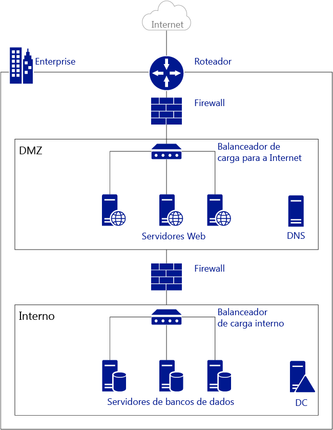
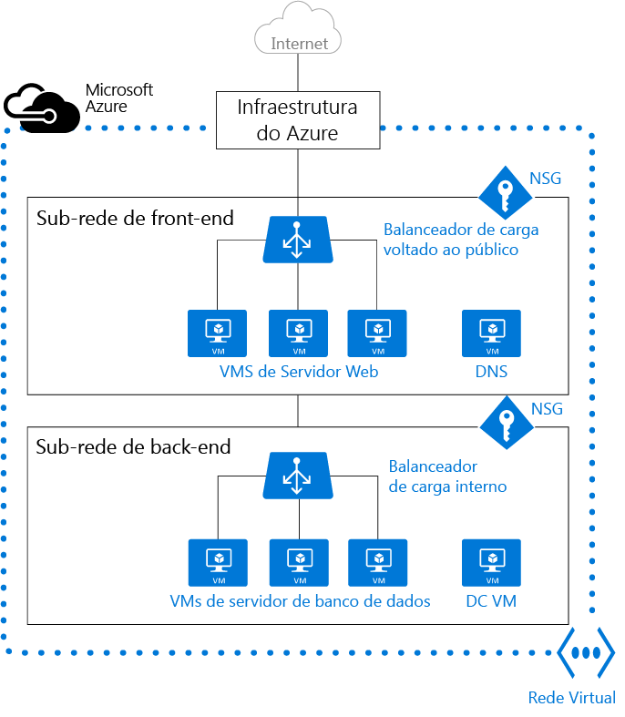

# Redes virtuais
Uma rede virtual do Azure (VNet) é uma representação da sua própria rede na nuvem.  É um isolamento lógico da nuvem do Azure dedicada à sua assinatura. Você pode controlar os blocos de endereços IP, as configurações de DNS, as políticas de segurança e as tabelas de rotas na rede. Você pode também segmentar a Rede Virtual em sub-redes e iniciar as máquinas virtuais (VMs) de IaaS do Azure e/ou os [serviços de Nuvem (instâncias de função de PaaS)](../cloud-services/cloud-services-choose-me.md). Além disso, você pode conectar a rede virtual à sua rede local usando uma das [opções de conectividade](../vpn-gateway/vpn-gateway-about-vpngateways.md#site-to-site-and-multi-site-ipsecike-vpn-tunnel) disponíveis no Azure. Em linhas gerais, você pode expandir sua rede no Azure, com controle total sobre os blocos de endereços IP, com benefícios de escala empresarial proporcionados pelo Azure.

Para entender melhor as VNets, dê uma olhada na figura abaixo, que mostra uma rede local simplificada.

A figura acima mostra uma rede local conectada à Internet pública por meio de um roteador. Também é possível ver um firewall entre o roteador e um rede de perímetro hospedando um servidor DNS e um farm de servidores web. O farm de servidores web tem a carga balanceada por um balanceador de carga de hardware que é exposto à Internet e consome recursos da sub-rede interna. A sub-rede interna é separada do rede de perímetro por outro firewall e hospeda servidores de controlador de domínio do Active Directory, servidores de banco de dados e servidores de aplicativos.

A mesma rede pode ser hospedada no Azure, conforme mostrado na figura abaixo.

Observe como a infraestrutura do Azure assume a função do roteador, permitindo o acesso à Internet pública pela VNet sem a necessidade de configuração. Firewalls podem ser substituídos por grupos de segurança de rede (NSGs) aplicados a cada sub-rede. E balanceadores de carga físicos são substituídos por balanceadores de carga interno e voltado para a internet no Azure.

> [!NOTE]
> Há dois modos de implantação no Azure: clássico (também conhecido como gerenciamento de serviços) e o Gerenciador de Recursos do Azure (ARM). As VNets clássicos podem ser adicionados a um grupo de afinidade ou criados como VNet regional. Se você tiver uma VNet em um grupo de afinidade, convém [migrá-la para uma VNet regional](virtual-networks-migrate-to-regional-vnet.md).
>

## Benefícios
* **Isolamento**. As VNets são completamente isoladas umas das outras. Dessa forma, você pode criar redes não contíguas para desenvolvimento, testes e produção com os mesmos blocos de endereços CIDR.
* **Acesso à Internet pública**. Todas as VMs de IaaS e  instâncias de função  de PaaS em uma VNet podem acessar a Internet pública por padrão. Você pode controlar o acesso usando grupos de segurança de rede (NSGs).
* **Acesso às VMs na VNet**. As VMs de IaaS e as instâncias de função de PaaS podem ser iniciadas e podem se conectar entre si na mesma rede virtual usando endereços IP privados, mesmo que estejam em sub-redes diferentes, sem a necessidade de configurar um gateway ou de usar endereços IP públicos.
* **Resolução de nomes**. O Azure fornece [resolução de nomes interna](virtual-networks-name-resolution-for-vms-and-role-instances.md) para VMs de IaaS e instâncias de função de PaaS implantadas na sua VNet. Você também pode implantar seus próprios servidores DNS e configurar a VNet para usá-los.
* **Segurança**. O tráfego de entrada e de saída das máquinas virtuais e das instâncias de função de PaaS em uma Rede Virtual pode ser controlado com grupos de Segurança de Rede.
* **Conectividade**. As redes virtuais podem ser conectadas usando gateways de rede ou o emparelhamento de VNet. As redes virtuais podem ser conectadas a datacenters locais por meio de redes VPN site a site ou do Azure ExpressRoute. Para saber mais sobre a conectividade VPN site a site, visite [Sobre gateways de VPN](../vpn-gateway/vpn-gateway-about-vpngateways.md). Para saber mais sobre a Rota Expressa, acesse [Visão geral técnica da Rota Expressa](../expressroute/expressroute-introduction.md). Para saber mais sobre o emparelhamento de rede virtual, visite [Emparelhamento de VNet](virtual-network-peering-overview.md).

  > [!NOTE]
  > Certifique-se de criar uma VNet antes de implantar qualquer VMs de IaaS ou instâncias de função de PaaS em seu ambiente do Azure. VMs baseadas em ARM exigem uma VNet e se você não especificar uma VNet existente, o Azure cria uma VNet padrão que pode ter conflito de bloco de endereços CIDR com sua rede local. Impossibilitando a conexão da Rede Virtual à sua rede local.
  >

## Sub-redes
Uma sub-rede é um intervalo de endereços IP na Rede Virtual. Você pode dividir uma Rede Virtual em várias sub-redes para efeitos de organização e de segurança. As VMs e as instâncias de função de PaaS implantadas em sub-redes (iguais ou diferentes) em uma Rede Virtual podem se comunicar entre si sem nenhuma configuração adicional. Você pode também configurar as tabelas de rotas e os NSGs para uma sub-rede.

## Endereços IP
Há dois tipos de endereços IP atribuídos aos recursos no Azure: *público* e *privado*. Os endereços IP públicos permitem a comunicação dos recursos do Azure com a Internet e com outros serviços do Azure voltados ao público, como o [Cache Redis do Azure](https://azure.microsoft.com/services/cache/) e os [Hubs de Eventos do Azure](https://azure.microsoft.com/documentation/services/event-hubs/). Os endereços IP privados permitem a comunicação entre os recursos de uma rede virtual juntamente com os recursos conectados por meio de uma VPN, sem usar endereços IP roteáveis na Internet.

Para saber mais sobre endereços IP no Azure, acesse [Endereços IP na rede virtual](virtual-network-ip-addresses-overview-arm.md)

## Balanceadores de carga do Azure
As máquinas virtuais e os serviços de nuvem de uma Rede Virtual podem ser expostos à Internet usando os Balanceadores de Carga do Azure. Os aplicativos de Linha de Negócios internos só podem ter balanceamento de carga com o ILB.

* **Balanceador externo de carga**. Você pode usar um balanceador de carga externo para fornecer alta disponibilidade para VMs de IaaS e  instâncias de função de PaaS acessadas pela Internet pública.
* **Balanceador Interno de carga**. Você pode usar um balanceador de carga interno para fornecer alta disponibilidade para VMs de IaaS e  instâncias de função de PaaS acessadas por outros serviços em sua VNET.

Para saber mais sobre o balanceamento de carga no Azure, acesse [Visão geral sobre balanceador de carga](../load-balancer/load-balancer-overview.md).

## Grupos de segurança de rede (NSG)
Você pode criar NSGs para controlar o acesso de entrada e saída para interfaces de rede (NICs), VMs e sub-redes. Cada NSG contém uma ou mais regras que especificam se o tráfego está aprovado ou negado com base no endereço IP de origem, porta de origem, endereço IP de destino e porta de destino. Para saber mais sobre NSGs, acesse [O que é um Grupo de Segurança de Rede](virtual-networks-nsg.md).

## Dispositivos virtuais
Um dispositivo virtual é apenas outra VM em seu VNet que executa uma função de aplicativo baseada em software, como firewall, otimização de WAN ou detecção de intrusão. Você pode criar uma rota no Azure para direcionar o tráfego da VNet por meio de um dispositivo virtual para usar seus recursos.

Por exemplo, NSGs podem ser usados para fornecer segurança em sua VNet. No entanto, NSGs fornecem lista de controle de acesso (ACL) de camada 4 para pacotes de entrada e saída. Se você quiser usar um modelo de segurança de camada 7, é necessário usar um dispositivo de firewall.

As soluções de virtualização dependem de [encaminhamento IP e de rotas definidas pelo usuário](virtual-networks-udr-overview.md).

## limites
Há limites para o número de Redes Virtuais permitido na assinatura. Confira [Limites de rede do Azure](../azure-subscription-service-limits.md#networking-limits) para saber mais.

## Preços
Não há custo adicional para usar Redes Virtuais no Azure. Serão cobradas taxas padrão das instâncias de computação iniciadas na Rede Virtual, como descrito em [Preços de VM do Azure](https://azure.microsoft.com/pricing/details/virtual-machines/). Também serão cobradas as taxas padrão dos [Gateways de VPN](https://azure.microsoft.com/pricing/details/vpn-gateway/) e os [Endereços IP Públicos](https://azure.microsoft.com/pricing/details/ip-addresses/) usados na Rede Virtual.

## Próximas etapas
* [Criar uma Rede Virtual](virtual-networks-create-vnet-arm-pportal.md) e sub-redes.
* [Criar uma VM em uma VNet](../virtual-machines/virtual-machines-windows-hero-tutorial.md).
* Saiba mais sobre [NSGs](virtual-networks-nsg.md).
* Saiba mais sobre [encaminhamento IP e rotas definidas pelo usuário](virtual-networks-udr-overview.md).

