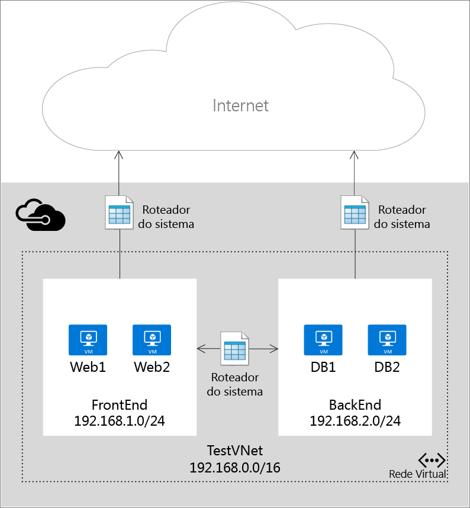
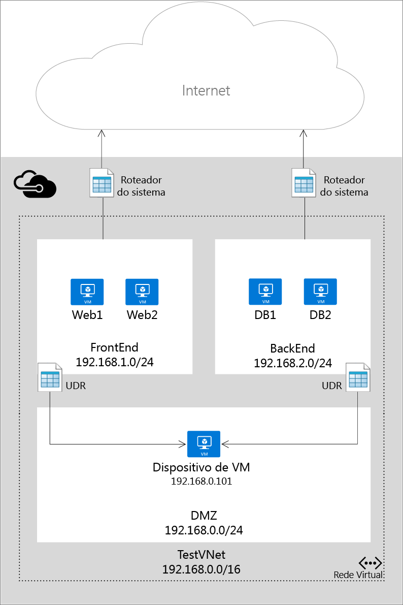

<properties 
   pageTitle="Visão geral sobre encaminhamento IP e rotas definidas pelo usuário"
   description="Noções básicas sobre UDR e Encaminhamento IP"
   services="virtual-network"
   documentationCenter="na"
   authors="telmosampaio"
   manager="adinah"
   editor="tysonn" />
<tags 
   ms.service="virtual-network"
   ms.devlang="na"
   ms.topic="article"
   ms.tgt_pltfrm="na"
   ms.workload="infrastructure-services"
   ms.date="06/09/2015"
   ms.author="telmos" />

# Encaminhamento IP e rotas definidas pelo usuário
Ao adicionar máquinas virtuais (VMs) a uma rede virtual (VNet) no Azure, você observará que as máquinas virtuais são capazes de se comunicar automaticamente com outras VMs na rede. Não é necessário especificar um gateway, mesmo que as VMs estejam em sub-redes diferentes. O mesmo vale para a comunicação entre as VMs para a Internet pública e até mesmo em suas instalações de rede quando houver uma conexão híbrida do Azure para o seu próprio datacenter.

Esse fluxo de comunicação é possível porque o Azure usa uma série de rotas do sistema para definir como o tráfego IP flui. As rotas de sistema controlam o fluxo de comunicação nos seguintes cenários:

- De dentro da mesma sub-rede.
- De uma sub-rede para outra em uma VNet.
- De VMs com a Internet.
- De uma VNet para outra VNet por meio de um gateway VPN.
- De uma VNet à sua rede local por meio de um gateway de VPN.

A figura a seguir mostra uma configuração simples com uma VNet, duas sub-redes e algumas VMs, juntamente com as rotas do sistema que permitem o fluxo do tráfego IP.

Embora o uso de rotas do sistema facilite o tráfego automaticamente para a sua implantação, há casos em que você deseja controlar o roteamento de pacotes por meio de um dispositivo virtual. Você pode fazer isso criando rotas definidas pelo usuário que especificam o próximo salto para os pacotes que fluem para uma sub-rede específica indo, então, para o dispositivo virtual e habilitar o encaminhamento de IP para a VM em execução como o dispositivo virtual.

A figura abaixo mostra um exemplo de rotas definidas pelo usuário e encaminhamento de IP para forçar os pacotes que vão de uma sub-rede front-end para a Internet a passar por um dispositivo virtual, e todos os pacotes que vão da sub-rede front-end para a sub-rede de back-end a passar por um dispositivo diferente. Observe que o tráfego da sub-rede de back-end para a sub-rede de front-end ainda está atravessando a rota do sistema, ignorando o dispositivo.

## Roteamento
Os pacotes são roteados através de uma rede TCP/IP com base em uma tabela de rotas definida em cada nó na rede física. Uma tabela de rotas é uma coleção de rotas individuais usadas para decidir para onde encaminhar pacotes com base no endereço IP de destino. Uma rota consiste no seguinte:

- **Prefixo de endereço**. O CIDR de destino ao qual a rota se aplica, como 10.1.0.0/16.
- **Tipo do próximo salto**. O tipo de salto do Azure ao qual o pacote deve ser enviado. Os valores possíveis são:
	- **Local**. Representa a rede virtual local. Por exemplo, se você tiver duas sub-redes, 10.1.0.0/16 e 10.2.0.0/16, na mesma rede virtual, a rota para cada sub-rede na tabela de rotas terá um valor de próximo salto de *Local*.
	- **Gateway de VPN**. Representa um Gateway de VPN S2S do Azure. 
	- **Internet**. Representa o gateway de Internet padrão fornecido pela Infraestrutura do Azure 
	- **Dispositivo virtual**. Representa um dispositivo virtual que você adicionou à sua rede virtual do Azure.
	- **NULO**. Representa um buraco negro. Pacotes encaminhados a um buraco negro não serão encaminhados.
- **Valor de próximo salto**. O valor de próximo salto contém o endereço IP para o qual os pacotes devem ser encaminhados. Os valores de próximas salto são permitidos apenas em rotas em que o próximo salto é um *Dispositivo Virtual*.

## Rotas do sistema
Cada sub-rede criada em uma rede virtual é associada automaticamente a uma tabela de rota que contém as seguintes regras de rota do sistema:

- **Regra VNet local**: esta regra é criada automaticamente para todas as sub-redes em uma rede virtual. Ela especifica que há um link direto entre as VMs na VNet e não há nenhum próximo salto intermediário.
- **Regra local**: essa regra se aplica a todo o tráfego destinado ao intervalo de endereços local e usa o gateway de VPN como o destino do próximo salto.
- **Regra de Internet**: essa regra processa todo o tráfego destinado à Internet pública e usa o gateway de internet de infraestrutura como o próximo salto para todo o tráfego destinado à Internet.

## Rotas definidas pelo usuário
Para a maioria dos ambientes, serão necessárias apenas as rotas de sistema já definidas pelo Azure. No entanto, talvez seja necessário criar uma tabela de rotas e adicionar uma ou mais rotas em casos específicos, como:

- Túnel à força para a Internet através de sua rede local.
- Uso de dispositivos virtuais em seu ambiente do Azure.

Nos cenários acima, você precisará criar uma tabela de rotas e adicionar rotas definidas pelo usuário a ela. Você pode ter várias tabelas de rotas, e a mesma tabela de rotas pode ser associada a uma ou mais sub-redes. Cada sub-rede só pode ser associada a uma única tabela de rotas. Todas as VMs e serviços em nuvem em uma sub-rede usam a tabela de rotas associada a essa sub-rede.

As sub-redes contam com rotas de sistema até que uma tabela de rotas seja associada à sub-rede. Quando existe uma associação, o roteamento é feito com base em LPM (Correspondência de Prefixo mais Longo) entre as rotas definidas pelo usuário e as rotas de sistema. Se houver mais de uma rota com a mesma correspondência LPM, uma rota será selecionada com base em sua origem na seguinte ordem:

1. Rota definida pelo usuário
1. Rota BGP (quando o ExpressRoute é usado)
1. Rota de sistema

Para saber como criar rotas definidas pelo usuário, consulte [Como criar rotas e habilitar o encaminhamento de IP no Azure](../virtual-networks-udr-how-to#How-to-manage-routes).

>[AZURE.IMPORTANT]As rotas definidas pelo usuário são aplicadas apenas a VMs do Azure e a serviços de nuvem. Por exemplo, se desejar adicionar um dispositivo virtual de firewall entre sua rede local e o Azure, você terá que criar uma rota definida pelo usuário para as tabelas de rotas do Azure que encaminham todo o tráfego direcionado ao espaço de endereço local para o dispositivo virtual. No entanto, o tráfego de entrada do espaço de endereço local fluirá através de seu gateway de VPN ou circuito do ExpressRoute diretamente para o ambiente do Azure, ignorando o dispositivo virtual.

## Rotas BGP
Se houver uma conexão ExpressRoute entre sua rede local e o Azure, você poderá habilitar o BGP para propagar rotas da rede local para o Azure. Essas rotas BGP são usadas da mesma maneira que as rotas do sistema e as rotas definidas pelo usuário em cada sub-rede do Azure. Para obter mais informações, consulte [Introdução ao ExpressRoute](../expressroute-introduction).

>[AZURE.IMPORTANT]Você pode configurar seu ambiente do Azure para usar um túnel à força por meio de sua rede local, criando uma rota definida pelo usuário para a sub-rede 0.0.0.0/0 que usa o gateway de VPN como o próximo salto. No entanto, isso só funcionará se você estiver usando um gateway de VPN, não o ExpressRoute. Para o ExpressRoute, o túnel à força é configurado por meio do BGP.

## Encaminhamento IP
Conforme descrito acima, uma das principais razões para criar uma rota definida pelo usuário é encaminhar o tráfego para um dispositivo virtual. Um dispositivo virtual é nada mais do que uma VM que executa um aplicativo usado para lidar com o tráfego de rede de alguma forma, como um firewall ou um dispositivo NAT.

Essa VM de dispositivo virtual deve ser capaz de receber o tráfego de entrada não endereçado a si mesma. Para permitir que uma VM receba o tráfego endereçado a outros destinos, você deve habilitar o Encaminhamento IP para a VM. Esta é uma configuração do Azure, não uma configuração no sistema operacional convidado.

Para saber como habilitar o Encaminhamento IP para uma máquina virtual no Azure, consulte [Como criar rotas e habilitar o Encaminhamento IP no Azure](../virtual-networks-udr-how-to#How-to-Manage-IP-Forwarding).

## Próximas etapas

- Saiba como [criar rotas](../virtual-networks-udr-how-to#How-to-manage-routes) e associá-las a sub-redes.
- Saiba como [habilitar o encaminhamento IP](../virtual-networks-udr-how-to#How-to-Manage-IP-Forwarding) para uma VM que executa um dispositivo virtual. 

<!---HONumber=August15_HO6-->