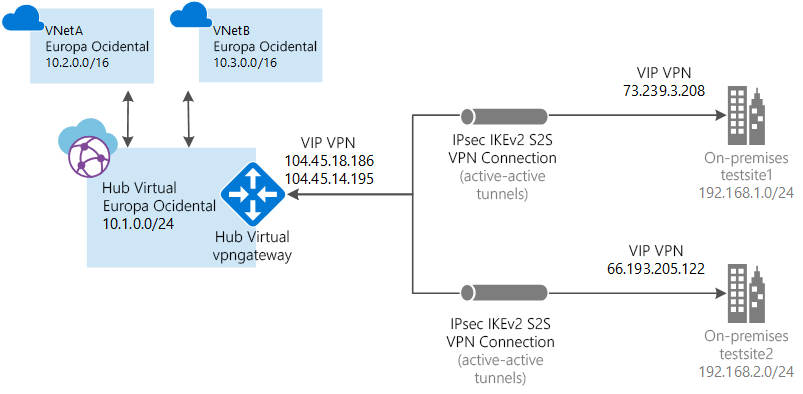

# O que é a WAN Virtual do Azure?

A WAN Virtual do Azure é um serviço de rede que fornece conectividade otimizada e automatizada entre branches por meio do Azure. A WAN Virtual permite que você conecte e configure dispositivos de branch para se comunicar com o Azure. Isso pode ser feito manualmente ou usando dispositivos de parceiro preferencial por meio de um parceiro de WAN Virtual. Veja o artigo [Parceiros preferenciais](https://go.microsoft.com/fwlink/p/?linkid=2019615) para obter detalhes. O uso de dispositivos de parceiro preferencial facilita o uso, simplifica a conectividade e permite o gerenciamento de configurações. O painel interno de WAN do Azure fornece informações instantâneas de solução de problemas que podem ajudar você a economizar tempo e proporcionam uma maneira fácil de exibir conectividade em larga escala.

Este artigo fornece uma visão rápida sobre a conectividade de rede de seu Azure e de cargas de trabalho não Azure. A WAN Virtual oferece as seguintes vantagens:

* **Soluções de conectividade integradas em hub e spoke:** automatize a configuração site a site e a conectividade entre sites locais e um hub do Azure.
* **Instalação e configuração automatizadas de spoke:** conecte suas redes virtuais e cargas de trabalho diretamente ao hub do Azure.
* **Solução de problemas intuitiva:** veja o fluxo ponta a ponta dentro do Azure e use essas informações para executar as ações necessárias.

## Conexões site a site

Para criar uma conexão site a site usando a WAN Virtual, você pode usar um [parceiro de WAN Virtual](virtual-wan-locations-partners.md) ou criar a conexão manualmente.

### Trabalhar com um parceiro de WAN Virtual

Quando você trabalha com um parceiro de WAN Virtual, o processo é:

1. O controlador do dispositivo de branch (VPN/SDWAN) é autenticado para exportar informações do site no Azure usando uma [Entidade de Serviço do Azure](../active-directory/develop/howto-create-service-principal-portal.md).
2. O controlador do dispositivo de branch (VPN/SDWAN) obtém a configuração de conectividade do Azure e atualiza o dispositivo local. Isso automatiza o download da configuração, a edição e a atualização do dispositivo VPN local.
3. Quando o dispositivo tiver a configuração do Azure correta, uma conexão site a site (dois túneis ativos) será estabelecida com a WAN do Azure. O Azure é compatível com IKEv1 e IKEv2. BGP é opcional.

Se você não quiser usar um parceiro preferencial, poderá configurar a conexão manualmente. Veja [Criar uma conexão site a site usando a WAN Virtual](virtual-wan-site-to-site-portal.md).

## Conexões ponto a site (versão prévia)

Uma conexão P2S (ponto a site) permite que você crie uma conexão segura para seu hub virtual de um computador cliente individual. Uma conexão P2S é estabelecida iniciando-a do computador cliente. Essa solução é útil para pessoas que trabalham remotamente que querem se conectar de um local remoto, como de casa ou de uma conferência. A VPN P2S também é uma solução útil para usar em vez de uma VPN S2S, quando você tiver apenas alguns clientes que precisam se conectar.

Para criar a conexão manualmente, veja [Criar uma conexão ponto a site usando a WAN Virtual](virtual-wan-point-to-site-portal.md).

## Conexões do ExpressRoute (versão prévia)

Para criar a conexão manualmente, veja [Criar uma conexão do ExpressRoute usando a WAN Virtual](virtual-wan-expressroute-portal.md).

## Recursos da WAN Virtual

Para configurar uma WAN virtual de ponta a ponta, crie os seguintes recursos:

* **virtualWAN:** o recurso virtualWAN representa uma sobreposição virtual de sua rede do Azure, e é uma coleção de vários recursos. Ele contém links para todos os seus hubs virtuais que você gostaria de ter dentro da WAN Virtual. Os recursos da WAN Virtual ficam isolados uns dos outros e não podem conter um hub comum. Os hubs virtuais na WAN Virtual não se comunicam entre si. A propriedade "Permitir o tráfego de branch para branch" habilita o tráfego entre os sites VPN, bem como VPN para sites habilitados para ExpressRoute. Lembre-se de que o ExpressRoute na WAN Virtual do Azure está atualmente em versão prévia.

* **Site:** o recurso de site conhecido como vpnsite representa o dispositivo VPN local e suas configurações. Ao trabalhar com um parceiro de WAN Virtual, você terá uma solução interna para exportar automaticamente essas informações para o Azure.

* **Hub:** um hub virtual é uma rede virtual gerenciada pela Microsoft. O hub contém vários pontos de extremidade de serviço para habilitar a conectividade de sua rede local (vpnsite). O hub é o núcleo da sua rede em uma região. Pode haver apenas um hub por região do Azure. Quando você cria um hub usando o portal do Azure, ele cria uma VNet de hub virtual e um hub virtual vpngateway.

  Um gateway de hub não é o mesmo que um gateway de rede virtual que você pode usar para ExpressRoute e Gateway de VPN. Por exemplo, ao usar a WAN Virtual, você não cria uma conexão site a site do seu site local diretamente com sua VNet. Em vez disso, você cria uma conexão site a site com o hub. O tráfego sempre passa pelo gateway do hub. Isso significa que suas VNets não precisam de um gateway de rede virtual próprio. A WAN Virtual permite que suas VNets tirem proveito do dimensionamento fácil por meio do hub virtual e do gateway do hub virtual. 

* **Conexão de rede virtual do hub:** o recurso de conexão de rede virtual do Hub é usado para conectar o hub perfeitamente à sua rede virtual. Neste momento, você só pode se conectar a redes virtuais que estejam na mesma região do hub.

* **Tabela de rotas do hub:** você pode criar uma rota de hub virtual e aplicar a rota à tabela de rotas de hub virtual. Você pode aplicar várias rotas à tabela de rotas do hub virtual.

## Perguntas frequentes

[!INCLUDE [Virtual WAN FAQ](../../includes/virtual-wan-faq-include.md)]

## Próximas etapas

Exibir a página [Parceiros da WAN Virtual e localizações](virtual-wan-locations-partners.md).
