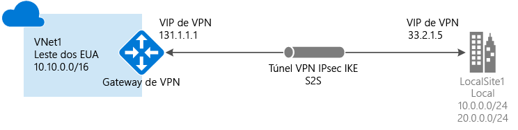
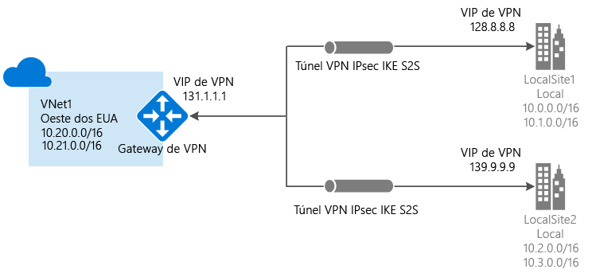
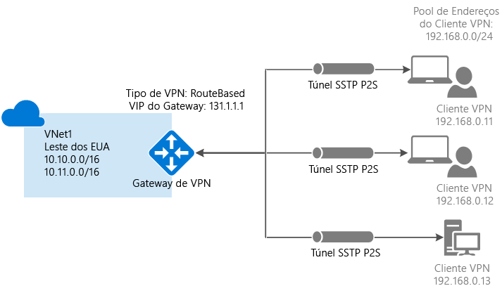
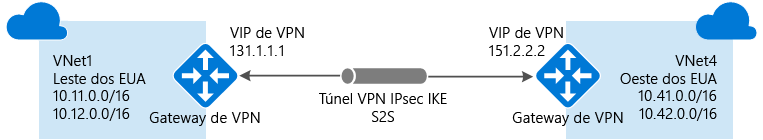
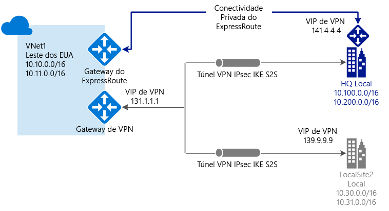

# Sobre o Gateway de VPN

Um gateway de VPN é um tipo de gateway de rede virtual que envia o tráfego criptografado em uma conexão pública para um local. Você também pode usar gateways de VPN para enviar o tráfego criptografado entre as redes virtuais do Azure pela rede da Microsoft. Para enviar o tráfego de rede criptografado entre sua rede virtual do Azure e seu site local, será necessário criar um gateway de VPN para sua rede virtual.

Cada rede virtual pode ter apenas um gateway de VPN, mas você pode criar várias conexões com o mesmo gateway de VPN. Um exemplo disso é uma configuração de conexão de vários sites. Quando você cria várias conexões ao mesmo gateway de VPN, todos os túneis VPN, incluindo VPNs Ponto a Site, compartilham a largura de banda disponível para o gateway.

### O que é um gateway da rede virtual?

Um gateway de rede virtual é composto de duas ou mais máquinas virtuais implantadas em uma sub-rede específica, chamada de GatewaySubnet. As VMs localizadas na GatewaySubnet são criadas quando você cria o gateway de rede virtual. As VMs de gateway de rede virtual são configuradas para conter as tabelas de roteamento e os serviços de gateway específicos do gateway. Não é possível configurar as VMs que fazem parte do gateway de rede virtual e você nunca deve implantar recursos adicionais para a GatewaySubnet.

Quando você criar um gateway de rede virtual usando o tipo de gateway 'Vpn', ele cria um tipo específico de gateway de rede virtual que criptografa o tráfego; um gateway VPN. Um gateway de VPN pode demorar até 45 minutos para ser criado. Isso ocorre porque as VMs do gateway de VPN são implantadas no GatewaySubnet e configuradas com as configurações especificadas. A SKU do Gateway que você selecionar determina o poder de processamento das VMs.

## SKUs do Gateway

[!INCLUDE [vpn-gateway-gwsku-include](../../includes/vpn-gateway-gwsku-include.md)]

## Configurando um Gateway de VPN

Uma conexão de gateway VPN conta com vários recursos que são configurados com definições específicas. A maioria dos recursos pode ser configurada separadamente, embora eles devam ser configurados em uma determinada ordem em alguns casos.

### Configurações

As configurações que você escolheu para cada recurso são essenciais para a criação de uma conexão bem-sucedida. Para obter informações sobre os recursos individuais e as configurações do Gateway de VPN, consulte [Sobre as configurações do Gateway de VPN](vpn-gateway-about-vpn-gateway-settings.md). Este artigo contém informações para ajudar você a entender os tipos de gateway, tipos de VPN, tipos de conexão, as sub-redes de gateway, gateways de rede local e várias outras configurações de recursos que você possa considerar.

### Ferramentas de implantação

Você pode começar criando e configurando os recursos usando uma ferramenta de configuração, como o portal do Azure. Você pode decidir trocar para outra ferramenta, como o PowerShell, para configurar recursos adicionais ou modificar os recursos existentes, quando aplicável. Atualmente, não é possível configurar cada recurso e definição de recursos no portal do Azure. As instruções nos artigos para cada topologia de conexão especificam quando uma ferramenta de configuração específica é necessária. 

### Modelo de implantação

Quando você configura um gateway de VPN, as etapas efetuadas dependem do modelo de implantação utilizado para criar sua rede virtual. Por exemplo, se tiver criado a rede virtual usando o modelo de implantação clássico, você usará as diretrizes e instruções do modelo de implantação clássico para criar e configurar o gateway de VPN. Para obter mais informações sobre os modelos de implantação, consulte [Noções básicas sobre o Resource Manager e os modelos de implantação clássicos](../azure-resource-manager/resource-manager-deployment-model.md).

## Diagramas de topologia de conexão

É importante saber que há diferentes configurações disponíveis para conexões de gateway de VPN. Você precisa determinar qual configuração melhor atende às suas necessidades. Nas seções a seguir, você pode exibir diagramas de topologia e informações sobre as conexões de gateway de VPN a seguir: as seções a seguir contêm tabelas que listam:

* Modelo de implantação disponível
* Ferramentas de configuração disponíveis
* Links que levam você diretamente a um artigo, se disponível

Use os diagramas e as descrições para ajudar a selecionar a topologia de conexão adequada a seus requisitos. Os diagramas mostram as principais topologias de linha de base, mas é possível criar topologias mais complexas usando os diagramas como uma diretriz.

## Site a Site e Vários Sites (túnel VPN IPsec/IKE)

### Site a site

Uma conexão de gateway VPN Site a Site (S2S) é uma conexão por túnel VPN IPsec/IKE (IKEv1 ou IKEv2). Uma conexão S2S exige um dispositivo VPN local com um endereço IP público atribuído a ele e não por uma NAT. As conexões S2S podem ser usadas para configurações entre instalações e híbridas.   

### Vários Sites

Esse tipo de conexão é uma variação da conexão Site a Site. Você pode criar mais de uma conexão de VPN em seu gateway de rede virtual, normalmente se conectando a vários sites locais. Ao trabalhar com várias conexões, você deve usar um tipo de VPN baseado em rota (conhecido como gateway dinâmico ao trabalhar com redes virtuais clássicas). Como cada rede virtual pode ter apenas um gateway de VPN, todas as conexões por meio do gateway compartilham a largura de banda disponível. Isso é geralmente chamado de conexão com "vários sites".

### Modelos de implantação e métodos para Site a Site e Vários Sites

[!INCLUDE [vpn-gateway-table-site-to-site](../../includes/vpn-gateway-table-site-to-site-include.md)]

## Ponto a Site (VPN sobre SSTP)

Um gateway VPN Ponto a Site (P2S) permite que você crie uma conexão segura para sua rede virtual a partir de um computador cliente individual. As conexões VPN Ponto a Site são úteis quando você deseja se conectar à rede virtual de um local remoto, como ao trabalhar de casa ou em uma conferência. Uma VPN P2S também é uma solução útil para usar em vez de uma VPN Site a Site, quando você tiver apenas alguns clientes que precisam se conectar a uma rede virtual. 

Ao contrário das conexões S2S, as conexões P2S não exigem um endereço IP público local ou um dispositivo VPN. As conexões P2S podem ser usadas com as conexões S2S pelo mesmo gateway de VPN, desde que todos os requisitos de configuração de ambas as conexões sejam compatíveis.

P2S usa o SSTP (Secure Socket Tunneling Protocol), que é um protocolo VPN baseado em SSL. Uma conexão VPN P2S é estabelecida iniciando-a do computador cliente.

### Modelos de implantação e métodos para Ponto a Site

[!INCLUDE [vpn-gateway-table-point-to-site](../../includes/vpn-gateway-table-point-to-site-include.md)]

## Conexões de VNet para VNet (túnel VPN IPsec/IKE)

Conectar uma rede virtual a outra rede virtual é semelhante a conectar uma rede virtual (Rede Virtual para Rede Virtual) a um site local. Os dois tipos de conectividade usam um gateway de VPN para fornecer um túnel seguro usando IPsec/IKE. Você pode até combinar a comunicação VNet a VNet com as configurações de conexão de vários sites. Isso permite estabelecer topologias de rede que combinam conectividade entre instalações a conectividade de rede intervirtual.

As redes virtuais às quais você se conecta podem estar:

* na mesma região ou em regiões diferentes
* na mesma assinatura ou em assinaturas diferentes 
* nos mesmos modelos de implantação ou em modelos diferentes

### Conexões entre os modelos de implantação

Atualmente, o Azure tem dois modelos de implantação: o clássico e o Resource Manager. Se você já usa o Azure há algum tempo, provavelmente terá as VMs do Azure e as funções de instância em execução em uma Rede Virtual clássica. Suas VMs e instâncias de função mais recentes podem estar em execução em uma Rede Virtual criada no Resource Manager. Você pode criar uma conexão entre as Redes Virtuais para permitir que os recursos em uma rede virtual se comuniquem diretamente com os recursos em outra.

### Emparelhamento VNet

Talvez você possa usar o emparelhamento VNet para criar sua conexão, desde que a rede virtual atenda a certos requisitos. O emparelhamento de Rede Virtual não usa um gateway de rede virtual. Para obter mais informações, consulte [Emparelhamento da VNet](../virtual-network/virtual-network-peering-overview.md).

### Modelos de implantação e métodos para VNet a VNet

[!INCLUDE [vpn-gateway-table-vnet-to-vnet](../../includes/vpn-gateway-table-vnet-to-vnet-include.md)]

## ExpressRoute (conexão privada dedicada)

O Microsoft Azure ExpressRoute permite que você estenda suas redes locais até a nuvem da Microsoft por meio de uma conexão privada dedicada, facilitada por um provedor de conectividade. Com o ExpressRoute, você pode estabelecer conexões com os serviços de nuvem da Microsoft, como o Microsoft Azure, o Office 365 e o CRM Online. A conectividade pode ocorrer de uma rede “qualquer para qualquer” (VPN IP), uma rede Ethernet ponto a ponto ou uma conexão cruzada virtual por meio de um provedor de conectividade em uma colocalização.

As conexões do ExpresssRoute não passam pela Internet pública. Isso permite que as conexões do ExpresssRoute ofereçam mais confiabilidade, mais velocidade, latências menores e muito mais segurança do que as conexões típicas pela Internet.

Uma conexão ExpressRoute não usa um gateway de VPN, embora ela use um gateway de rede virtual como parte de sua configuração necessária. Em uma conexão ExpressRoute, um gateway de rede virtual é configurado com o tipo de gateway 'ExpressRoute', em vez de 'Vpn'. Para obter mais informações sobre o ExpresssRoute, consulte [Visão geral técnica do ExpresssRoute](../expressroute/expressroute-introduction.md).

## Conexões coexistentes Site a Site e de ExpressRoute

O ExpresssRoute é uma conexão direta e dedicada da sua WAN (não pela Internet pública) para Serviços Microsoft, incluindo o Azure. O tráfego da VPN Site a Site é criptografado ao percorer a Internet pública. Poder configurar conexões VPN Site a Site e o ExpresssRoute para a mesma rede virtual oferece várias vantagens.

Você pode configurar uma VPN Site a Site como um caminho de failover seguro para o ExpresssRoute ou usar VPNs Site a Site para se conectar a sites que não fazem parte de sua rede, mas estão conectados por meio do ExpresssRoute. Observe que essa configuração exige dois gateways de rede virtual para a mesma rede virtual, um usando o tipo de gateway 'Vpn' e o outro usando o tipo de gateway 'ExpressRoute'.

### Modelos de implantação e métodos para S2S e ExpressRoute

[!INCLUDE [vpn-gateway-table-coexist](../../includes/vpn-gateway-table-coexist-include.md)]

## Preços

[!INCLUDE [vpn-gateway-about-pricing-include](../../includes/vpn-gateway-about-pricing-include.md)]

Para saber mais sobre as SKUs de gateway para Gateway de VPN, veja [SKUs de Gateway](vpn-gateway-about-vpn-gateway-settings.md#gwsku).

## Perguntas frequentes

Para perguntas frequentes sobre o gateway de VPN, consulte [Perguntas frequentes sobre o gateway de VPN](vpn-gateway-vpn-faq.md).

## Próximas etapas

- Planeje sua configuração de gateway VPN. Confira [Planejamento e design do Gateway de VPN](vpn-gateway-plan-design.md).
- Exiba as [Perguntas frequentes sobre o Gateway de VPN](vpn-gateway-vpn-faq.md) para saber mais.
- Exiba os [Limites de serviço e assinatura](../azure-subscription-service-limits.md#networking-limits).
- Saiba mais sobre alguns dos outros principais [recursos de rede](../networking/networking-overview.md) do Azure.
