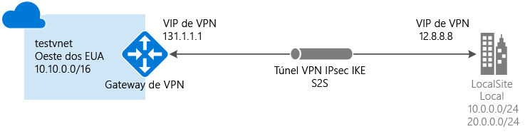

# <a name="create-a-vnet-with-a-site-to-site-vpn-connection-using-powershell"></a>Criar uma Rede Virtual com uma conexão VPN site a site usando o PowerShell

Este artigo mostra como usar o PowerShell para criar uma conexão de gateway de VPN Site a Site de sua rede local para a Vnet. As etapas neste artigo se aplicam ao modelo de implantação do Resource Manager. Você também pode criar essa configuração usando uma ferramenta de implantação ou um modelo de implantação diferente, selecionando uma opção diferente na lista a seguir:

> [!div class="op_single_selector"]
> * [Resource Manager - portal do Azure](vpn-gateway-howto-site-to-site-resource-manager-portal.md)
> * [Resource Manager - PowerShell](vpn-gateway-create-site-to-site-rm-powershell.md)
> * [Resource Manager - CLI](vpn-gateway-howto-site-to-site-resource-manager-cli.md)
> * [Clássico - portal do Azure](vpn-gateway-howto-site-to-site-classic-portal.md)
> * [Clássico - portal clássico](vpn-gateway-site-to-site-create.md)
> 
>




Uma conexão de gateway de VPN Site a Site é usada para conectar a rede local a uma rede virtual do Azure por um túnel VPN IPsec/IKE (IKEv1 ou IKEv2). Esse tipo de conexão exige um dispositivo VPN localizado no local que tenha um endereço IP público voltado para o exterior atribuído a ele. Para saber mais sobre os gateways de VPN, veja [Sobre o gateway de VPN](vpn-gateway-about-vpngateways.md).

## <a name="before-you-begin"></a>Antes de começar

Verifique se você atende aos seguintes critérios antes de iniciar a configuração:

* Verifique se você deseja trabalhar com o modelo de implantação do Resource Manager. [!INCLUDE [deployment models](../../includes/vpn-gateway-deployment-models-include.md)] 
* Um dispositivo VPN compatível e alguém que possa configurá-lo. Para obter mais informações sobre dispositivos VPN compatíveis e a configuração de dispositivo, confira [Sobre dispositivos VPN](vpn-gateway-about-vpn-devices.md).
* Um endereço IPv4 público voltado para o exterior para seu dispositivo VPN. Esse endereço IP não pode estar localizado atrás de um NAT.
* Se não estiver familiarizado com os intervalos de endereços IP localizados na configuração de rede local, você precisará trabalhar em conjunto com alguém que possa lhe fornecer os detalhes. Ao criar essa configuração, você deve especificar os prefixos de intervalo de endereços IP que o Azure roteará para seu local. Nenhuma das sub-redes da rede local podem se sobrepor às sub-redes de rede virtual às quais você deseja se conectar.
* A versão mais recente dos cmdlets do PowerShell do Azure Resource Manager. Confira [Como instalar e configurar o Azure PowerShell](/powershell/azureps-cmdlets-docs) para saber mais sobre como instalar os cmdlets do PowerShell.

### <a name="example-values"></a>Valores de exemplo

Os exemplos neste artigo usam os seguintes valores. Você pode usar esses valores para criar um ambiente de teste ou consultá-los para compreender melhor os exemplos neste artigo.

```
#Example values

VnetName                = testvnet 
ResourceGroup           = testrg 
Location                = West US 
AddressSpace            = 10.0.0.0/16 
SubnetName              = Subnet1 
Subnet                  = 10.0.1.0/28 
GatewaySubnet           = 10.0.0.0/27
LocalNetworkGatewayName = LocalSite
LNG Public IP           = <VPN device IP address> 
Local Address Prefixes  = 10.0.0.0/24','20.0.0.0/24
Gateway Name            = vnetgw1
PublicIP                = gwpip
Gateway IP Config       = gwipconfig1 
VPNType                 = RouteBased 
GatewayType             = Vpn 
ConnectionName          = myGWConnection
```

## <a name="Login"></a>1. Conecte-se as suas assinaturas
Alterne para o modo do PowerShell para usar os cmdlets do Gerenciador de Recursos. Para obter mais informações, consulte [Usando o Windows PowerShell com o Gerenciador de Recursos](../powershell-azure-resource-manager.md).

1. Abra o console do PowerShell e conecte-se à sua conta. Use o exemplo a seguir para ajudar a se conectar:

  ```powershell
  Login-AzureRmAccount
  ```
2. Verificar as assinaturas da conta.

  ```powershell
  Get-AzureRmSubscription
  ```
3. Especifique a assinatura que você quer usar.

  ```powershell
  Select-AzureRmSubscription -SubscriptionName "Replace_with_your_subscription_name"
  ```

## <a name="VNet"></a>2. Criar uma rede virtual e uma sub-rede de gateway

Se você ainda não tiver uma rede virtual, crie uma. Ao criar uma rede virtual, certifique-se de que os espaços de endereço que você especificar não se sobreponham nenhum espaço de endereço que você tenha na rede local. Para essa configuração, você também precisará de uma sub-rede de gateway. O gateway de rede virtual usa uma sub-rede de gateway que contém os endereços IP que são usados pelos serviços de gateway de VPN. Quando você cria uma sub-rede de gateway, ela deve ser nomeada como 'GatewaySubnet'. Se usar outro nome, você criará uma sub-rede, mas o Azure não a tratará como uma sub-rede de gateway.

O tamanho da sub-rede de gateway que você especifica depende da configuração do gateway de VPN que deseja criar. Embora seja possível criar uma sub-rede de gateway tão pequena quanto /29, recomendamos que você crie uma sub-rede maior que inclua mais endereços selecionando /27 ou /28. Usar a sub-rede de gateway maior permite endereços IP suficientes para acomodar as possíveis configurações futuras.

[!INCLUDE [vpn-gateway-no-nsg](../../includes/vpn-gateway-no-nsg-include.md)]

### <a name="to-create-a-virtual-network-and-a-gateway-subnet"></a>Para criar uma rede virtual e uma sub-rede de gateway

O exemplo a seguir cria uma rede virtual e uma sub-rede de gateway. Se você já tiver uma rede virtual que você precisa adicionar a uma sub-rede de gateway, consulte [Para adicionar uma sub-rede do gateway a uma rede virtual que você já criou](#gatewaysubnet).

Crie um grupo de recursos:

```powershell
New-AzureRmResourceGroup -Name testrg -Location 'West US'
```

Criar sua rede virtual. 

1. Defina as variáveis.

  ```powershell
  $subnet1 = New-AzureRmVirtualNetworkSubnetConfig -Name 'GatewaySubnet' -AddressPrefix 10.0.0.0/27
  $subnet2 = New-AzureRmVirtualNetworkSubnetConfig -Name 'Subnet1' -AddressPrefix '10.0.1.0/28'
  ```
2. Crie a Rede Virtual.

  ```powershell
  New-AzureRmVirtualNetwork -Name testvnet -ResourceGroupName testrg `
  -Location 'West US' -AddressPrefix 10.0.0.0/16 -Subnet $subnet1, $subnet2
  ```

### <a name="gatewaysubnet"></a>Para adicionar uma sub-rede do gateway a uma rede virtual já criada

1. Defina as variáveis.

  ```powershell
  $vnet = Get-AzureRmVirtualNetwork -ResourceGroupName testrg -Name testvnet
  ```
2. Crie a sub-rede de gateway.

  ```powershell
  Add-AzureRmVirtualNetworkSubnetConfig -Name 'GatewaySubnet' -AddressPrefix 10.0.0.0/27 -VirtualNetwork $vnet
  ```
3. Defina a configuração.

  ```powershell
  Set-AzureRmVirtualNetwork -VirtualNetwork $vnet
  ```

## 3. <a name="localnet"></a>Criar o gateway de rede local

O gateway de rede local geralmente se refere ao seu local. Você atribui um nome ao site pelo qual o Azure pode fazer referência a ele e especifica o endereço IP do dispositivo VPN local para o qual você criará uma conexão. Você também pode especificar os prefixos de endereço IP que serão roteados por meio do gateway de VPN para o dispositivo VPN. Os prefixos de endereço que você especifica são os prefixos localizados em sua rede local. Se sua rede local for alterada, você poderá atualizar facilmente os prefixos.

Use os seguintes valores:

* O *GatewayIPAddress* é o endereço IP do dispositivo VPN local. O dispositivo VPN não pode estar localizado atrás de um NAT.
* O *AddressPrefix* é o espaço de endereço local.

- Para adicionar um gateway de rede local com um único prefixo de endereço:

  ```powershell
  New-AzureRmLocalNetworkGateway -Name LocalSite -ResourceGroupName testrg `
  -Location 'West US' -GatewayIpAddress '23.99.221.164' -AddressPrefix   '10.0.0.0/24'
  ```

- Para adicionar um gateway de rede local com vários prefixos de endereço:

  ```powershell
  New-AzureRmLocalNetworkGateway -Name LocalSite -ResourceGroupName testrg `
  -Location 'West US' -GatewayIpAddress '23.99.221.164' -AddressPrefix @('10.0.0.0/24','20.0.0.0/24')
  ```

- Para modificar os prefixos de endereço IP do seu gateway de rede local:<br>
Às vezes, os prefixos de gateway de rede local são alterados. As etapas usadas para modificar os prefixos de endereço IP dependem de você ter criado uma conexão de gateway de VPN. Consulte a seção [Modificar os prefixos do endereço IP para um gateway da rede local](#modify) deste artigo.

## <a name="PublicIP"></a>4. Solicitar um endereço IP público

Solicite um endereço IP público que será alocado para o gateway de VPN da rede virtual. Esse é o endereço IP para o qual você configura seu dispositivo VPN para conexão.

O gateway de rede virtual do modelo de implantação do Gerenciador de Recursos atualmente dá suporte apenas a endereços IP públicos usando o método de Alocação Dinâmica. No entanto, isso não significa que o endereço IP muda. A única vez em que o endereço IP de gateway de VPN é alterado é quando o gateway é excluído e recriado. O endereço IP público do gateway de rede virtual não muda durante o redimensionamento, a redefinição ou a manutenção/atualização interna do gateway de VPN.

Use o seguinte exemplo do PowerShell:

```powershell
$gwpip= New-AzureRmPublicIpAddress -Name gwpip -ResourceGroupName testrg -Location 'West US' -AllocationMethod Dynamic
```

## <a name="GatewayIPConfig"></a>5. Criar a configuração de endereçamento IP do gateway
A configuração do gateway define a sub-rede e o endereço IP público a serem usados. Use o exemplo a seguir para criar a configuração do gateway:

```powershell
$vnet = Get-AzureRmVirtualNetwork -Name testvnet -ResourceGroupName testrg
$subnet = Get-AzureRmVirtualNetworkSubnetConfig -Name 'GatewaySubnet' -VirtualNetwork $vnet
$gwipconfig = New-AzureRmVirtualNetworkGatewayIpConfig -Name gwipconfig1 -SubnetId $subnet.Id -PublicIpAddressId $gwpip.Id
```

## <a name="CreateGateway"></a>6. Criar o gateway de VPN

Crie o gateway de VPN da rede virtual. A criação de um gateway de VPN pode demorar até 45 minutos ou mais para ser concluída.

Use os seguintes valores:

* O *-GatewayType* para uma configuração Site a Site é *Vpn*. O tipo de gateway é sempre específico para a configuração que você está implementando. Por exemplo, outras configurações de gateway podem exigir -GatewayType ExpressRoute.
* O *-VpnType* pode ser *RouteBased* (referido como Gateway Dinâmico em alguns documentos) ou *PolicyBased* (referido como Gateway Estático em alguns documentos). Para saber mais sobre os tipos de gateway de VPN, veja [Sobre o Gateway de VPN](vpn-gateway-about-vpngateways.md).
* O *-GatewaySku* pode ser Basic, Standard ou HighPerformance. Há limitações de configuração para alguns SKUs. Para obter mais informações, confira [SKUs de gateway](vpn-gateway-about-vpngateways.md#gateway-skus).

```powershell
New-AzureRmVirtualNetworkGateway -Name vnetgw1 -ResourceGroupName testrg `
-Location 'West US' -IpConfigurations $gwipconfig -GatewayType Vpn `
-VpnType RouteBased -GatewaySku Standard
```

## <a name="ConfigureVPNDevice"></a>7. Configurar o dispositivo de VPN

[!INCLUDE [vpn-gateway-configure-vpn-device-rm](../../includes/vpn-gateway-configure-vpn-device-rm-include.md)]

Para localizar o endereço IP público do seu gateway de rede virtual usando o PowerShell, use o exemplo a seguir:

```powershell
Get-AzureRmPublicIpAddress -Name GW1PublicIP -ResourceGroupName TestRG
```

## <a name="CreateConnection"></a>8. Criar a conexão VPN
Em seguida, crie a conexão VPN Site a Site entre o gateway de rede virtual e o dispositivo VPN. Substitua os valores pelos seus próprios. A chave compartilhada deve corresponder ao valor usado para a configuração do dispositivo VPN. Observe que o '-ConnectionType' para Site a Site é *IPsec*.

1. Defina as variáveis.
  ```powershell
  $gateway1 = Get-AzureRmVirtualNetworkGateway -Name vnetgw1 -ResourceGroupName testrg
  $local = Get-AzureRmLocalNetworkGateway -Name LocalSite -ResourceGroupName testrg
  ```

2. Crie a conexão.
  ```powershell
  New-AzureRmVirtualNetworkGatewayConnection -Name MyGWConnection -ResourceGroupName testrg `
  -Location 'West US' -VirtualNetworkGateway1 $gateway1 -LocalNetworkGateway2 $local `
  -ConnectionType IPsec -RoutingWeight 10 -SharedKey 'abc123'
  ```

Após um instante, a conexão será estabelecida.

## <a name="toverify"></a>9. Verificar a conexão VPN
Existem algumas maneiras diferentes de verificar a conexão VPN.

[!INCLUDE [vpn-gateway-verify-connection-ps-rm](../../includes/vpn-gateway-verify-connection-ps-rm-include.md)]

## <a name="modify"></a>Para modificar os prefixos do endereço IP para um gateway de rede local
Se precisar alterar os prefixos do gateway de rede local, use as instruções a seguir. São fornecidos dois conjuntos de instruções. As instruções escolhidas dependem de você já ter criado sua conexão de gateway.

[!INCLUDE [vpn-gateway-modify-ip-prefix-rm](../../includes/vpn-gateway-modify-ip-prefix-rm-include.md)]

## <a name="modifygwipaddress"></a>Para modificar o endereço IP do gateway para um gateway de rede local
[!INCLUDE [vpn-gateway-modify-lng-gateway-ip-rm](../../includes/vpn-gateway-modify-lng-gateway-ip-rm-include.md)]

## <a name="next-steps"></a>Próximas etapas
*  Quando sua conexão for concluída, você poderá adicionar máquinas virtuais às suas redes virtuais. Para saber mais, veja [Máquinas virtuais](https://docs.microsoft.com/azure/#pivot=services&panel=Compute).
* Para obter informações sobre o BGP, consulte a [Visão Geral do BGP](vpn-gateway-bgp-overview.md) e [Como configurar o BGP](vpn-gateway-bgp-resource-manager-ps.md).

