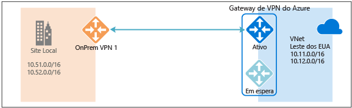
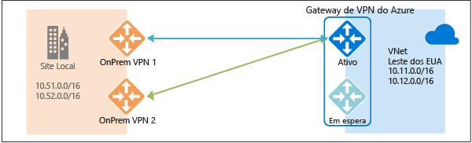
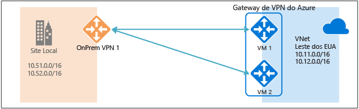
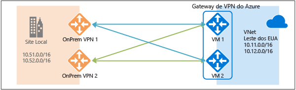
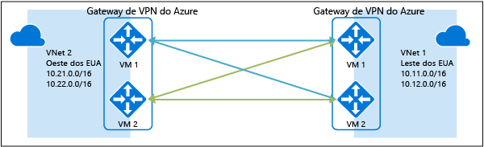

# Conectividade Altamente Disponível entre os Locais e VNet com VNet
Este artigo fornece uma visão geral das opções de configuração Altamente Disponível para sua conectividade entre os locais e VNet com VNet usando os gateways de VPN.

## Sobre a redundância do gateway de VPN do Azure
Cada gateway de VPN do Azure consiste em duas instâncias em uma configuração ativa e em espera. Para qualquer manutenção planejada ou interrupção não planejada que ocorre na instância ativa, a instância em espera deve assumir (fazer o failover) automaticamente e retomar as conexões de VPN S2S ou VNet com VNet. A troca causará uma breve interrupção. Para uma manutenção planejada, a conectividade deve ser restaurada dentro de 10 a 15 segundos. Para os problemas não planejados, a recuperação da conexão será mais longa, aproximadamente de 1 minuto a 1 e meio, no pior caso. Para as conexões do cliente VPN P2S com o gateway, as conexões P2S serão desconectadas e os usuários precisarão reconectar a partir dos computadores cliente.

## Conectividade Altamente Disponível entre os Locais
Para fornecer maior disponibilidade para suas conexões entre os locais, há algumas opções disponíveis:

* Vários dispositivos VPN locais
* Gateway de VPN do Azure ativo
* Combinação dos dois

### Vários dispositivos VPN locais
Você pode usar vários dispositivos VPN a partir de sua rede local para conectar o gateway de VPN do Azure, como mostrado no diagrama a seguir:

Essa configuração fornece vários túneis ativos do mesmo gateway de VPN do Azure para seus dispositivos locais no mesmo local. Há alguns requisitos e restrições:

1. Você precisa criar várias conexões VPN S2S a partir dos dispositivos VPN no Azure. Quando você conectar vários dispositivos VPN da mesma rede local com o Azure, precisará criar um gateway de rede local para cada dispositivo VPN e uma conexão do gateway de VPN do Azure para cada gateway de rede local.
2. Os gateways de rede locais que correspondem aos dispositivos VPN devem ter endereços IP públicos exclusivos na propriedade "GatewayIpAddress".
3. O BGP é necessário para esta configuração. Cada gateway de rede local que representa um dispositivo VPN deve ter um endereço IP no nível do BGP exclusivo especificado na propriedade "BgpPeerIpAddress".
4. O campo de propriedade AddressPrefix em cada gateway de rede local não deve se sobrepor. Você deve especificar "BgpPeerIpAddress" no formato CIDR/32 no campo AddressPrefix, por exemplo, 10.200.200.254/32.
5. Você deve usar o BGP para anunciar os mesmos prefixos dos mesmos prefixos da rede local para o gateway de VPN do Azure e o tráfego será encaminhado por esses túneis simultaneamente.
6. Você precisa usar o ECMP (roteamento de múltiplos caminhos de mesmo custo).
7. Cada conexão é contada em relação ao número máximo de túneis para o gateway de VPN do Azure, 10 para os SKUs Basic e Standard, e 30 para o SKU de Alto Desempenho. 

Nessa configuração, o gateway de VPN do Azure ainda está no modo ativo em espera, portanto, o mesmo comportamento de failover e breve interrupção ainda acontecerá como descrito [acima](#activestandby). Mas essa configuração protege contra falhas ou interrupções na rede local e nos dispositivos VPN.

### Gateway de VPN do Azure ativo
Agora, você pode criar um gateway de VPN do Azure em uma configuração ativa, onde ambas as instâncias das VMs de gateway estabelecerão túneis VPN S2S para seu dispositivo VPN local, como mostra o diagrama a seguir:

Nessa configuração, cada instância do gateway do Azure terá um endereço IP público exclusivo e cada uma estabelecerá um túnel VPN S2S IPsec/IKE para seu dispositivo VPN local especificado em sua conexão e gateway de rede local. Observe que os dois túneis VPN são, na verdade, parte da mesma conexão. Você ainda precisará configurar o dispositivo VPN local para aceitar ou estabelecer dois túneis VPN S2S para esses dois endereços IP públicos do gateway de VPN do Azure.

Como as instâncias de gateway do Azure estão na configuração ativa, o tráfego da rede virtual do Azure para sua rede local será roteado através dos dois túneis ao mesmo tempo, mesmo que o dispositivo VPN local possa favorecer um túnel em detrimento do outro. Observe que o mesmo fluxo TCP ou UDP sempre percorrerá o mesmo caminho ou túnel, a menos que um evento de manutenção ocorre em uma das instâncias.

Quando um evento não planejado ou manutenção planejada acontecer em uma instância do gateway, o túnel IPsec dessa instância para o dispositivo VPN local será desconectado. As rotas correspondentes em seus dispositivos VPN devem ser removidas ou retiradas automaticamente para que o tráfego seja trocado para outro túnel IPsec ativo. No lado do Azure, a troca ocorrerá automaticamente da instância afetada para a instância ativa.

### Dupla redundância: gateways VPN ativos para redes locais e do Azure
A opção mais confiável é combinar os gateways ativos em sua rede e no Azure, como mostrado no diagrama abaixo.

Aqui, você crie e configura o gateway de VPN do Azure em uma configuração ativa e cria dois gateways de rede locais e duas conexões para seus dois dispositivos VPN locais como descrito acima. O resultado é uma conectividade de malha completa de quatro túneis IPsec entre sua rede virtual do Azure e a rede local.

Todos os gateways e túneis estão ativos no lado do Azure, portanto, o tráfego se espalhará entre todos os quatro túneis simultaneamente, embora cada fluxo TCP ou UDP siga novamente o mesmo caminho ou túnel no lado do Azure. Mesmo que distribuindo o tráfego você possa ver uma taxa de transferência um pouco melhor nos túneis IPsec, o objetivo principal dessa configuração é para a alta disponibilidade. E devido à natureza estatística da propagação, é difícil fornecer a medida de como as diferentes condições de tráfego do aplicativo afetarão a taxa de transferência agregada.

Essa topologia irá requerer dois gateways de rede locais e duas conexões para suportar o par de dispositivos VPN locais e o BGP é necessário para permitir as duas conexões com a mesma rede local. Esses requisitos são iguais aos mostrados [acima](#activeactiveonprem). 

## Conectividade de VNet com VNet de Alta Disponibilidade através de Gateways VPN do Azure
A mesma configuração ativa pode também se aplicar às conexões entre as VNets do Azure. Você pode criar gateways de VPN ativos para ambas as redes virtuais e conectá-los para formar a mesma conectividade de malha completa de quatro túneis entre duas VNets, como mostrado no diagrama abaixo:

Isso garante que sempre haverá um par de túneis entre as duas redes virtuais para qualquer evento de manutenção planejada, fornecendo uma disponibilidade ainda melhor. Ainda que a mesma topologia para a conectividade entre os locais requeira duas conexões, a topologia de VNet para VNet mostrada acima precisará apenas de uma conexão para cada gateway. Além disso, o BGP é opcional, a menos que o roteamento de tráfego na conexão VNet com VNet seja necessário.

## Próximas etapas
Consulte [Configurando os Gateways de VPN Ativos para Conexões de VNet com VNet e Entre Locais](vpn-gateway-activeactive-rm-powershell.md) para ver as etapas de configuração das conexões ativas entre os locais e conexões VNet com VNet.

