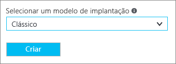
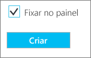

# Configurar uma conexão Ponto a Site com uma rede virtual usando o Portal do Azure (Clássico)

[!INCLUDE [deployment models](../../includes/vpn-gateway-classic-deployment-model-include.md)]

Este artigo mostra como criar uma rede virtual com uma conexão Ponto a Site no modelo de implantação clássico usando o portal do Azure. Você também pode criar essa configuração usando uma ferramenta de implantação ou um modelo de implantação diferente, selecionando uma opção diferente na lista a seguir:

> [!div class="op_single_selector"]
> * [Resource Manager - portal do Azure](vpn-gateway-howto-point-to-site-resource-manager-portal.md)
> * [Resource Manager - PowerShell](vpn-gateway-howto-point-to-site-rm-ps.md)
> * [Clássico - portal do Azure](vpn-gateway-howto-point-to-site-classic-azure-portal.md)
>
>

Uma configuração Ponto a Site (P2S) permite que você crie uma conexão segura de um computador cliente individual com uma rede virtual. O P2S é uma conexão VPN sobre SSTP (Secure Socket Tunneling Protocol). Conexões ponto a site são úteis quando você deseja se conectar à sua rede virtual de um local remoto, como de casa ou de uma conferência, ou quando há apenas alguns clientes que precisam se conectar a uma rede virtual. As conexões ponto a site não exigem um dispositivo VPN ou um endereço IP voltado para o público. Estabeleça a conexão VPN no computador cliente. Para saber mais sobre conexões Ponto a site, consulte as [Perguntas frequentes sobre Ponto a site](#faq) no final deste artigo.

### Configurações de exemplo

Você pode usar os seguintes valores para criar um ambiente de teste ou fazer referência a esses valores para entender melhor os exemplos neste artigo:

* **Nome: VNet1**
* **Espaço de endereço: 192.168.0.0/16** Neste exemplo, usamos apenas um espaço de endereço. Você pode ter mais de um espaço de endereço para sua rede virtual.
* **Nome da sub-rede: FrontEnd**
* **Intervalo de endereços da sub-rede: 192.168.1.0/24**
* **Assinatura:** verifique se você tem mais de uma assinatura, verifique se está usando a correta.
* **Grupo de Recursos: TestRG**
* **Local: Leste dos EUA**
* **Tipo de conexão: ponto a site**
* **Espaço de Endereço de Cliente: 172.16.201.0/24**. Os clientes VPN que se conectarem à rede virtual usando esta conexão Ponto a Site receberão um endereço IP do pool especificado.
* **GatewaySubnet: 192.168.200.0/24**. A sub-rede de Gateway deve usar o nome "GatewaySubnet".
* **Tamanho:** selecione a SKU de gateway que você deseja usar.
* **Tipo de Roteamento: Dinâmico**

## Seção 1 - Criar uma rede virtual e um gateway de VPN

Antes de começar, verifique se você tem uma assinatura do Azure. Se ainda não tiver uma assinatura do Azure, você poderá ativar os [Benefícios do assinante do MSDN](https://azure.microsoft.com/pricing/member-offers/msdn-benefits-details) ou inscrever-se para obter uma [conta gratuita](https://azure.microsoft.com/pricing/free-trial).

### Parte 1: criar uma rede virtual

Se você ainda não tiver uma rede virtual, crie uma. Capturas de tela são fornecidas como exemplos. Substitua os valores pelos seus próprios. Para criar uma rede virtual usando o portal do Azure, use as seguintes etapas:

1. Em um navegador, navegue até o [portal do Azure](http://portal.azure.com) e, se necessário, entre com sua conta do Azure.
2. Clique em **Novo**. No campo **Pesquisar no Marketplace**, digite "Rede Virtual". Localize **Rede Virtual** na lista retornada e clique para abrir a folha **Rede Virtual**.

  
3. Perto da parte inferior da folha Rede Virtual, na lista **Selecionar um modelo de implantação**, selecione **Clássico** e clique em **Criar**.

  
4. Na folha **Criar rede virtual** , defina as configurações da VNet. Nessa folha, você adiciona o primeiro espaço de endereço e um único intervalo de endereços de sub-rede. Depois de terminar a criação da rede virtual, você poderá voltar e adicionar espaços de endereço e sub-redes adicionais.

  
5. Verifique se a **Assinatura** é a correta. Você pode alterar as assinaturas usando o menu suspenso.
6. Clique em **Grupo de recursos** e selecione um grupo de recursos existente ou crie um novo digitando um nome para seu novo grupo de recursos. Se estiver criando um novo grupo de recursos, dê o nome do grupo de recursos de acordo com os valores de configuração planejados. Para saber mais sobre grupos de recursos, acesse [Visão geral do Azure Resource Manager](../azure-resource-manager/resource-group-overview.md#resource-groups).
7. Em seguida, selecione as configurações do **Local** para sua VNet. O local determina onde ficarão os recursos que você implanta nessa rede virtual.
8. Selecione **Fixar no painel** se quiser ser capaz de encontrar sua VNet facilmente no painel, em seguida, clique em **Criar**.

  
9. Depois que você clicar em Criar, um bloco será exibido no painel para refletir o progresso de sua rede virtual. O bloco muda à medida que a rede virtual é criada.

  
10. Quando sua rede virtual tiver sido criada, você verá a denominação **Criada** listada em **Status** na página de redes no Portal Clássico do Azure.
11. Adicionar um servidor DNS (opcional). Depois de criar a rede virtual, você pode adicionar o endereço IP de um servidor DNS para resolução de nomes. O servidor DNS que você especificar deve ser um que possa resolver os nomes dos recursos em sua rede virtual. Para adicionar um servidor DNS, abra as configurações de sua rede virtual, clique em servidores DNS e adicione o endereço IP do servidor DNS que você deseja usar. O pacote de configuração de cliente gerado em uma etapa posterior conterá os endereços IP dos servidores DNS que você especificar nesta configuração. Se você precisar atualizar a lista de servidores DNS no futuro, você pode gerar e instalar novos pacotes de configuração de cliente VPN que refletem a lista atualizada.

### Parte 2: criar um gateway de roteamento dinâmico e de sub-rede de gateway

Nesta etapa, você cria uma sub-rede de gateway e um gateway de roteamento Dinâmico. No portal do Azure para o modelo de implantação clássico, a criação da sub-rede de gateway e do gateway pode ser feita por meio das mesmas folhas de configuração.

1. No portal, navegue até a rede virtual para a qual você deseja criar um gateway.
2. Na folha de sua rede virtual, na folha **Visão geral**, na seção de conexões VPN, clique em **Gateway**.

  
3. Na folha **Nova Conexão VPN**, selecione **Ponto a site**.

  
4. Para **Espaço de Endereço de Cliente**, adicione o intervalo de endereços IP. É o intervalo do qual os clientes VPN recebem um endereço IP ao se conectar. Exclua o intervalo de preenchimento automático e adicione seus próprios.

  
5. Marque a caixa de seleção **Criar gateway imediatamente**.

  
6. Clique em **Configuração de gateway opcional** para abrir a folha **Configuração de gateway**.

  
7. Clique em **Definir configurações de sub-rede necessárias** para adicionar a **sub-rede de gateway**. Embora seja possível criar uma sub-rede de gateway tão pequena quanto /29, recomendamos que você crie uma sub-rede maior que inclua mais endereços selecionando pelo menos /28 ou /27. Isso permitirá endereços suficientes a fim de acomodar as possíveis configurações adicionais que você possa querer no futuro. Ao trabalhar com sub-redes de gateway, evite a associação de um NSG (grupo de segurança de rede) à sub-rede de gateway. Associar um grupo de segurança de rede a essa sub-rede pode fazer com que seu gateway de VPN para parar de funcionar conforme o esperado.

  
8. Selecionar o **tamanho** do gateway. O tamanho é o SKU de gateway do gateway de rede virtual. No portal, a SKU padrão é **Básica**. Para obter informações sobre os SKUs de gateway, confira [Sobre configurações de Gateway de VPN](vpn-gateway-about-vpn-gateway-settings.md#gwsku).

  
9. Selecione o **Tipo de Roteamento** para seu gateway. Configurações de P2S requerem um tipo de roteamento **Dinâmico**. Clique em **OK** quando terminar de configurar esta folha.

  
10. Na folha **Nova Conexão VPN**, clique em **OK** na parte inferior da folha para começar a criar o gateway de rede virtual. Um gateway de VPN pode demorar até 45 minutos para ser concluído.

## Seção 2 - Criar certificados

Os certificados são usados pelo Azure para autenticar clientes de VPN para as VPNs Ponto a Site.

### Parte 1: obter a chave pública (.cer) do certificado raiz

[!INCLUDE [vpn-gateway-basic-vnet-rm-portal](../../includes/vpn-gateway-p2s-rootcert-include.md)]

### Parte 2: gerar um certificado de cliente

[!INCLUDE [vpn-gateway-basic-vnet-rm-portal](../../includes/vpn-gateway-p2s-clientcert-include.md)]

## Seção 3 - carregar o arquivo .cer do certificado raiz

Depois que o gateway tiver sido criado, você poderá carregar o arquivo .cer para um certificado raiz confiável no Azure. Você pode carregar arquivos em até 20 certificados raiz. Você não carrega a chave privada do certificado raiz no Azure. Depois que o arquivo .cer for carregado, o Azure o utilizará para autenticar clientes que se conectam à rede virtual.

1. Na seção **Conexões VPN** da folha de sua VNet, clique no gráfico **Clientes** para abrir a folha **Conexão VPN Ponto-a-site**.

  
2. Na folha **Conexão ponto a site**, clique em **Gerenciar certificados** para abrir a folha **Certificados**. 

    
3. Na folha **Certificados**, clique em **Carregar** para abrir a folha **Carregar um certificado**. 

     
4. Clique no gráfico de pasta para procurar o arquivo .cer. Selecione o arquivo e clique em **OK**. Atualize a página para ver o certificado carregado na folha **Certificados**.

   

## Seção 4 - configurar o cliente

Para se conectar a uma rede virtual usando uma VPN Ponto a Site, cada cliente deverá instalar um pacote de configuração de cliente VPN. O pacote não instala um cliente VPN. Você pode usar o mesmo pacote de configuração de cliente VPN em cada computador cliente, desde que a versão corresponda à arquitetura do cliente. Para obter a lista de sistemas operacionais clientes com suporte, consulte as [Perguntas frequentes sobre conexões Ponto a site](#faq) ao final desse artigo.

O pacote de configuração configura o cliente VPN do Windows nativo com as configurações necessárias para se conectar à rede virtual e, se você especificou um servidor DNS para sua rede virtual, contém o endereço IP do servidor DNS que o cliente usará para a resolução de nomes. Se você alterar o servidor DNS especificado posteriormente, depois de gerar o pacote de configuração do cliente, certifique-se de gerar um novo pacote de configuração do cliente para instalar nos computadores cliente.

### Parte 1: gerar e instalar o pacote de configuração de cliente VPN

1. No portal do Azure, na folha **Visão geral** da rede virtual, em **Conexões VPN**, clique no gráfico de cliente para abrir a folha **Conexão VPN Ponto-a-site**.
2. Na parte superior da folha **Conexão ponto-VPN a-site**, clique no pacote de download que corresponde ao sistema operacional cliente no qual ela será instalada:

  * Para clientes de 64 bits, selecione **Cliente VPN (64 bits)**.
  * Para clientes de 32 bits, selecione **Cliente VPN (32 bits)**.

   
3. Depois que o pacote for gerado, baixe-o e instale-o no computador cliente. Se vir um pop-up do SmartScreen, clique em **Mais informações** e em **Executar mesmo assim**. Você também pode salvar o pacote de instalação em outros computadores clientes.

### Parte 2: Instalar um certificado de cliente

Se você quiser criar uma conexão P2S de um computador cliente diferente daquele usada para gerar os certificados cliente, instale um certificado de cliente. Ao instalar um certificado do cliente, você precisará da senha criada durante a exportação do certificado do cliente. Normalmente, isso é apenas uma questão de clicar duas vezes no certificado e instalá-lo. Para saber mais informações consulte, [Instalar um certificado de cliente exportado](vpn-gateway-certificates-point-to-site.md#install).

## Seção 5 - Conectar-se ao Azure

### Conectar-se à sua VNet

1. Para se conectar à sua rede virtual, no computador cliente, navegue até conexões VPN e localize a conexão VPN que você criou. Ele terá o mesmo nome da sua rede virtual. Clique em **Conectar**. Uma mensagem pop-up pode ser exibida sobre o uso do certificado. Se isso acontecer, clique em **Continuar** para usar os privilégios elevados.
2. Na página de status **Conexão**, clique em **Conectar** para iniciar a conexão. Se for exibida uma tela de **Selecionar certificado** , verifique se o certificado de cliente mostrado é o que você deseja usar para se conectar. Se não for, use a seta suspensa para selecionar o certificado correto e clique em **OK**.

  
3. A conexão é estabelecida.

  

Se estiver tendo problemas para se conectar, verifique os seguintes itens:

- Abra **Gerenciar certificados de usuário** e navegue até **Trusted Root Certification Authorities\Certificates**. Verifique se o certificado raiz está listado. O certificado raiz deve estar presente para que a autenticação funcione. Quando você exporta um .pfx de certificado de cliente usando o valor padrão 'Incluir todos os certificados no caminho de certificação, se possível', as informações do certificado raiz também são exportadas. Quando você instala o certificado do cliente, o certificado raiz também é instalado no computador cliente. 

- Se você estiver usando um certificado emitido com uma solução de AC corporativa e estiver com problemas na autenticação, verifique a ordem de autenticação no certificado do cliente. Você pode verificar a ordem da lista de autenticação ao clicar duas vezes no certificado do cliente e acessar **Detalhes > Uso Avançado de Chave**. Verifique se a lista mostra 'Autenticação de cliente' como o primeiro item. Caso contrário, é necessário emitir um certificado de cliente com base no modelo Usuário que tem a Autenticação de cliente como o primeiro item na lista. 

### Verificar a conexão VPN

1. Para verificar se a conexão VPN está ativa, abra um prompt de comandos com privilégios elevados e execute *ipconfig/all*.
2. Exiba os resultados. Observe que o endereço IP que você recebeu está dentro do intervalo de endereços de conectividade ponto a site que você especificou quando criou a sua VNet. Os resultados devem ser algo semelhante a isto:

Exemplo:

    PPP adapter VNet1:
        Connection-specific DNS Suffix .:
        Description.....................: VNet1
        Physical Address................:
        DHCP Enabled....................: No
        Autoconfiguration Enabled.......: Yes
        IPv4 Address....................: 192.168.130.2(Preferred)
        Subnet Mask.....................: 255.255.255.255
        Default Gateway.................:
        NetBIOS over Tcpip..............: Enabled

 
 Se você estiver tendo problemas para se conectar a uma máquina virtual em P2S, use 'ipconfig' para verificar o endereço IPv4 atribuído ao adaptador Ethernet no computador do qual está se conectando. Se o endereço IP está dentro do intervalo de endereços da VNet a que você está se conectando ou dentro do intervalo de endereços de seu VPNClientAddressPool, isso é chamado de espaço de endereço sobreposto. Quando o espaço de endereço se sobrepõe dessa forma, o tráfego de rede não alcança o Azure; ele permanece na rede local. Se seus espaços de endereço de rede não se sobrepõem e você ainda não consegue se conectar à sua VM, confira [Solucionar problemas de conexão de área de trabalho remota a uma VM](../virtual-machines/windows/troubleshoot-rdp-connection.md).

## Conectar-se a uma máquina virtual

[!INCLUDE [Connect to a VM](../../includes/vpn-gateway-connect-vm-p2s-classic-include.md)]

## Adicionar ou remover certificados raiz confiáveis

Você pode adicionar e remover um certificado raiz do Azure. Quando você remove um certificado raiz, os clientes que possuem um certificado gerado a partir dessa raiz não serão capazes de fazer a autenticação e, portanto, não serão capazes de se conectar. Se você deseja que um clientes faça autenticação e se conecte, você precisa instalar um novo certificado de cliente gerado a partir de um certificado confiável (carregado) no Azure.

### Para adicionar um certificado raiz confiável

Você pode adicionar até 20 arquivos .cer de certificado raiz ao Azure. Para obter instruções, confira [Seção 3 - Carregar o arquivo .cer do certificado raiz](#upload).

### Para remover um certificado raiz confiável

1. Na seção **Conexões VPN** da folha de sua VNet, clique no gráfico **Clientes** para abrir a folha **Conexão VPN Ponto-a-site**.

  
2. Na folha **Conexão ponto a site**, clique em **Gerenciar certificados** para abrir a folha **Certificados**. 

    
3. Na folha **Certificados**, clique no botão de reticências ao lado do certificado que você deseja remover e clique em **Excluir**.

   

## Revogar um certificado de cliente

É possível revogar certificados de cliente. A lista de certificados revogados permite que você negue seletivamente conectividade ponto a site com base em certificados de cliente individuais. Isso é diferente da remoção de um certificado raiz confiável. Se você remover um arquivo .cer de certificado raiz confiável do Azure, ele revogará o acesso para todos os certificados de cliente gerados/assinados pelo certificado raiz revogado. Revogar um certificado de cliente, em vez do certificado raiz, permite que os outros certificados gerados a partir do certificado raiz continuem a ser usados para autenticar a conexão ponto a site.

A prática comum é usar o certificado raiz para gerenciar o acesso em níveis de equipe ou organização, enquanto estiver usando certificados de cliente revogados para controle de acesso refinado em usuários individuais.

### Para revogar um certificado de cliente

Você pode revogar um certificado de cliente adicionando a impressão digital à lista de revogação.

1. Recupere a impressão digital do certificado de cliente. Para saber mais, confira [Como recuperar a impressão digital de um certificado](https://msdn.microsoft.com/library/ms734695.aspx).
2. Copie as informações para um editor de texto e remova todos os espaços para que seja uma cadeia de caracteres contínua.
3. Navegue até a folha **'nome de rede virtual clássica' > Conexão VPN ponto a site > Certificados** e clique em **Lista de revogação** para abrir a folha de Lista de revogação. 
4. Na folha **Lista de revogação**, clique em **+Adicionar certificado** para abrir a folha **Adicionar certificado à lista de revogação**.
5. Na folha **Adicionar certificado à lista de revogação**, cole a impressão digital do certificado como uma linha contínua de texto, sem espaços. Clique em **OK** na parte inferior da folha.
6. Após a conclusão da atualização, o certificado não poderá mais ser usado para se conectar. Os clientes que tentam se conectar usando este certificado recebem uma mensagem informando que o certificado não é mais válido.

## Perguntas frequentes sobre Ponto a site

[!INCLUDE [Point-to-Site FAQ](../../includes/vpn-gateway-point-to-site-faq-include.md)]

## Próximas etapas
Quando sua conexão for concluída, você poderá adicionar máquinas virtuais às suas redes virtuais. Para saber mais, veja [Máquinas virtuais](https://docs.microsoft.com/azure/#pivot=services&panel=Compute). Para saber mais sobre redes e máquinas virtuais, consulte [Visão geral de rede do Azure e VM Linux](../virtual-machines/linux/azure-vm-network-overview.md).

