# <a name="configure-a-point-to-site-connection-by-using-certificate-authentication-classic"></a>Configurar uma conexão ponto a site usando a autenticação de certificado (clássico)

[!INCLUDE [deployment models](../../includes/vpn-gateway-classic-deployment-model-include.md)]

Este artigo mostra como criar uma VNet com uma conexão ponto a site. Você cria essa VNet com o modelo de implantação clássico usando o portal do Azure. Essa configuração usa certificados para autenticar o cliente de conexão, autoassinado ou emitido por uma Autoridade de Certificação. Você também pode criar essa configuração com um modelo ou ferramenta de implantação diferente usando as opções descritas nos artigos a seguir:

> [!div class="op_single_selector"]
> * [Portal do Azure](vpn-gateway-howto-point-to-site-resource-manager-portal.md)
> * [PowerShell](vpn-gateway-howto-point-to-site-rm-ps.md)
> * [Portal do Azure (clássico)](vpn-gateway-howto-point-to-site-classic-azure-portal.md)
>

Use um gateway VPN P2S (conexão ponto a site) para criar uma conexão segura para sua rede virtual com base em um computador cliente individual. As conexões VPN ponto a site são úteis quando você deseja se conectar à rede virtual de uma localização remota. Quando você tiver apenas alguns clientes que precisam se conectar a uma VNet, uma VPN P2S é uma solução útil para ser usada em vez da VPN site a site. Uma conexão VPN P2S é estabelecida iniciando-a do computador cliente.

> [!IMPORTANT]
> O modelo de implantação clássico dá suporte somente a clientes VPN do Windows e usa o protocolo SSTP (Secure Socket Tunneling), um protocolo de VPN baseada em SSL. Para a compatibilidade com clientes VPN não Windows, você deve criar sua VNet com o modelo de implantação do Resource Manager. O modelo de implantação do Resource Manager oferece suporte à VPN IKEv2, além de SSTP. Para saber mais, veja [Sobre conexões P2S](point-to-site-about.md).
>
>

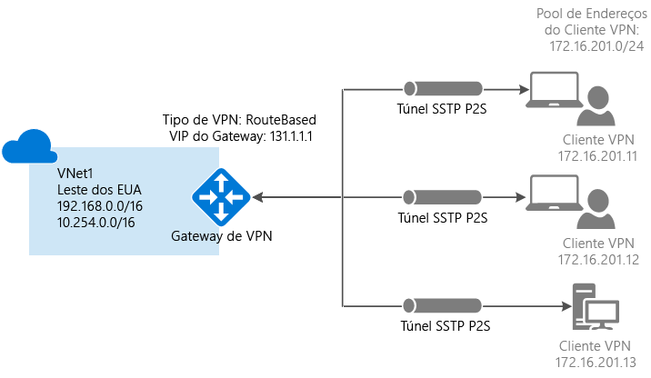

## <a name="prerequisites"></a>Pré-requisitos

As conexões de autenticação de certificado de ponto a site exigem os seguintes pré-requisitos:

* Um gateway de VPN dinâmico.
* A chave pública (arquivo .cer) para um certificado raiz, que é carregado no Azure. Essa chave é considerada um certificado confiável e é usada para autenticação.
* O certificado de cliente é gerado a partir do certificado raiz e instalado em cada computador cliente que irá se conectar. Esse certificado é usado para autenticação do cliente.
* Um pacote de configuração de cliente VPN deve ser gerado e instalado em cada computador cliente que se conecta. O pacote de configuração do cliente configura o cliente VPN nativo que já está no sistema operacional com as informações necessárias para se conectar à VNet.

As conexões Ponto a Site não exigem um dispositivo VPN ou um endereço IP voltado para o público local. A conexão VPN é criada no SSTP (Secure Socket Tunneling Protocol). No lado do servidor, há suporte para as versões 1.0, 1.1 e 1.2 do SSTP. O cliente decide qual versão usar. Por padrão, para Windows 8.1 e posterior, o SSTP usa 1.2. 

Para saber mais sobre conexões ponto a site, confira [Perguntas frequentes sobre ponto a site](#point-to-site-faq).

### <a name="example-settings"></a>Configurações de exemplo

Use os seguintes valores para criar um ambiente de teste ou fazer referência a esses valores para entender melhor os exemplos neste artigo:

- **Criar as configurações de uma rede virtual (clássica)**
   - **Nome**: Insira *VNet1*.
   - **Espaço de endereço**: Insira *192.168.0.0/16*. Neste exemplo, usamos apenas um espaço de endereço. Você pode ter mais de um espaço de endereço para a sua rede virtual, conforme mostrado no diagrama.
   - **Nome da sub-rede**: Insira *FrontEnd*.
   - **Intervalo de endereços da sub-rede**: Insira *192.168.1.0/24*.
   - **Assinatura**: Selecione uma assinatura na lista de assinaturas disponíveis.
   - **Grupo de recursos**: Insira *TestRG*. Selecione **Criar novo** se o grupo de recursos não existir.
   - **Localização**: Selecione **Leste dos EUA** na lista.

  - **Configurações de conexão VPN**
    - **Tipo de conexão**: Selecione **Ponto a site**.
    - **Espaço de Endereço de Cliente**: Insira *172.16.201.0/24*. Os clientes VPN que se conectarem à rede virtual usando esta conexão Ponto a Site receberão um endereço IP do pool especificado.

- **Definições de sub-rede de configuração do Gateway**
   - **Nome**: Preenchido automaticamente com *GatewaySubnet*.
   - **Intervalo de endereços**: Insira *192.168.200.0/24*. 

- **Definições de configuração do Gateway**:
   - **Tamanho**: Selecione a SKU de gateway que você deseja usar.
   - **Tipo de Roteamento**: selecione **Dinâmico**.

## <a name="create-a-virtual-network-and-a-vpn-gateway"></a>Criar uma rede virtual e um gateway de VPN

Antes de começar, verifique se você tem uma assinatura do Azure. Se ainda não tiver uma assinatura do Azure, você poderá ativar os [Benefícios do assinante do MSDN](https://azure.microsoft.com/pricing/member-offers/msdn-benefits-details) ou inscrever-se para obter uma [conta gratuita](https://azure.microsoft.com/pricing/free-trial).

### <a name="part-1-create-a-virtual-network"></a>Parte 1: Criar uma rede virtual

Se você ainda não tiver uma VNet (rede virtual), crie uma. Capturas de tela são fornecidas como exemplos. Substitua os valores pelos seus próprios. Para criar uma rede virtual usando o portal do Azure, use as seguintes etapas:

1. Entre no [portal do Azure](https://portal.azure.com) e selecione **Criar um recurso**. A página **Novo** é aberta. 

2. No campo **Pesquisar no marketplace**, insira *rede virtual* e selecione **Rede virtual** na lista retornada. A página **Rede virtual** é aberta.

3. Na lista **Selecionar um modelo de implantação**, selecione **Clássico** e, em seguida, **Criar**. A página **Criar rede virtual** é aberta.

4. Na página **Criar rede virtual**, defina as configurações da VNet. Nessa página, você adiciona o primeiro espaço de endereço e um único intervalo de endereços da sub-rede. Depois de terminar a criação da rede virtual, você poderá voltar e adicionar espaços de endereço e sub-redes adicionais.

   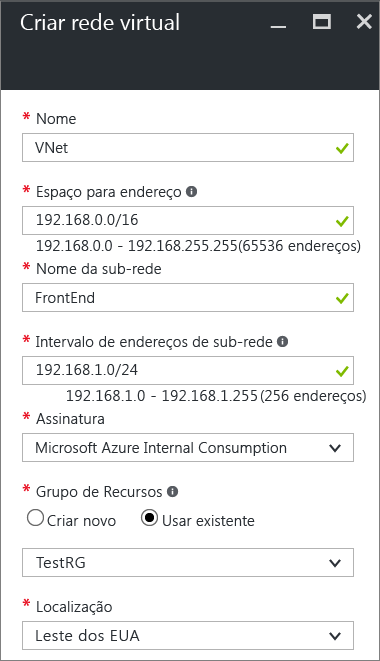

5. Selecione a **Assinatura** que deseja usar na lista suspensa.

6. Selecione um **Grupo de Recursos** existente. Ou crie um novo grupo de recursos selecionando **Criar novo** e inserindo um nome. Se estiver criando um novo grupo de recursos, dê o nome a ele de acordo com os valores de configuração planejados. Para saber mais sobre os grupos de recursos, confira [Visão geral do Azure Resource Manager](../azure-resource-manager/resource-group-overview.md#resource-groups).

7. Selecione uma **Localização** para a VNet. Essa configuração determina a localização geográfica dos recursos que você implanta nessa VNet.

8. Selecione **Criar** para criar a VNet. Na página **Notificações**, você verá uma mensagem de **Implantação em andamento**.

8. Depois de sua rede virtual ter sido criada, a mensagem na página **Notificações** muda para **Implantação bem-sucedida**. Selecione **Fixar no painel** se desejar encontrar facilmente sua VNet no painel. 

10. Adicionar um servidor DNS (opcional). Depois de criar a rede virtual, você pode adicionar o endereço IP de um servidor DNS para resolução de nomes. O endereço IP do servidor DNS especificado deve ser um que possa resolver os nomes dos recursos em sua VNet.

    Para adicionar um servidor DNS, selecione **servidores DNS** da página da sua VNet. Em seguida, insira o endereço IP do servidor DNS que deseja usar e selecione **Salvar**.

### <a name="part-2-create-a-gateway-subnet-and-a-dynamic-routing-gateway"></a>Parte 2: Criar um gateway de roteamento dinâmico e de sub-rede de gateway

Nesta etapa, você cria uma sub-rede de gateway e um gateway de roteamento dinâmico. No portal do Azure para o modelo de implantação clássico, você cria a sub-rede de gateway e o gateway com as mesmas páginas de configuração. Use a sub-rede de gateway apenas para serviços de gateway. Nunca implante algo diretamente na sub-rede do gateway (como VMs ou outros serviços).

1. No portal do Azure, navegue até a rede virtual para a qual você deseja criar um gateway.

2. Na página da sua rede virtual, selecione **Visão Geral** e, na seção **Conexões VPN**, selecione **Gateway**.

   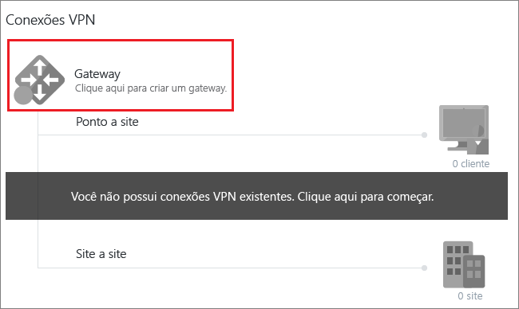
3. Na página **Nova Conexão VPN**, selecione **Ponto a site**.

   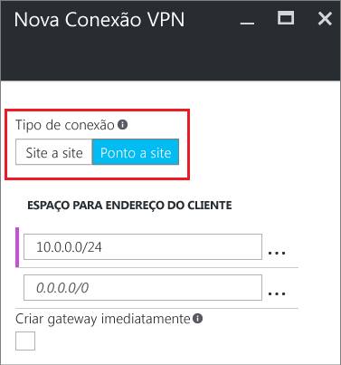
4. Para **Espaço de Endereço de Cliente**, adicione o intervalo de endereços IP dos quais os clientes VPN recebem um endereço IP ao se conectar. Use um intervalo de endereços IP privado que não coincida com a localização local da qual você se conecta ou com a rede virtual à qual você se conecta. Você pode substituir o intervalo de preenchimento automático com o intervalo de endereços IP privado que você deseja usar. Este exemplo mostra o preenchimento automático à distância. 

   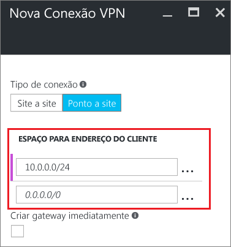
5. Selecione **Criar gateway imediatamente** e selecione **Configuração do gateway opcional** para abrir a página **Configuração de gateway**.

   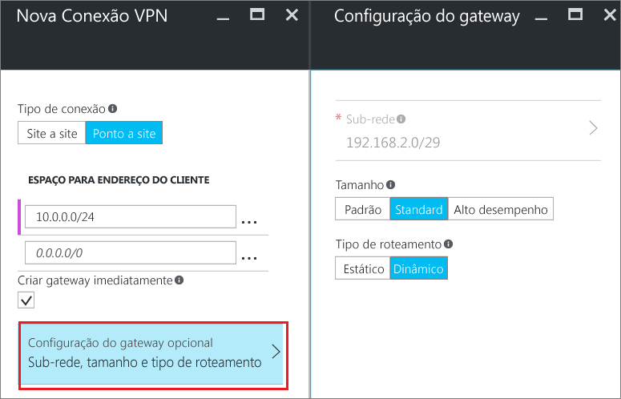

6. Na página **Configuração de gateway**, selecione **Sub-rede** para adicionar a sub-rede de gateway. É possível criar uma sub-rede de gateway tão pequena quanto/29. No entanto, recomendamos que você crie uma sub-rede maior que inclua mais endereços selecionando pelo menos /28 ou /27. Fazer isso permitirá endereços suficientes a fim de acomodar as possíveis configurações adicionais que você possa querer no futuro. Ao trabalhar com sub-redes de gateway, evite a associação de um NSG (grupo de segurança de rede) à sub-rede de gateway. Associar um grupo de segurança de rede a essa sub-rede pode fazer com que seu gateway de VPN não funcione conforme o esperado. Selecione **OK** para salvar essa configuração.

   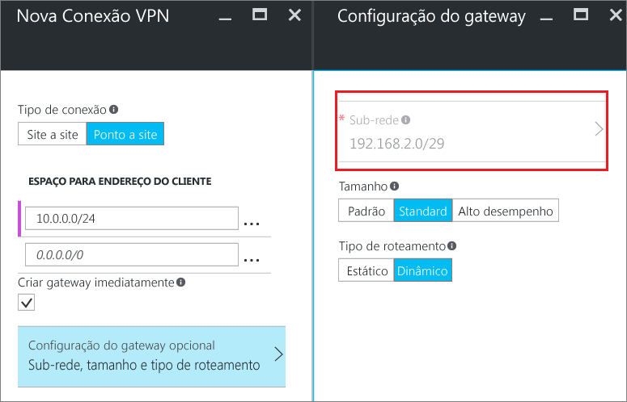
7. Selecionar o **tamanho** do gateway. O tamanho é o SKU de gateway do gateway de rede virtual. No portal do Azure, a SKU padrão é **Padrão**. Para obter informações sobre os SKUs de gateway, confira [Sobre configurações de gateway de VPN](vpn-gateway-about-vpn-gateway-settings.md#gwsku).

   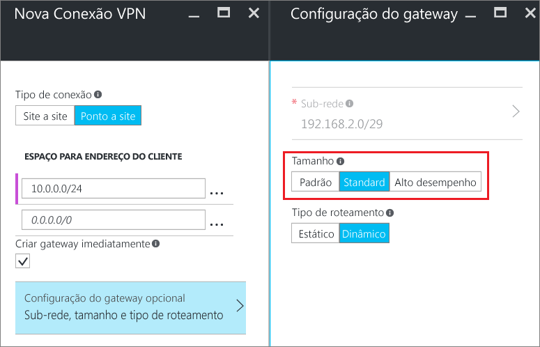
8. Selecione o **Tipo de Roteamento** para seu gateway. Configurações de P2S requerem um tipo de roteamento **Dinâmico**. Selecione **OK** quando terminar de configurar esta página.

   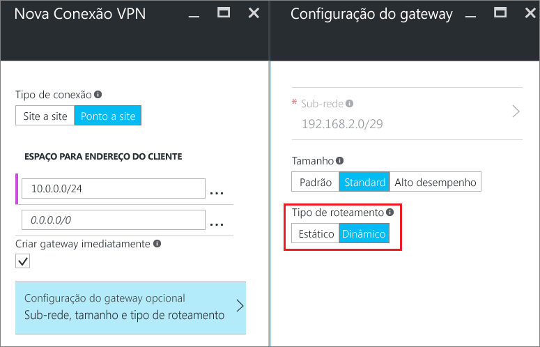

9. Na página **Nova Conexão VPN**, selecione **OK** na parte inferior da página para começar a criar o gateway de rede virtual. Um gateway de VPN pode levar até 45 minutos para ser concluído, dependendo do SKU de gateway que você selecionar.
 
## <a name="generatecerts"></a>Criar certificados

O Azure usa certificados para autenticar clientes VPN para VPNs ponto a site. Você pode carregar as informações da chave públicas do certificado raiz no Azure. A chave pública é considerada *confiável*. Os certificados de cliente devem ser gerados do certificado raiz confiável e, em seguida, em cada computador cliente no repositório de certificados Certificates-Current User\Personal\Certificates. O certificado é usado para autenticar o cliente quando ele se conecta à VNet. 

Se você usa certificados autoassinados, eles devem ser criados usando parâmetros específicos. Você pode criar um certificado autoassinado usando as instruções para [PowerShell e Windows 10](vpn-gateway-certificates-point-to-site.md) ou [MakeCert](vpn-gateway-certificates-point-to-site-makecert.md). É importante que você siga as etapas nestas instruções ao usar os certificados raiz autoassinados e gerar certificados de cliente do certificado raiz autoassinado. Caso contrário, os certificados criados não serão compatíveis com conexões P2S e você receberá um erro de conexão.

### <a name="acquire-the-public-key-cer-for-the-root-certificate"></a>Adquirir a chave pública (.cer) do certificado raiz

[!INCLUDE [vpn-gateway-basic-vnet-rm-portal](../../includes/vpn-gateway-p2s-rootcert-include.md)]

### <a name="generate-a-client-certificate"></a>Gerar um certificado de cliente

[!INCLUDE [vpn-gateway-basic-vnet-rm-portal](../../includes/vpn-gateway-p2s-clientcert-include.md)]

## <a name="upload-the-root-certificate-cer-file"></a>Carregar o arquivo .cer do certificado raiz

Após o gateway ser criado, você pode carregar o arquivo. cer (que contém as informações de chave pública) para um certificado raiz confiável do Azure. Não carregue a chave privada do certificado raiz. Depois de carregar o certificado, o Azure o utiliza para autenticar clientes com um certificado de cliente instalado gerado de um certificado raiz confiável. Você pode carregar arquivos de certificado raiz confiável adicionais posteriormente (até um total de 20) se necessário.  

1. Na seção **Conexões VPN** da página de sua VNet, selecione o gráfico de clientes para abrir a página **Conexão VPN de ponto a site**.

   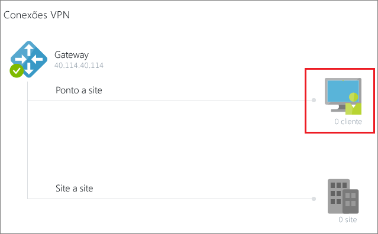

2. Na página **Conexão VPN de ponto a site**, selecione **Gerenciar certificado** para abrir a página **Certificados**.

   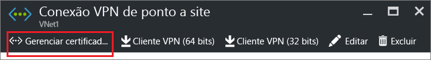

1. Na página **Certificados**, selecione **Carregar** para abrir a página **Carregar um certificado**.

    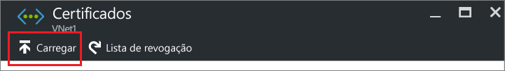

4. Selecione o gráfico de pasta para procurar o arquivo .cer. Selecione o arquivo e selecione **OK**. O certificado carregado aparece na página **Certificados**.

   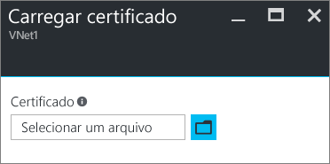


## <a name="configure-the-client"></a>Configurar o cliente

Para se conectar a uma rede virtual usando uma VPN ponto a site, cada cliente deve instalar um pacote para configurar o cliente VPN do Windows nativo. O pacote de configuração configura o cliente VPN do Windows nativo com as configurações necessárias para se conectar à rede virtual.

Você pode usar o mesmo pacote de configuração de cliente VPN em cada computador cliente, desde que a versão corresponda à arquitetura do cliente. Para obter a lista de sistemas operacionais compatíveis, confira as [Perguntas frequentes sobre conexões ponto a site](#point-to-site-faq).

### <a name="generate-and-install-a-vpn-client-configuration-package"></a>Gerar e instalar um pacote de configuração de cliente VPN

1. No portal do Azure, na página **Visão geral** da rede virtual, em **Conexões VPN**, selecione o gráfico do cliente para abrir a página **Conexão VPN de ponto a site**.

2. Na página **Conexão VPN de ponto a site**, selecione o pacote de download que corresponde ao sistema operacional cliente em que ele está instalado:

   * Para clientes de 64 bits, selecione **Cliente VPN (64 bits)**.
   * Para clientes de 32 bits, selecione **Cliente VPN (32 bits)**.

   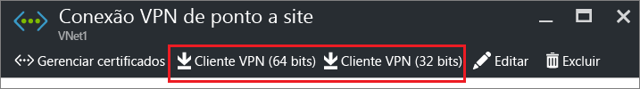

3. Depois que o pacote for gerado, baixe-o e instale-o no computador cliente. Se vir um pop-up do SmartScreen, selecione **Mais informações** e **Executar mesmo assim**. Você também pode salvar o pacote de instalação em outros computadores clientes.

### <a name="install-a-client-certificate"></a>Instalar um certificado de cliente

Para criar uma conexão P2S de um computador cliente diferente daquele usado para gerar os certificados cliente, instale um certificado de cliente. Ao instalar um certificado do cliente, você precisará da senha criada durante a exportação do certificado do cliente. Normalmente, você pode instalar o certificado simplesmente clicando duas vezes nele. Para saber mais informações consulte, [Instalar um certificado de cliente exportado](vpn-gateway-certificates-point-to-site.md#install).


## <a name="connect-to-your-vnet"></a>Conectar-se à sua VNet

>[!NOTE]
>Você deve ter direitos de Administrador no computador cliente do qual você está se conectando.
>
>

1. Para se conectar à sua rede virtual, no computador cliente, navegue até **Conexões VPN** no portal do Azure e localize a conexão VPN que você criou. A conexão VPN tem o mesmo nome que sua rede virtual. Selecione **Conectar**. Se aparecer uma mensagem pop-up sobre o certificado, selecione **Continuar** para usar privilégios elevados.

2. Na página de status **Conexão**, selecione **Conectar** para iniciar a conexão. Se você vir a tela **Selecionar Certificado**, verifique se o certificado do cliente exibido é o correto. Se não, selecione o certificado correto na lista suspensa e, em seguida, selecione **Ok**.

3. Se a conexão for bem-sucedida, você verá uma notificação **Conectado**.


### <a name="troubleshooting-p2s-connections"></a>Solucionar problemas de conexões P2S

[!INCLUDE [verify-client-certificates](../../includes/vpn-gateway-certificates-verify-client-cert-include.md)]

## <a name="verify-the-vpn-connection"></a>Verificar a conexão VPN

1. Verifique se a conexão VPN está ativa. Abra um prompt de comandos com privilégios elevados no computador cliente e execute **ipconfig/all**.
2. Exiba os resultados. Observe que o endereço IP que você recebeu está dentro do intervalo de endereços de conectividade ponto a site que você especificou quando criou a sua VNet. Os resultados devem ser semelhantes a este exemplo:

   ```
    PPP adapter VNet1:
        Connection-specific DNS Suffix .:
        Description.....................: VNet1
        Physical Address................:
        DHCP Enabled....................: No
        Autoconfiguration Enabled.......: Yes
        IPv4 Address....................: 192.168.130.2(Preferred)
        Subnet Mask.....................: 255.255.255.255
        Default Gateway.................:
        NetBIOS over Tcpip..............: Enabled
   ```

## <a name="connect-to-a-virtual-machine"></a>Conectar-se a uma máquina virtual

[!INCLUDE [Connect to a VM](../../includes/vpn-gateway-connect-vm-p2s-classic-include.md)]

## <a name="add-or-remove-trusted-root-certificates"></a>Adicionar ou remover certificados raiz confiáveis

Você pode adicionar e remover um certificado raiz do Azure. Quando você remove um certificado raiz, os clientes que têm um certificado gerado dessa raiz não poderão mais fazer a autenticação e se conectar. Para esses clientes fazerem a autenticação e se conectem novamente, você deve instalar um novo certificado do cliente gerado de um certificado confiável pelo Azure.

### <a name="to-add-a-trusted-root-certificate"></a>Para adicionar um certificado raiz confiável

Você pode adicionar até 20 arquivos .cer de certificado raiz ao Azure. Para obter instruções, confira Carregar o arquivo .cer do certificado raiz.

### <a name="to-remove-a-trusted-root-certificate"></a>Para remover um certificado raiz confiável

1. Na seção **Conexões VPN** da página de sua VNet, selecione o gráfico de clientes para abrir a página **Conexão VPN de ponto a site**.

   

2. Na página **Conexão VPN de ponto a site**, selecione **Gerenciar certificado** para abrir a página **Certificados**.

   

3. Na página **Certificados**, selecione as reticências ao lado do certificado que você deseja remover e selecione **Excluir**.

   

## <a name="revoke-a-client-certificate"></a>Revogar um certificado de cliente

Se necessário, você pode revogar um certificado de cliente. A lista de certificados revogados permite que você negue seletivamente conectividade ponto a site com base em certificados de cliente individuais. Este método é diferente da remoção de um certificado raiz confiável. Se você remover um arquivo .cer de certificado raiz confiável do Azure, ele revogará o acesso para todos os certificados de cliente gerados/assinados pelo certificado raiz revogado. Revogar um certificado de cliente, em vez do certificado raiz, permite que os outros certificados gerados a partir do certificado raiz continuem a ser usados para autenticar a conexão ponto a site.

A prática comum é usar o certificado raiz para gerenciar o acesso em níveis de equipe ou organização, enquanto estiver usando certificados de cliente revogados para controle de acesso refinado em usuários individuais.

### <a name="to-revoke-a-client-certificate"></a>Para revogar um certificado de cliente

Você pode revogar um certificado de cliente adicionando a impressão digital à lista de revogação.

1. Recupere a impressão digital do certificado de cliente. Para obter mais informações, confira [Como recuperar a impressão digital de um certificado](https://msdn.microsoft.com/library/ms734695.aspx).
2. Copie as informações para um editor de texto e remova os espaços para que seja uma cadeia de caracteres contínua.
3. Navegue até a rede virtual clássica. Selecione **Conexão VPN de ponto a site** e **Gerenciar certificado** para abrir a página **Certificados**.
4. Selecione **Lista de revogação** para abrir a página **Lista de revogação**. 
5. Selecione **Adicionar certificado** para abrir a página **Adicionar certificado à lista de revogação**.
6. Na **Impressão digital**, cole a impressão digital do certificado como uma linha contínua de texto, sem espaços. Selecione **OK** para concluir.

Após a conclusão da atualização, o certificado não poderá mais ser usado para se conectar. Os clientes que tentam se conectar usando este certificado recebem uma mensagem informando que o certificado não é mais válido.

## <a name="point-to-site-faq"></a>Perguntas frequentes sobre ponto a site

[!INCLUDE [Point-to-Site FAQ](../../includes/vpn-gateway-faq-point-to-site-classic-include.md)]

## <a name="next-steps"></a>Próximas etapas

- Após sua conexão ser concluída, você poderá adicionar máquinas virtuais às suas redes virtuais. Para saber mais, veja [Máquinas virtuais](https://docs.microsoft.com/azure/). 

- Para saber mais sobre redes e máquinas virtuais do Linux, confira [Visão geral de rede de VMs do Linux e do Azure](../virtual-machines/linux/network-overview.md).

- Para obter informações sobre solução de problemas de P2S, consulte [Solução de problemas de conexões de ponto a site do Azure](vpn-gateway-troubleshoot-vpn-point-to-site-connection-problems.md).
