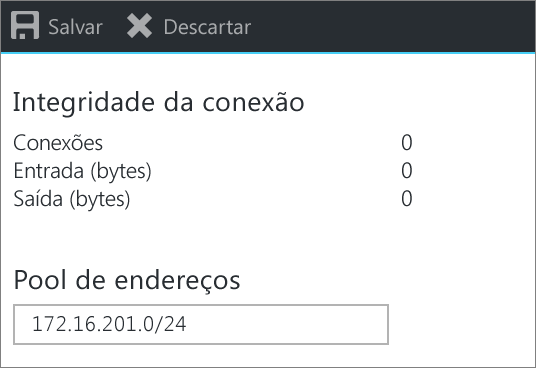

# <a name="configure-a-point-to-site-connection-to-a-vnet-using-native-azure-certificate-authentication-azure-portal"></a>Para isso, configure uma conexão ponto a site em uma VNet usando a autenticação de certificado nativa do Azure: Portal do Azure

Este artigo ajuda você a conectar clientes individuais que executem Windows, Linux ou Mac OS X a uma VNet do Azure com segurança. As conexões VPN Ponto a Site são úteis quando você deseja se conectar à rede virtual de um local remoto, como ao trabalhar de casa ou em uma conferência. Também é possível usar P2S em vez de uma VPN Site a Site, quando você tiver apenas alguns clientes que precisam se conectar a uma VNet. As conexões Ponto a Site não exigem um dispositivo VPN ou um endereço IP voltado para o público. A P2S cria a conexão VPN no SSTP (Secure Socket Tunneling Protocol) ou IKEv2. Para obter mais informações sobre conexões VPN Ponto a Site, consulte [Sobre VPN Ponto a Site](point-to-site-about.md).


## <a name="architecture"></a>Arquitetura

Conexões nativas de autenticação de certificado do Azure Ponto a Site usam os itens a seguir, os quais são configurados neste exercício:

* Gateway de VPN RouteBased.
* A chave pública (arquivo .cer) para um certificado raiz, que é carregado no Azure. Depois que o certificado é carregado, ele é considerado um certificado confiável e é usado para autenticação.
* Um certificado do cliente que é gerado a partir do certificado raiz. O certificado do cliente instalado em cada computador cliente que se conectará à VNet. Esse certificado é usado para autenticação do cliente.
* Uma configuração de cliente VPN. Os arquivos de configuração de cliente VPN contém as informações necessárias para o cliente se conectar à VNet. Os arquivos configuram o cliente VPN existente que é nativo do sistema operacional. Cada cliente que se conecta deve ser configurado usando as configurações nos arquivos de configuração.

#### <a name="example"></a>Valores de exemplo

Você pode usar os seguintes valores para criar um ambiente de teste ou fazer referência a esses valores para entender melhor os exemplos neste artigo:

* **Nome da VNet:** VNet1
* **Espaço de endereço:** 192.168.0.0/16<br>Neste exemplo, usamos apenas um espaço de endereço. Você pode ter mais de um espaço de endereço para sua rede virtual.
* **Nome da sub-rede:** FrontEnd
* **Intervalo de endereços da sub-rede:**  192.168.1.0/24
* **Assinatura:** Se você tem mais de uma assinatura, verifique se está usando a correta.
* **Grupo de recursos:** TestRG
* **Localização:** Leste dos EUA
* **GatewaySubnet:** 192.168.200.0/24<br>
* **Servidor DNS:** (opcional) endereço IP do servidor DNS que você deseja usar para a resolução de nome.
* **Nome do gateway de rede virtual:** VNet1GW
* **Tipo de gateway:** VPN
* **Tipo de VPN:** Baseado em rotas
* **Nome do endereço IP público:** VNet1GWpip
* **Tipo de conexão**: Point-to-site
* **Pool de endereços do cliente:** 172.16.201.0/24<br>Os clientes VPN que se conectarem à rede virtual usando esta conexão Ponto a Site receberão um endereço IP do pool de endereços do cliente.

## <a name="createvnet"></a>1. Criar uma rede virtual

Antes de começar, verifique se você tem uma assinatura do Azure. Se ainda não tiver uma assinatura do Azure, você poderá ativar os [Benefícios do assinante do MSDN](https://azure.microsoft.com/pricing/member-offers/msdn-benefits-details) ou inscrever-se para obter uma [conta gratuita](https://azure.microsoft.com/pricing/free-trial).
[!INCLUDE [Basic Point-to-Site VNet](../../includes/vpn-gateway-basic-p2s-vnet-rm-portal-include.md)]

## <a name="gatewaysubnet"></a>2. Adicionar uma sub-rede de gateway

Antes de conectar sua Rede Virtual a um gateway, você precisará criar a sub-rede de gateway para a Rede Virtual à qual você deseja se conectar. Os serviços de gateway usam os endereços IP especificados na sub-rede do gateway. Se possível, crie uma sub-rede de gateway usando um bloco CIDR de /28 ou /27, para fornecer endereços IP suficientes para acomodar requisitos de configuração futuros.

[!INCLUDE [vpn-gateway-add-gwsubnet-rm-portal](../../includes/vpn-gateway-add-gwsubnet-p2s-rm-portal-include.md)]

## <a name="dns"></a>3. Especificar um servidor DNS (opcional)

Depois de criar a rede virtual, você pode adicionar o endereço IP de um servidor DNS para lidar com a resolução de nomes. O servidor DNS é opcional para essa configuração, mas necessário se você quer a resolução de nomes. A especificação de um valor não cria um novo servidor DNS. O endereço IP do servidor DNS especificado deve ser um servidor DNS que pode resolver os nomes dos recursos aos quais você está se conectando. Neste exemplo, usamos um endereço IP privado, mas é provável que ele não seja o endereço IP do seu servidor DNS. Use seus próprios valores. O valor especificado é usado pelos recursos que são implantados para a rede virtual, não com a conexão de P2S no cliente de VPN.

[!INCLUDE [vpn-gateway-add-dns-rm-portal](../../includes/vpn-gateway-add-dns-rm-portal-include.md)]

## <a name="creategw"></a>4. Criar um gateway de rede virtual

[!INCLUDE [create-gateway](../../includes/vpn-gateway-add-gw-p2s-rm-portal-include.md)]

>[!NOTE]
>A SKU Básica não dá suporte à autenticação IKEv2 ou RADIUS. Se você estiver planejando clientes Mac, se conecte à sua rede virtual, não use a SKU básica.
>

## <a name="generatecert"></a>5. Gerar certificados

Certificados são usados pelo Azure para autenticar clientes que se conectam a uma VNet por meio de conexão VPN Ponto a Site. Depois de obter um certificado raiz, você poderá [carregar](#uploadfile) as informações de chave pública para o Azure. O certificado raiz é considerado 'confiável' pelo Azure para conexão sobre P2S com a rede virtual. Você também gera certificados do cliente a partir do certificado raiz confiável e os instala em cada computador cliente. O certificado do cliente é usado para autenticar o cliente quando ele inicia uma conexão de rede virtual. 

### <a name="getcer"></a>1. Obter o arquivo .cer do certificado raiz

[!INCLUDE [root-certificate](../../includes/vpn-gateway-p2s-rootcert-include.md)]

### <a name="generateclientcert"></a>2. Gerar um certificado de cliente

[!INCLUDE [generate-client-cert](../../includes/vpn-gateway-p2s-clientcert-include.md)]

## <a name="addresspool"></a>6. Adicionar o pool de endereços de cliente

O pool de endereços do cliente é um intervalo de endereços IP que você especificar. Os clientes que se conectam por VPN ponto a site recebem dinamicamente um endereço IP desse intervalo. Use um intervalo de endereço IP privado que não coincida com o local de onde você se conecta ou com a rede virtual à qual você deseja se conectar.

1. Quando o gateway de rede virtual tiver sido criado, navegue até a seção **Configurações** da página do gateway de rede virtual. Na seção **Configurações**, clique em **Configuração ponto a site**.

    
2. Clique em **Configurar agora** para abrir a página de configuração.

   
3. Na página de configuração **Ponto a site**, na caixa **Pool de endereços**, adicione o intervalo de endereços IP privado que deseja usar. Os clientes VPN recebem dinamicamente um endereço IP do intervalo que você especificar. Clique em **Salvar** para validar e salvar a configuração.

   

   >[!NOTE]
   >Se você não vir o tipo de Túnel ou tipo de Autenticação no portal nesta página, o gateway está usando o SKU básico. A SKU Básica não dá suporte à autenticação IKEv2 ou RADIUS.
   >

## <a name="tunneltype"></a>7. Configurar o tipo de túnel

Você pode selecionar o tipo de túnel. As duas opções de túneis são SSTP e IKEv2. O cliente strongSwan no Android e no Linux e o cliente nativo VPN IKEv2 no iOS e no OSX usarão somente o túnel IKEv2 para se conectar. Os clientes Windows tentam o IKEv2 primeiro e, se isso gerar a conexão, retornarão ao SSTP. Você pode habilitar um deles ou ambos. Marque as caixas de seleção que sua solução exige.


## <a name="authenticationtype"></a>8. Configurar o tipo de autenticação

Selecionar **certificado do Azure**.

  

## <a name="uploadfile"></a>9. Carregar os dados de certificado público do certificado raiz

Você pode carregar outros certificados raiz confiáveis até um total de 20. Uma vez carregados os dados públicos do certificado, o Azure pode usá-los para autenticar clientes com um certificado do cliente instalado gerado a partir de um certificado raiz confiável. Carregue as informações da chave pública do certificado raiz no Azure.

1. Os certificados são adicionados na página **Configuração Ponto a site** na seção **Certificado raiz**.
2. Verifique se você exportou o certificado raiz como um arquivo x.509 (.cer) codificado em Base 64. Você precisa exportar o certificado neste formato para poder abri-lo em um editor de texto.
3. Abra o certificado com um editor de texto, como o Bloco de Notas. Ao copiar os dados do certificado, certifique-se de copiar o texto como uma linha contínua sem retornos de carro ou alimentações de linha. Talvez seja necessário modificar a exibição no editor de texto para 'Mostrar símbolo/Mostrar todos os caracteres' para ver os retornos de carro e alimentações de linha. Copie apenas a seção a seguir como uma linha contínua:

   
4. Cole os dados do certificado no campo **Dados de Certificado Público**. **Nomeie** o certificado e, em seguida, clique em **Salvar**. Pode adicionar até 20 certificados raiz.

   
5. Clique em **Salvar** na parte superior da página para salvar todas as configurações.

   

## <a name="installclientcert"></a>10. Instalar um certificado do cliente exportado

Se você quiser criar uma conexão P2S de um computador cliente diferente daquele usada para gerar os certificados cliente, instale um certificado de cliente. Ao instalar um certificado do cliente, você precisará da senha criada durante a exportação do certificado do cliente.

Verifique se o certificado do cliente foi exportado como um .pfx juntamente com a cadeia de certificado inteira (que é o padrão). Caso contrário, as informações do certificado raiz não estão presentes no computador cliente e este não será capaz de fazer a autenticação corretamente.

Para as etapas de instalação, confira [Instalar um certificado de cliente](point-to-site-how-to-vpn-client-install-azure-cert.md).

## <a name="clientconfig"></a>11. Gerar e instalar o pacote de configuração de cliente VPN

Os arquivos de configuração de cliente de VPN contêm configurações para definir os dispositivos a fim de se conectar a uma VNet através de uma conexão de P2S. Para obter instruções sobre como gerar e instalar arquivos de configuração de cliente de VPN, confira [Criar e instalar arquivos de configuração de cliente de VPN para configurações de PS2 de autenticação de certificado nativa do Azure ](point-to-site-vpn-client-configuration-azure-cert.md).

## <a name="connect"></a>12. Conecte-se ao Azure

### <a name="to-connect-from-a-windows-vpn-client"></a>Para conectar-se a partir de um cliente de VPN do Windows

>[!NOTE]
>Você deve ter direitos de Administrador no computador cliente do Windows do qual você está se conectando.
>
>

1. Para se conectar à sua rede virtual, no computador cliente, navegue até conexões VPN e localize a conexão VPN que você criou. Ele terá o mesmo nome da sua rede virtual. Clique em **Conectar**. Uma mensagem pop-up pode ser exibida sobre o uso do certificado. Clique em **Continuar** para usar os privilégios elevados.

2. Na página de status **Conexão**, clique em **Conectar** para iniciar a conexão. Se for exibida uma tela de **Selecionar certificado** , verifique se o certificado de cliente mostrado é o que você deseja usar para se conectar. Se não for, use a seta suspensa para selecionar o certificado correto e clique em **OK**.

   
3. A conexão é estabelecida.

   

#### <a name="troubleshoot-windows-p2s-connections"></a>Solucionar problemas de conexões P2S do Windows

[!INCLUDE [verifies client certificates](../../includes/vpn-gateway-certificates-verify-client-cert-include.md)]

### <a name="to-connect-from-a-mac-vpn-client"></a>Para conectar-se a partir de um cliente de VPN do Mac

Na caixa de diálogo Rede, localize o perfil de cliente que você deseja usar, especifique as configurações de [VpnSettings.xml](point-to-site-vpn-client-configuration-azure-cert.md#installmac)e clique em **Conectar**.

Verifique [ Instalar - Mac (OSX)](https://docs.microsoft.com/azure/vpn-gateway/point-to-site-vpn-client-configuration-azure-cert#installmac) para obter instruções detalhadas. Se você estiver tendo problemas para se conectar, verifique se que o gateway de rede virtual não está usando uma SKU básica. Não há suporte para a SKU básica para clientes Mac.

  

## <a name="verify"></a>Para verificar sua conexão

Essas instruções se aplicam a clientes do Windows.

1. Para verificar se a conexão VPN está ativa, abra um prompt de comandos com privilégios elevados e execute *ipconfig/all*.
2. Exiba os resultados. Observe que o endereço IP que você recebeu está dentro do pool de endereços de cliente VPN Ponto a Site especificado em sua configuração. Os resultados são semelhantes a este exemplo:

   ```
   PPP adapter VNet1:
      Connection-specific DNS Suffix .:
      Description.....................: VNet1
      Physical Address................:
      DHCP Enabled....................: No
      Autoconfiguration Enabled.......: Yes
      IPv4 Address....................: 172.16.201.3(Preferred)
      Subnet Mask.....................: 255.255.255.255
      Default Gateway.................:
      NetBIOS over Tcpip..............: Enabled
   ```

## <a name="connectVM"></a>Para conectar-se a uma máquina virtual

Essas instruções se aplicam a clientes do Windows.

[!INCLUDE [Connect to a VM](../../includes/vpn-gateway-connect-vm-p2s-include.md)]

## <a name="add"></a>Para adicionar ou remover certificados raiz confiáveis

Você pode adicionar e remover um certificado raiz do Azure. Quando você remove um certificado raiz, os clientes que possuem um certificado gerado a partir dessa raiz não serão capazes de fazer a autenticação e, portanto, não serão capazes de se conectar. Se você deseja que um clientes faça autenticação e se conecte, você precisa instalar um novo certificado de cliente gerado a partir de um certificado confiável (carregado) no Azure.

### <a name="to-add-a-trusted-root-certificate"></a>Para adicionar um certificado raiz confiável

Você pode adicionar até 20 arquivos .cer de certificado raiz ao Azure. Para obter instruções, consulte a seção [Carregar um certificado raiz confiável](#uploadfile) neste artigo.

### <a name="to-remove-a-trusted-root-certificate"></a>Para remover um certificado raiz confiável

1. Para remover um certificado raiz confiável, navegue até a página **Configuração ponto a site** de seu gateway de rede virtual.
2. Na seção **Certificado raiz** da página, encontre o certificado que você deseja remover.
3. Clique no botão de reticências ao lado do certificado e clique em 'Remover'.

## <a name="revokeclient"></a>Para revogar um certificado de cliente

É possível revogar certificados de cliente. A lista de certificados revogados permite que você negue seletivamente conectividade ponto a site com base em certificados de cliente individuais. Isso é diferente da remoção de um certificado raiz confiável. Se você remover um arquivo .cer de certificado raiz confiável do Azure, ele revogará o acesso para todos os certificados de cliente gerados/assinados pelo certificado raiz revogado. Revogar um certificado de cliente, em vez do certificado raiz, permite que os outros certificados gerados a partir do certificado raiz continuem a ser usados para autenticação.

A prática comum é usar o certificado raiz para gerenciar o acesso em níveis de equipe ou organização, enquanto estiver usando certificados de cliente revogados para controle de acesso refinado em usuários individuais.

### <a name="revoke-a-client-certificate"></a>Revogar um certificado de cliente

Você pode revogar um certificado de cliente adicionando a impressão digital à lista de revogação.

1. Recupere a impressão digital do certificado de cliente. Para saber mais, confira [Como recuperar a impressão digital de um certificado](https://msdn.microsoft.com/library/ms734695.aspx).
2. Copie as informações para um editor de texto e remova todos os espaços para que seja uma cadeia de caracteres contínua.
3. Navegue até a página **Configuração ponto a site** do gateway de rede virtual. É a mesma página que você usou para [carregar um certificado raiz confiável](#uploadfile).
4. Na seção **Certificados revogados**, insira um nome amigável para o certificado (não precisa ser o CN do certificado).
5. Copie e cole a cadeia de caracteres de impressão digital no campo **Impressão digital**.
6. A impressão digital é validada e adicionada automaticamente à lista de revogação. Uma mensagem aparece na tela informando que a lista está atualizando. 
7. Após a conclusão da atualização, o certificado não poderá mais ser usado para se conectar. Os clientes que tentam se conectar usando este certificado recebem uma mensagem informando que o certificado não é mais válido.

## <a name="faq"></a>Perguntas frequentes sobre Ponto a site

[!INCLUDE [Point-to-Site FAQ](../../includes/vpn-gateway-faq-p2s-azurecert-include.md)]

## <a name="next-steps"></a>Próximas etapas
Quando sua conexão for concluída, você poderá adicionar máquinas virtuais às suas redes virtuais. Para saber mais, veja [Máquinas virtuais](https://docs.microsoft.com/azure/). Para saber mais sobre redes e máquinas virtuais, consulte [Visão geral de rede do Azure e VM Linux](../virtual-machines/linux/azure-vm-network-overview.md).

Para obter informações sobre solução de problemas de P2S, consulte [Solução de problemas de conexões de ponto a site do Azure](vpn-gateway-troubleshoot-vpn-point-to-site-connection-problems.md).
