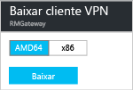

# Configurar uma conexão Ponto a Site para uma rede virtual usando o portal do Azure
> [!div class="op_single_selector"]
> * [Resource Manager - Portal do Azure](vpn-gateway-howto-point-to-site-resource-manager-portal.md)
> * [Resource Manager - PowerShell](vpn-gateway-howto-point-to-site-rm-ps.md)
> * [Portal do Azure - Clássico](vpn-gateway-howto-point-to-site-classic-azure-portal.md)
> 
> 

Uma configuração Ponto a Site (P2S) permite que você crie uma conexão segura de um computador cliente individual com uma rede virtual. Uma conexão P2S é útil quando você deseja se conectar à sua rede virtual de um local remoto, como de casa ou de uma conferência, ou quando há apenas alguns clientes que precisam se conectar a uma rede virtual. 

As conexões Ponto a Site não exigem um dispositivo VPN ou um endereço IP voltado para o público para funcionar. Uma conexão VPN é estabelecida por meio do início da conexão do computador cliente. Para saber mais sobre conexões Ponto a site, consulte as [Perguntas frequentes sobre Ponto a site](#faq) no final deste artigo.

Este artigo orienta na criação de uma Rede Virtual com uma conexão Ponto a site usando o Portal do Azure. As etapas se aplicam ao modelo de implantação do Resource Manager.

### Modelos e métodos de implantação para as conexões P2S
[!INCLUDE [deployment models](../../includes/vpn-gateway-deployment-models-include.md)]

A tabela a seguir mostra os dois modelos de implantação e os métodos de implantação disponíveis para configurações de P2S. Quando houver um artigo com etapas de configuração disponível, o vincularemos diretamente desta tabela.

[!INCLUDE [vpn-gateway-clasic-rm](../../includes/vpn-gateway-table-point-to-site-include.md)]

## Fluxo de trabalho básico

### Valores de exemplo
* **Nome: VNet1**
* **Espaço de endereço: 192.168.0.0/16** Neste exemplo, usamos apenas um espaço de endereço. Você pode ter mais de um espaço de endereço para sua rede virtual.
* **Nome da sub-rede: FrontEnd**
* **Intervalo de endereços da sub-rede: 192.168.1.0/24**
* **Assinatura:** verifique se você tem mais de uma assinatura, verifique se está usando a correta.
* **Grupo de Recursos: TestRG**
* **Local: Leste dos EUA**
* **GatewaySubnet: 192.168.200.0/24**
* **Nome do gateway de rede virtual: VNet1GW**
* **Tipo de gateway: VPN**
* **Tipo de VPN: baseada em rota**
* **Endereço IP público: VNet1GWpip**
* **Tipo de conexão: Ponto a Site**
* **Pool de endereços do cliente: 172.16.201.0/24** Os clientes VPN que se conectarem à rede virtual usando esta conexão Ponto a Site receberão um endereço IP do pool de endereços do cliente.

## Antes de começar
* Verifique se você tem uma assinatura do Azure. Se ainda não tiver uma assinatura do Azure, você poderá ativar os [Benefícios do assinante do MSDN](https://azure.microsoft.com/pricing/member-offers/msdn-benefits-details) ou inscrever-se para obter uma [conta gratuita](https://azure.microsoft.com/pricing/free-trial).

## Parte 1 - Criar uma rede virtual
Se você estiver criando esta configuração como um exercício, poderá consultar estes [valores de exemplo](#example).

[!INCLUDE [vpn-gateway-basic-vnet-rm-portal](../../includes/vpn-gateway-basic-vnet-rm-portal-include.md)]

## Parte 2 - Especificar o espaço de endereço e sub-redes
Você pode adicionar um espaço de endereço e sub-redes adicionais para sua rede virtual após sua criação.

[!INCLUDE [vpn-gateway-additional-address-space](../../includes/vpn-gateway-additional-address-space-include.md)]

## Parte 3 - Adicionar uma sub-rede de gateway

Antes de conectar sua Rede Virtual a um gateway, você precisará criar a sub-rede de gateway para a Rede Virtual à qual você deseja se conectar. Os serviços de gateway usam os endereços IP especificados na sub-rede do gateway. Se possível, crie uma sub-rede de gateway usando um bloco CIDR de /28 ou /27, para fornecer endereços IP suficientes para acomodar requisitos de configuração futuros.

As capturas de tela desta seção são fornecidas como um exemplo de referência. Use o intervalo de endereços GatewaySubnet que corresponda aos valores necessários para sua configuração.

###Para criar uma sub-rede de gateway

[!INCLUDE [vpn-gateway-add-gwsubnet-rm-portal](../../includes/vpn-gateway-add-gwsubnet-rm-portal-include.md)]

## Parte 4 - Especificar um servidor DNS (opcional)
[!INCLUDE [vpn-gateway-add-dns-rm-portal](../../includes/vpn-gateway-add-dns-rm-portal-include.md)]

## Parte 5 - Criar um gateway de rede virtual
As conexões Ponto a Site exigem as seguintes configurações:

* Tipo de gateway: VPN
* Tipo de VPN: baseada em rota

### Para criar um gateway da rede virtual
[!INCLUDE [vpn-gateway-add-gw-rm-portal](../../includes/vpn-gateway-add-gw-rm-portal-include.md)]

## Parte 6 - Gerar certificados
Os certificados são usados pelo Azure para autenticar clientes de VPN para as VPNs Ponto a Site. Você exporta dados de certificado público (e não a chave privada) como um arquivo .cer X.509 codificado em Base&64; de um certificado raiz gerado por uma solução de certificado empresarial, ou um certificado raiz autoassinado. Em seguida, você importa os dados do certificado público do certificado raiz para o Azure. Além disso, você precisa gerar um certificado do cliente a partir do certificado raiz para os clientes. Cada cliente que deseja se conectar à rede virtual usando uma conexão P2S deve ter instalado um certificado do cliente gerado desde o certificado raiz.

### Etapa 1 - Obter o arquivo .cer do certificado raiz

É necessário obter o arquivo .cer do certificado raiz. Você pode usar um certificado raiz de uma solução corporativa ou pode [criar um certificado raiz autoassinado usando o makecert](vpn-gateway-certificates-point-to-site.md). Embora seja possível usar o PowerShell para criar certificados autoassinados, o certificado que é gerado usando o PowerShell não contém os campos necessários para conexões P2S.

1. Para obter um arquivo .cer de um certificado, abra **certmgr.msc** e localize o certificado raiz. Clique com o botão direito no certificado raiz autoassinado, clique em** todas as tarefas** e clique em **exportar**. O **Assistente para Exportação de Certificados** será aberto.
2. No Assistente, clique em **Avançar**, escolha , **Não exportar a chave privada** e clique em **Avançar**.
3. Na página **Exportar Formato de Arquivo**, selecione **X.509 codificado em Base&64; (.CER).** Em seguida, clique em **Avançar**. 
4. Em **Arquivo a ser Exportado**, use **Procurar** para encontrar a localização para a qual você deseja exportar o certificado. Em **Nome do arquivo**, dê um nome ao arquivo de certificado. Em seguida, clique em **Próximo**.
5. Clique em **Concluir** para exportar o certificado.

### Etapa 2 - Gerar um certificado de cliente
Você pode gerar um certificado exclusivo para cada cliente que se conectará à rede virtual ou pode usar o mesmo certificado em vários clientes. A vantagem da geração de certificados de cliente exclusivos é a capacidade de revogar um único certificado, se necessário. Caso contrário, se todos estiverem usando o mesmo certificado de cliente e se for necessário revogar o certificado para um cliente, você precisará gerar e instalar novos certificados para todos os clientes que usam aquele certificado para autenticação.

####Certificado corporativo
- Se você estiver usando uma solução de certificado corporativo, gere um certificado de cliente com o formato de valor de nome comum 'name@yourdomain.com',, em vez do formato 'nome do domínio\nomedeusuário'.
- Verifique se o certificado do cliente que você emite baseia-se no modelo de certificado 'Usuário' que tem 'Autenticação de cliente' como o primeiro item na lista de uso, em vez de Logon de Cartão Inteligente, etc. Você pode verificar o certificado clicando duas vezes no certificado do cliente e exibindo **Detalhes > Uso Avançado de Chave**.

####Certificado autoassinado 
Se você estiver usando um certificado autoassinado, veja [Trabalhando com certificados raiz autoassinados para configurações Ponto a Site](vpn-gateway-certificates-point-to-site.md) para gerar um certificado de cliente.

### Etapa 3 - Exportar o certificado de cliente
Um certificado de cliente é necessário para autenticação. Depois de gerar o certificado do cliente, exporte-o. O certificado do cliente exportado será instalado posteriormente em cada computador cliente.

1. Para exportar um certificado do cliente, use *certmgr.msc*. Clique com o botão direito no certificado do cliente que você deseja exportar, clique em **todas as tarefas** e, em seguida, clique em **exportar**.
2. Exporte o certificado de cliente com a chave privada. Este é um arquivo *.pfx* . Certifique-se de registrar ou se lembrar da senha (chave) que você definiu para esse certificado.

## Parte 7 - Adicionar o pool de endereços de cliente
1. Quando o gateway de rede virtual tiver sido criado, navegue até a seção **Configurações** da folha do gateway de rede virtual. Na seção **Configurações**, clique em **Configuração Ponto a Site** para abrir a folha **Configuração**.
   
    
2. **Pool de endereços** é o pool de endereços IP do qual os clientes que se conectam receberão um endereço IP. Adicione o pool de endereços e então clique em **Salvar**.
   
    

## Parte 8 - Carregar o arquivo .cer do certificado raiz
Depois que o gateway tiver sido criado, você poderá carregar o arquivo .cer para um certificado raiz confiável no Azure. Você pode carregar arquivos em até 20 certificados raiz. Você não carrega a chave privada do certificado raiz no Azure. Depois que o arquivo .cer for carregado, o Azure o utilizará para autenticar clientes que se conectam à rede virtual.

1. Os certificados são adicionados na folha de **Configuração Ponto a site** na seção **Certificado raiz**.  
2. Verifique se você exportou o certificado raiz como um arquivo x.509 (.cer) codificado em Base&64;. Você precisa exportá-lo neste formato para poder abrir o certificado em um editor de texto.
3. Abra o certificado com um editor de texto, como o Bloco de Notas. Copie apenas a seção a seguir como uma linha contínua:
   
    

    > [!NOTE]
    > Ao copiar os dados do certificado, certifique-se de copiar o texto como uma linha contínua sem retornos de carro ou alimentações de linha. Talvez seja necessário modificar a exibição no editor de texto para 'Mostrar símbolo/Mostrar todos os caracteres' para ver os retornos de carro e alimentações de linha.                                                                                                                                                                            
    >
    >

4. Cole os dados do certificado no campo **Dados de Certificado Público**. **Nomeie** o certificado e, em seguida, clique em **Salvar**. Pode adicionar até 20 certificados raiz.
   
    

## Parte 9 - Baixar e instalar o pacote de configuração do cliente VPN
Os clientes que se conectam ao Azure usando P2S devem ter um certificado de cliente e um pacote de configuração de cliente VPN instalado. Pacotes de configuração de cliente VPN estão disponíveis para clientes do Windows. 

O pacote do cliente VPN contém informações de para configurar o software de cliente VPN integrado ao Windows. A configuração é específica da VPN à qual você deseja se conectar. O pacote não instala softwares adicionais.

1. Na folha **Configuração ponto a site** , clique em **Baixar cliente VPN** para abrir a folha **Baixar cliente VPN**.
   
    
2. Selecione o pacote correto para o cliente e clique em **Baixar**. Para os clientes de 64 bits, selecione **AMD64**. Para clientes de 32 bits, selecione **x86**.

    
3. Instale o pacote no computador cliente. Se aparecer um pop-up do SmartScreen, clique em **Mais informações** e em **Executar mesmo assim** para instalar o pacote.
4. No computador cliente, navegue até **Configurações de Rede** e clique em **VPN**. Você verá a conexão listada. Isso mostrará o nome da rede virtual a qual se conectará, e terá uma aparência parecida com esta: 
   
    

## Parte 10 – Instalar um certificado de cliente
Cada computador cliente deve ter um certificado do cliente para se autenticar. Ao instalar o certificado do cliente, você precisará da senha criada quando o certificado do cliente foi exportado.

1. Copie o arquivo .pfx para o computador cliente.
2. Clique duas vezes no arquivo .pfx para instalá-lo. Não modifique o local de instalação.

## Parte 11 - Conectar-se ao Azure
1. Para se conectar à sua rede virtual, no computador cliente, navegue até conexões VPN e localize a conexão VPN que você criou. Ele terá o mesmo nome da sua rede virtual. Clique em **Conectar**. Uma mensagem pop-up pode ser exibida sobre o uso do certificado. Se isso acontecer, clique em **Continuar** para usar os privilégios elevados. 
2. Na página de status **Conexão**, clique em **Conectar** para iniciar a conexão. Se for exibida uma tela de **Selecionar certificado** , verifique se o certificado de cliente mostrado é o que você deseja usar para se conectar. Se não for, use a seta suspensa para selecionar o certificado correto e clique em **OK**.
   
    

    
3. Sua conexão já deve ter sido estabelecida.
   
    
                                                                                                                                                                           

> [!NOTE]
> Se você estiver usando um certificado emitido com uma solução de AC corporativa e estiver com problemas na autenticação, verifique a ordem de autenticação no certificado do cliente. Você pode verificar a ordem da lista de autenticação ao clicar duas vezes no certificado do cliente e acessar **Detalhes > Uso Avançado de Chave**. Verifique se a lista mostra 'Autenticação de cliente' como o primeiro item. Caso contrário, é necessário emitir um certificado de cliente com base no modelo Usuário que tem a Autenticação de cliente como o primeiro item na lista. 
>
>

## Parte 12 - Verificar sua conexão
1. Para verificar se a conexão VPN está ativa, abra um prompt de comandos com privilégios elevados e execute *ipconfig/all*.
2. Exiba os resultados. Observe que o endereço IP que você recebeu está dentro do pool de endereços de cliente VPN Ponto a Site especificado em sua configuração. Os resultados devem ser algo semelhante a isto:
   
        PPP adapter VNet1:
            Connection-specific DNS Suffix .:
            Description.....................: VNet1
            Physical Address................:
            DHCP Enabled....................: No
            Autoconfiguration Enabled.......: Yes
            IPv4 Address....................: 172.16.201.3(Preferred)
            Subnet Mask.....................: 255.255.255.255
            Default Gateway.................:
            NetBIOS over Tcpip..............: Enabled

## Para adicionar ou remover certificados raiz confiáveis
Você pode remover um certificado raiz do Azure. Quando você remove um certificado confiável, os certificados de cliente gerados desde o certificado raiz não será capaz de se conectar ao Azure por meio de Ponto a Site. Se desejar que os clientes se conectem, eles precisarão instalar um novo certificado de cliente gerado de um certificado confiável no Azure.

Você pode gerenciar a lista de certificados de cliente revogados na folha **Configuração ponto a site**. Esta é a folha que você usou para [carregar um certificado raiz confiável](#uploadfile).

## Para gerenciar a lista de certificados de cliente revogados
É possível revogar certificados de cliente. A lista de certificados revogados permite que você negue seletivamente conectividade ponto a site com base em certificados de cliente individuais. Se você remover um arquivo .cer de certificado raiz do Azure, ele revogará o acesso para todos os certificados de cliente gerados/assinados pelo certificado raiz revogado. É possível revogar um certificado de cliente específico que não seja o raiz. Dessa forma, os outros certificados gerados desde o certificado raiz ainda serão válidos. 

A prática comum é usar o certificado raiz para gerenciar o acesso em níveis de equipe ou organização, enquanto estiver usando certificados de cliente revogados para controle de acesso refinado em usuários individuais.

Você pode gerenciar a lista de certificados de cliente revogados na folha **Configuração ponto a site**. Esta é a folha que você usou para [carregar um certificado raiz confiável](#uploadfile). Adicione o nome do certificado e a impressão digital e salve.

## Perguntas frequentes sobre Ponto a site

[!INCLUDE [Point-to-Site FAQ](../../includes/vpn-gateway-point-to-site-faq-include.md)]

## Próximas etapas
Quando sua conexão for concluída, você poderá adicionar máquinas virtuais às suas redes virtuais. Para saber mais, veja [Máquinas virtuais](https://docs.microsoft.com/azure/#pivot=services&panel=Compute).

