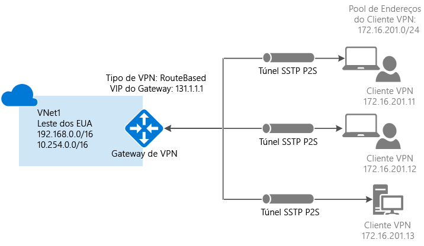
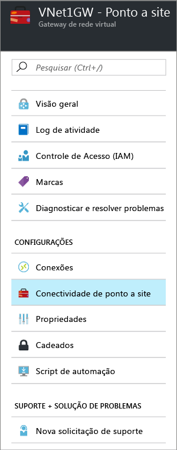
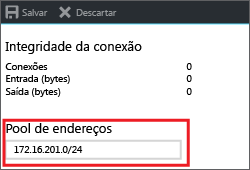
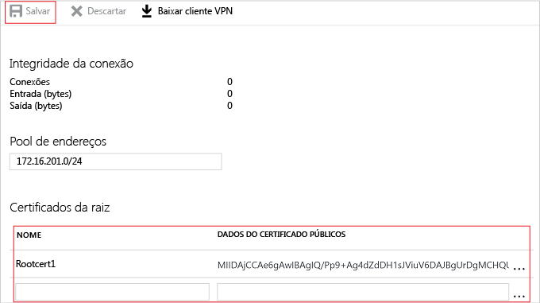

# <a name="configure-a-point-to-site-connection-to-a-vnet-using-certificate-authentication-azure-portal"></a>Configurar uma conexão Ponto a Site a uma autenticação de certificado usando VNet: Portal do Azure

Este artigo mostra como criar uma rede virtual com uma conexão Ponto a Site no modelo de implantação do Resource Manager usando o portal do Azure. Essa configuração usa certificados para autenticar o cliente de conexão. Você também pode criar essa configuração usando uma ferramenta de implantação ou um modelo de implantação diferente, selecionando uma opção diferente na lista a seguir:

> [!div class="op_single_selector"]
> * [Portal do Azure](vpn-gateway-howto-point-to-site-resource-manager-portal.md)
> * [PowerShell](vpn-gateway-howto-point-to-site-rm-ps.md)
> * [Portal do Azure (clássico)](vpn-gateway-howto-point-to-site-classic-azure-portal.md)
>
>

Uma configuração Ponto a Site (P2S) permite que você crie uma conexão segura de um computador cliente individual com uma rede virtual. Conexões ponto a site são úteis quando você deseja se conectar à sua rede virtual de um local remoto, como de casa ou de uma conferência, ou quando há apenas alguns clientes que precisam se conectar a uma rede virtual. A conexão VPN de P2S é iniciada no computador cliente usando o cliente VPN do Windows nativo. Os clientes de conexão utilizam certificados para autenticação. 



Conexões de autenticação de certificado de Ponto a Site exigem o seguinte:

* Gateway de VPN RouteBased.
* A chave pública (arquivo .cer) para um certificado raiz, que é carregado no Azure. Isso é considerado um certificado confiável e é usado para autenticação.
* O certificado de cliente é gerado a partir do certificado raiz e instalado em cada computador cliente que irá se conectar. Esse certificado é usado para autenticação do cliente.
* Um pacote de configuração de cliente VPN deve ser gerado e instalado em cada computador cliente que se conecta. O pacote de configuração do cliente configura o cliente VPN nativo que já está no sistema operacional com as informações necessárias para se conectar à VNet.

As conexões Ponto a Site não exigem um dispositivo VPN ou um endereço IP voltado para o público local. A conexão VPN é criada no SSTP (Secure Socket Tunneling Protocol). No lado do servidor, há suporte para as versões 1.0, 1.1 e 1.2 do SSTP. O cliente decide qual versão usar. Por padrão, para Windows 8.1 e posterior, o SSTP usa 1.2. 

Para saber mais sobre conexões Ponto a site, consulte as [Perguntas frequentes sobre Ponto a site](#faq) no final deste artigo.

### <a name="example"></a>Valores de exemplo

Você pode usar os seguintes valores para criar um ambiente de teste ou fazer referência a esses valores para entender melhor os exemplos neste artigo:

* **Nome: VNet1**
* **Espaço de endereço: 192.168.0.0/16**<br>Neste exemplo, usamos apenas um espaço de endereço. Você pode ter mais de um espaço de endereço para sua rede virtual.
* **Nome da sub-rede: FrontEnd**
* **Intervalo de endereços da sub-rede: 192.168.1.0/24**
* **Assinatura:** verifique se você tem mais de uma assinatura, verifique se está usando a correta.
* **Grupo de Recursos: TestRG**
* **Local: Leste dos EUA**
* **GatewaySubnet: 192.168.200.0/24**
* **Nome do gateway de rede virtual: VNet1GW**
* **Tipo de gateway: VPN**
* **Tipo de VPN: baseada em rota**
* **Endereço IP público: VNet1GWpip**
* **Tipo de conexão: Ponto a Site**
* **Pool de endereços do cliente: 172.16.201.0/24**<br>Os clientes VPN que se conectarem à rede virtual usando esta conexão Ponto a Site receberão um endereço IP do pool de endereços do cliente.

## <a name="createvnet"></a>1 - Criar uma rede virtual

Antes de começar, verifique se você tem uma assinatura do Azure. Se ainda não tiver uma assinatura do Azure, você poderá ativar os [Benefícios do assinante do MSDN](https://azure.microsoft.com/pricing/member-offers/msdn-benefits-details) ou inscrever-se para obter uma [conta gratuita](https://azure.microsoft.com/pricing/free-trial). Se você estiver criando esta configuração como um exercício, poderá consultar estes [valores de exemplo](#example).

[!INCLUDE [vpn-gateway-basic-vnet-rm-portal](../../includes/vpn-gateway-basic-vnet-rm-portal-include.md)]

## <a name="address"></a>2 - Especificar o espaço de endereço e sub-redes

Você pode adicionar um espaço de endereço e sub-redes adicionais para sua rede virtual após sua criação.

[!INCLUDE [vpn-gateway-additional-address-space](../../includes/vpn-gateway-additional-address-space-include.md)]

## <a name="gatewaysubnet"></a>3 - Adicionar uma sub-rede de gateway

Antes de conectar sua Rede Virtual a um gateway, você precisará criar a sub-rede de gateway para a Rede Virtual à qual você deseja se conectar. Os serviços de gateway usam os endereços IP especificados na sub-rede do gateway. Se possível, crie uma sub-rede de gateway usando um bloco CIDR de /28 ou /27, para fornecer endereços IP suficientes para acomodar requisitos de configuração futuros.

As capturas de tela desta seção são fornecidas como um exemplo de referência. Use o intervalo de endereços GatewaySubnet que corresponda aos valores necessários para sua configuração.

### <a name="to-create-a-gateway-subnet"></a>Para criar uma sub-rede de gateway

[!INCLUDE [vpn-gateway-add-gwsubnet-rm-portal](../../includes/vpn-gateway-add-gwsubnet-rm-portal-include.md)]

## <a name="dns"></a>4 - Especificar um servidor DNS (opcional)

Depois de criar a rede virtual, você pode adicionar o endereço IP de um servidor DNS para lidar com a resolução de nomes. O servidor DNS especificado deve ser um servidor DNS que pode resolver os nomes dos recursos aos quais você está se conectando.

[!INCLUDE [vpn-gateway-add-dns-rm-portal](../../includes/vpn-gateway-add-dns-rm-portal-include.md)]

## <a name="creategw"></a>5 - Criar um gateway de rede virtual

As conexões Ponto a Site exigem as seguintes configurações:

* Tipo de gateway: VPN
* Tipo de VPN: baseada em rota

### <a name="to-create-a-virtual-network-gateway"></a>Para criar um gateway da rede virtual

[!INCLUDE [create a vnet gateway](../../includes/vpn-gateway-add-gw-rm-portal-include.md)]

## <a name="generatecert"></a>6 - Gerar certificados

Os certificados são usados pelo Azure para autenticar clientes de VPN para as VPNs Ponto a Site. Você pode carregar as informações da chave públicas do certificado raiz no Azure. A chave pública é considerada “trusted” (confiável). Os certificados de cliente devem ser gerados a partir do certificado raiz confiável e, em seguida, em cada computador cliente no repositório de certificados de usuário/pessoal de certificados atual. O certificado é usado para autenticar o cliente quando ele inicia uma conexão de rede virtual. 

Se você usa certificados autoassinados, eles devem ser criados usando parâmetros específicos. Você pode criar um certificado autoassinado usando as instruções para [PowerShell e Windows 10](vpn-gateway-certificates-point-to-site.md) ou [MakeCert](vpn-gateway-certificates-point-to-site-makecert.md). É importante que você siga as etapas nestas instruções ao trabalhar com os certificados raiz autoassinados e gerar certificados de cliente a partir do certificado raiz autoassinado. Caso contrário, os certificados criados não serão compatíveis com conexões P2S e você receberá um erro de conexão.

### <a name="getcer"></a>Etapa 1 - Obter o arquivo .cer do certificado raiz

[!INCLUDE [get the root certificate](../../includes/vpn-gateway-p2s-rootcert-include.md)]

### <a name="generateclientcert"></a>Etapa 2 - Gerar um certificado de cliente

[!INCLUDE [generates client certificate](../../includes/vpn-gateway-p2s-clientcert-include.md)]

## <a name="addresspool"></a>7 - Adicionar o pool de endereços de cliente

O pool de endereços do cliente é um intervalo de endereços IP que você especificar. Os clientes que se conectam por P2S recebem um endereço IP desse intervalo. Use um intervalo de endereço IP privado que não coincida com o local que você irá se conectar a partir da, ou com a rede virtual que você deseja se conectar.

1. Quando o gateway de rede virtual tiver sido criado, navegue até a seção **Configurações** da folha do gateway de rede virtual. Na seção **Configurações**, clique em **Configuração Ponto a Site** para abrir a folha **Configuração**.

  
2. Você pode excluir o intervalo de preenchimento automático e adicionar o intervalo de endereços IP privado que você deseja usar. Clique em **Salvar** para validar e salvar a configuração.

  

## <a name="uploadfile"></a>8 - Carregar o arquivo .cer do certificado raiz

Após o gateway ser criado, você pode carregar o arquivo. cer (que contém as informações de chave pública) para um certificado raiz confiável do Azure. Uma vez carregado o arquivo .cer, o Azure pode usá-lo para autenticar clientes com um certificado de cliente instalado gerado a partir de um certificado raiz confiável. Você pode carregar arquivos de certificado raiz confiável adicionais - até um total de 20 - posteriormente, se necessário. 

1. Os certificados são adicionados na folha de **Configuração Ponto a site** na seção **Certificado raiz**.  
2. Verifique se você exportou o certificado raiz como um arquivo x.509 (.cer) codificado em Base 64. Você precisa exportar o certificado neste formato para poder abri-lo em um editor de texto.
3. Abra o certificado com um editor de texto, como o Bloco de Notas. Ao copiar os dados do certificado, certifique-se de copiar o texto como uma linha contínua sem retornos de carro ou alimentações de linha. Talvez seja necessário modificar a exibição no editor de texto para 'Mostrar símbolo/Mostrar todos os caracteres' para ver os retornos de carro e alimentações de linha. Copie apenas a seção a seguir como uma linha contínua:

  
4. Cole os dados do certificado no campo **Dados de Certificado Público**. **Nomeie** o certificado e, em seguida, clique em **Salvar**. Pode adicionar até 20 certificados raiz.

  

## <a name="clientconfig"></a>9 - Instalar o pacote de configuração de cliente VPN

Para se conectar a uma rede virtual usando uma VPN Ponto a Site, cada cliente deve instalar um pacote para configurar o cliente VPN do Windows. O pacote de configuração configura o cliente VPN do Windows nativo com as configurações necessárias para se conectar à rede virtual.

Você pode usar o mesmo pacote de configuração de cliente VPN em cada computador cliente, desde que a versão corresponda à arquitetura do cliente. Para obter a lista de sistemas operacionais clientes com suporte, consulte as [Perguntas frequentes sobre conexões Ponto a site](#faq) ao final desse artigo.

### <a name="step-1---download-the-client-configuration-package"></a>Etapa 1- Baixar o pacote de configuração de cliente

1. Na folha **Configuração ponto a site** , clique em **Baixar cliente VPN** para abrir a folha **Baixar cliente VPN**. Demora um ou dois minutos para gerar o pacote.

  
2. Selecione o pacote correto para o cliente e clique em **Baixar**. Salve o arquivo de pacote de configuração. Você pode instalar o pacote de configuração de cliente VPN em cada computador cliente que se conecta à rede virtual.

  

### <a name="step-2---install-the-client-configuration-package"></a>Etapa 2 - instalar o pacote de configuração do cliente

1. Copie o arquivo de configuração localmente no computador que você deseja conectar à sua rede virtual. 
2. No computador cliente, clique duas vezes no arquivo .exe para instalar o pacote. Como você criou o pacote de configuração, ele não está assinado e um aviso pode aparecer. Se aparecer um pop-up do SmartScreen do Windows, clique em **Mais informações** (à esquerda)e em **Executar mesmo assim** para instalar o pacote.
3. Instale o pacote no computador cliente. Se aparecer um pop-up do SmartScreen do Windows, clique em **Mais informações** (à esquerda)e em **Executar mesmo assim** para instalar o pacote.
4. No computador cliente, navegue até **Configurações de Rede** e clique em **VPN**. A conexão VPN mostra o nome da rede virtual a que ele se conecta.

## <a name="installclientcert"></a>10 - Instalar um certificado cliente

Se você quiser criar uma conexão P2S de um computador cliente diferente daquele usada para gerar os certificados cliente, instale um certificado de cliente. Ao instalar um certificado do cliente, você precisará da senha criada durante a exportação do certificado do cliente. Normalmente, isso é apenas uma questão de clicar duas vezes no certificado e instalá-lo. Para saber mais informações consulte, [Instalar um certificado de cliente exportado](vpn-gateway-certificates-point-to-site.md#install).

## <a name="connect"></a>11 - Conectar-se ao Azure

1. Para se conectar à sua rede virtual, no computador cliente, navegue até conexões VPN e localize a conexão VPN que você criou. Ele terá o mesmo nome da sua rede virtual. Clique em **Conectar**. Uma mensagem pop-up pode ser exibida sobre o uso do certificado. Clique em **Continuar** para usar os privilégios elevados.

2. Na página de status **Conexão**, clique em **Conectar** para iniciar a conexão. Se for exibida uma tela de **Selecionar certificado** , verifique se o certificado de cliente mostrado é o que você deseja usar para se conectar. Se não for, use a seta suspensa para selecionar o certificado correto e clique em **OK**.

  
3. A conexão é estabelecida.

  

[!INCLUDE [verifies client certificates](../../includes/vpn-gateway-certificates-verify-client-cert-include.md)]

## <a name="verify"></a>12 - Verificar a conexão

1. Para verificar se a conexão VPN está ativa, abra um prompt de comandos com privilégios elevados e execute *ipconfig/all*.
2. Exiba os resultados. Observe que o endereço IP que você recebeu está dentro do pool de endereços de cliente VPN Ponto a Site especificado em sua configuração. Os resultados são semelhantes a este exemplo:

  ```
  PPP adapter VNet1:
      Connection-specific DNS Suffix .:
      Description.....................: VNet1
      Physical Address................:
      DHCP Enabled....................: No
      Autoconfiguration Enabled.......: Yes
      IPv4 Address....................: 172.16.201.3(Preferred)
      Subnet Mask.....................: 255.255.255.255
      Default Gateway.................:
      NetBIOS over Tcpip..............: Enabled
  ```

## <a name="connectVM"></a>Conectar-se a uma máquina virtual

[!INCLUDE [Connect to a VM](../../includes/vpn-gateway-connect-vm-p2s-include.md)]

## <a name="add"></a>Adicionar ou remover certificados raiz confiáveis

Você pode adicionar e remover um certificado raiz do Azure. Quando você remove um certificado raiz, os clientes que possuem um certificado gerado a partir dessa raiz não serão capazes de fazer a autenticação e, portanto, não serão capazes de se conectar. Se você deseja que um clientes faça autenticação e se conecte, você precisa instalar um novo certificado de cliente gerado a partir de um certificado confiável (carregado) no Azure.

### <a name="to-add-a-trusted-root-certificate"></a>Para adicionar um certificado raiz confiável

Você pode adicionar até 20 arquivos .cer de certificado raiz ao Azure. Para obter instruções, consulte a seção [Carregar um certificado raiz confiável](#uploadfile) neste artigo.

### <a name="to-remove-a-trusted-root-certificate"></a>Para remover um certificado raiz confiável

1. Para remover um certificado raiz confiável, navegue até a folha **Configuração ponto a site** de seu gateway de rede virtual.
2. Na seção **Certificado raiz** da folha, localize o certificado que você deseja remover.
3. Clique no botão de reticências ao lado do certificado e clique em 'Remover'.

## <a name="revokeclient"></a>Revogar um certificado de cliente

É possível revogar certificados de cliente. A lista de certificados revogados permite que você negue seletivamente conectividade ponto a site com base em certificados de cliente individuais. Isso é diferente da remoção de um certificado raiz confiável. Se você remover um arquivo .cer de certificado raiz confiável do Azure, ele revogará o acesso para todos os certificados de cliente gerados/assinados pelo certificado raiz revogado. Revogar um certificado de cliente, em vez do certificado raiz, permite que os outros certificados gerados a partir do certificado raiz continuem a ser usados para autenticação.

A prática comum é usar o certificado raiz para gerenciar o acesso em níveis de equipe ou organização, enquanto estiver usando certificados de cliente revogados para controle de acesso refinado em usuários individuais.

### <a name="to-revoke-a-client-certificate"></a>Para revogar um certificado de cliente

Você pode revogar um certificado de cliente adicionando a impressão digital à lista de revogação.

1. Recupere a impressão digital do certificado de cliente. Para saber mais, confira [Como recuperar a impressão digital de um certificado](https://msdn.microsoft.com/library/ms734695.aspx).
2. Copie as informações para um editor de texto e remova todos os espaços para que seja uma cadeia de caracteres contínua.
3. Navegue até a folha **Configuração ponto a site** do gateway de rede virtual. Esta é a mesma folha que você usou para [carregar um certificado raiz confiável](#uploadfile).
4. Na seção **Certificados revogados**, insira um nome amigável para o certificado (não precisa ser o CN do certificado).
5. Copie e cole a cadeia de caracteres de impressão digital no campo **Impressão digital**.
6. A impressão digital é validada e adicionada automaticamente à lista de revogação. Uma mensagem aparece na tela informando que a lista está atualizando. 
7. Após a conclusão da atualização, o certificado não poderá mais ser usado para se conectar. Os clientes que tentam se conectar usando este certificado recebem uma mensagem informando que o certificado não é mais válido.

## <a name="faq"></a>Perguntas frequentes sobre Ponto a site

[!INCLUDE [Point-to-Site FAQ](../../includes/vpn-gateway-point-to-site-faq-include.md)]

## <a name="next-steps"></a>Próximas etapas
Quando sua conexão for concluída, você poderá adicionar máquinas virtuais às suas redes virtuais. Para saber mais, veja [Máquinas virtuais](https://docs.microsoft.com/azure/#pivot=services&panel=Compute). Para saber mais sobre redes e máquinas virtuais, consulte [Visão geral de rede do Azure e VM Linux](../virtual-machines/linux/azure-vm-network-overview.md).
