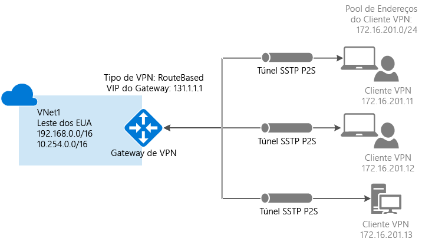

# <a name="configure-a-point-to-site-connection-to-a-vnet-using-powershell"></a>Configurar uma conexão Ponto a Site com uma rede virtual usando PowerShell


Este artigo mostra como criar uma rede virtual com uma conexão Ponto a Site no modelo de implantação do Resource Manager usando o portal o PowerShell. Você também pode criar essa configuração usando uma ferramenta de implantação ou um modelo de implantação diferente, selecionando uma opção diferente na lista a seguir:

> [!div class="op_single_selector"]
> * [Resource Manager - portal do Azure](vpn-gateway-howto-point-to-site-resource-manager-portal.md)
> * [Resource Manager - PowerShell](vpn-gateway-howto-point-to-site-rm-ps.md)
> * [Clássico - portal do Azure](vpn-gateway-howto-point-to-site-classic-azure-portal.md)
>
>

Uma configuração Ponto a Site (P2S) permite que você crie uma conexão segura de um computador cliente individual com uma rede virtual. Conexões ponto a site são úteis quando você deseja se conectar à sua rede virtual de um local remoto, como de casa ou de uma conferência, ou quando há apenas alguns clientes que precisam se conectar a uma rede virtual. A conexão VPN de P2S é iniciada no computador cliente usando o cliente VPN do Windows nativo. Os clientes de conexão utilizam certificados para autenticação. 



As conexões Ponto a Site não exigem um dispositivo VPN ou um endereço IP voltado para o público. A P2S cria a conexão VPN no SSTP (Secure Socket Tunneling Protocol). No lado do servidor, há suporte para as versões 1.0, 1.1 e 1.2 do SSTP. O cliente decide qual versão usar. Por padrão, para Windows 8.1 e posterior, o SSTP usa 1.2. Para saber mais sobre conexões Ponto a site, consulte as [Perguntas frequentes sobre Ponto a site](#faq) no final deste artigo.

Conexões P2S exigem o seguinte:

* Gateway de VPN RouteBased.
* A chave pública (arquivo .cer) para um certificado raiz, carregado no Azure. Isso é considerado um certificado confiável e é usado para autenticação.
* O certificado de cliente é gerado a partir do certificado raiz e instalado em cada computador cliente que irá se conectar. Esse certificado é usado para autenticação do cliente.
* Um pacote de configuração de cliente VPN deve ser gerado e instalado em cada computador cliente que se conecta. O pacote de configuração do cliente configura o cliente VPN nativo que já está no sistema operacional com as informações necessárias para se conectar à VNet.


## <a name="before-beginning"></a>Antes de começar

* Verifique se você tem uma assinatura do Azure. Se ainda não tiver uma assinatura do Azure, você poderá ativar os [Benefícios do assinante do MSDN](https://azure.microsoft.com/pricing/member-offers/msdn-benefits-details) ou inscrever-se para obter uma [conta gratuita](https://azure.microsoft.com/pricing/free-trial).
* Instale a versão mais recente dos cmdlets do PowerShell do Azure Resource Manager. Para saber mais sobre como instalar cmdlets do PowerShell, confira [Como instalar e configurar o Azure PowerShell](/powershell/azure/overview).

### <a name="example"></a>Valores de exemplo

Você pode usar os valores do exemplo para criar um ambiente de teste ou fazer referência a esses valores para entender melhor os exemplos neste artigo. Definimos as variáveis na seção [1](#declare) do artigo. Você pode usar as etapas como um passo a passo e usar os valores sem alterá-los, ou alterá-los para refletir seu ambiente. 

* **Nome: VNet1**
* **Espaço de endereço: 192.168.0.0/16** e **10.254.0.0/16**<br>Neste exemplo, usamos mais de um espaço de endereço para ilustrar que esta configuração funciona com vários espaços de endereço. No entanto, vários espaços de endereço não são necessários para esta configuração.
* **Nome da sub-rede: FrontEnd**
  * **Intervalo de endereços da sub-rede: 192.168.1.0/24**
* **Nome da sub-rede: BackEnd**
  * **Intervalo de endereços da sub-rede: 10.254.1.0/24**
* **Nome da sub-rede: GatewaySubnet**<br>O nome da Sub-rede *GatewaySubnet* é obrigatório para que o gateway de VPN funcione.
  * **Intervalo de endereços da GatewaySubnet: 192.168.200.0/24** 
* **Pool de endereços do cliente VPN: 172.16.201.0/24**<br>Os clientes VPN que se conectarem à rede virtual usando esta conexão Ponto a Site receberão um endereço IP do pool de endereços do cliente VPN.
* **Assinatura:** verifique se você tem mais de uma assinatura, verifique se está usando a correta.
* **Grupo de Recursos: TestRG**
* **Local: Leste dos EUA**
* **Servidor DNS: Endereço IP** do servidor DNS que você deseja usar para a resolução de nome.
* **Nome de GW: Vnet1GW**
* **Nome do IP público: VNet1GWPIP**
* **VpnType: RouteBased** 

## <a name="declare"></a>Parte 1 - Faça logon e defina as variáveis

Nesta seção, faça logon e declare os valores usados para esta configuração. Os valores declarados são usados nos scripts de exemplo. Altere os valores para refletir seu próprio ambiente. Ou, você pode usar os valores declarados e percorrer as etapas como um exercício.

1. Abra o console do PowerShell com privilégios elevados e entre na sua conta do Azure. Esse cmdlet solicita as credenciais de logon. Depois de entrar, ele baixa as configurações da conta para que elas estejam disponíveis para o Azure PowerShell.

  ```powershell
  Login-AzureRmAccount
  ```
2. Obtenha uma lista das assinaturas do Azure.

  ```powershell
  Get-AzureRmSubscription
  ```
3. Especifique a assinatura que você quer usar.

  ```powershell
  Select-AzureRmSubscription -SubscriptionName "Name of subscription"
  ```
4. Declare as variáveis que você quer usar. Use o exemplo a seguir, substituindo os valores existentes pelos seus quando necessário.

  ```powershell
  $VNetName  = "VNet1"
  $FESubName = "FrontEnd"
  $BESubName = "Backend"
  $GWSubName = "GatewaySubnet"
  $VNetPrefix1 = "192.168.0.0/16"
  $VNetPrefix2 = "10.254.0.0/16"
  $FESubPrefix = "192.168.1.0/24"
  $BESubPrefix = "10.254.1.0/24"
  $GWSubPrefix = "192.168.200.0/26"
  $VPNClientAddressPool = "172.16.201.0/24"
  $RG = "TestRG"
  $Location = "East US"
  $DNS = "8.8.8.8"
  $GWName = "VNet1GW"
  $GWIPName = "VNet1GWPIP"
  $GWIPconfName = "gwipconf"
  ```

## <a name="ConfigureVNet"></a>2 - Configurar uma rede virtual

1. Crie um grupos de recursos.

  ```powershell
  New-AzureRmResourceGroup -Name $RG -Location $Location
  ```
2. Crie as configurações de sub-rede para a rede virtual e dê a elas os nomes *FrontEnd*, *BackEnd* e *GatewaySubnet*. Esses prefixos devem fazer parte do espaço de endereço da rede virtual declarada por você.

  ```powershell
  $fesub = New-AzureRmVirtualNetworkSubnetConfig -Name $FESubName -AddressPrefix $FESubPrefix
  $besub = New-AzureRmVirtualNetworkSubnetConfig -Name $BESubName -AddressPrefix $BESubPrefix
  $gwsub = New-AzureRmVirtualNetworkSubnetConfig -Name $GWSubName -AddressPrefix $GWSubPrefix
  ```
3. Crie a rede virtual. <br>O servidor DNS é opcional. Especificar esse valor não cria um novo servidor DNS. O pacote de configuração de cliente gerado em uma etapa posterior conterá o endereço IP do servidor DNS que você especificar nesta configuração. Se você precisar atualizar a lista de servidores DNS no futuro, você pode gerar e instalar novos pacotes de configuração de cliente VPN que refletem a nova lista. O servidor DNS especificado deve ser um servidor DNS que pode resolver os nomes dos recursos aos quais você está se conectando. Neste exemplo, usamos um endereço IP público. Use seus próprios valores.

  ```powershell
  New-AzureRmVirtualNetwork -Name $VNetName -ResourceGroupName $RG -Location $Location -AddressPrefix $VNetPrefix1,$VNetPrefix2 -Subnet $fesub, $besub, $gwsub -DnsServer $DNS
  ```
4. Especifique as variáveis da rede virtual que você criou.

  ```powershell
  $vnet = Get-AzureRmVirtualNetwork -Name $VNetName -ResourceGroupName $RG
  $subnet = Get-AzureRmVirtualNetworkSubnetConfig -Name "GatewaySubnet" -VirtualNetwork $vnet
  ```
5. Um gateway de VPN deve ter um endereço IP público. Você primeiro solicita o recurso de endereço IP e, em seguida, faz referência a ele ao criar seu gateway de rede virtual. O endereço IP é atribuído dinamicamente ao recurso quando o gateway de VPN é criado. O gateway de VPN atualmente suporta apenas alocação de endereços IP público *Dinâmico*. Você não pode solicitar uma atribuição de endereço IP Público Estático. No entanto, isso não significa que o endereço IP é alterado depois que ele foi atribuído ao seu gateway de VPN. A única vez em que o endereço IP Público é alterado é quando o gateway é excluído e recriado. Isso não altera o redimensionamento, a redefinição ou outras manutenções/atualizações internas do seu gateway de VPN.

  Solicite um endereço IP público atribuído dinamicamente.

  ```powershell
  $pip = New-AzureRmPublicIpAddress -Name $GWIPName -ResourceGroupName $RG -Location $Location -AllocationMethod Dynamic
  $ipconf = New-AzureRmVirtualNetworkGatewayIpConfig -Name $GWIPconfName -Subnet $subnet -PublicIpAddress $pip
  ```

## <a name="Certificates"></a>3 - Gerar certificados

Os certificados são usados pelo Azure para autenticar clientes de VPN para as VPNs Ponto a Site. Você pode carregar as informações da chave públicas do certificado raiz no Azure. A chave pública é considerada “trusted” (confiável). Os certificados de cliente devem ser gerados a partir do certificado raiz confiável e, em seguida, em cada computador cliente no repositório de certificados de usuário/pessoal de certificados atual. O certificado é usado para autenticar o cliente quando ele inicia uma conexão de rede virtual. Para obter mais informações sobre como gerar e instalar certificados, consulte [Certificados para Ponto a Site](vpn-gateway-certificates-point-to-site.md).

### <a name="cer"></a>Etapa 1 - Obter o arquivo .cer do certificado raiz

[!INCLUDE [vpn-gateway-basic-vnet-rm-portal](../../includes/vpn-gateway-p2s-rootcert-include.md)]


### <a name="generate"></a>Etapa 2 - Gerar um certificado de cliente

[!INCLUDE [vpn-gateway-basic-vnet-rm-portal](../../includes/vpn-gateway-p2s-clientcert-include.md)]

## <a name="upload"></a>4 - preparar o arquivo .cer do certificado raiz para carregamento

Prepare-se para carregar o arquivo. cer (que contém as informações de chave pública) de um certificado raiz confiável do Azure. Você não carrega a chave privada do certificado raiz no Azure. Uma vez carregado o arquivo .cer, o Azure pode usá-lo para autenticar clientes com um certificado de cliente instalado gerado a partir de um certificado raiz confiável. Você pode carregar arquivos de certificado raiz confiável adicionais - até um total de 20 - posteriormente, se necessário. Nesta seção, você declara o arquivo .cer do certificado raiz que será associado ao seu gateway de VPN quando for criado na próxima seção.

1. Declare a variável para o nome do certificado, substituindo o valor pelo seu.

  ```powershell
  $P2SRootCertName = "P2SRootCert.cer"
  ```
2. Substitua o caminho do arquivo pelo seu e execute os cmdlets.

  ```powershell
  $filePathForCert = "C:\cert\P2SRootCert.cer"
  $cert = new-object System.Security.Cryptography.X509Certificates.X509Certificate2($filePathForCert)
  $CertBase64 = [system.convert]::ToBase64String($cert.RawData)
  $p2srootcert = New-AzureRmVpnClientRootCertificate -Name $P2SRootCertName -PublicCertData $CertBase64
  ```

## <a name="creategateway"></a>5 - Criar o gateway de VPN

Configurar e criar o gateway de rede virtual para sua rede virtual.

* O *-GatewayType* deve ser **Vpn** e o *-VpnType* deve ser **RouteBased**.
* Neste exemplo, a chave pública para o certificado raiz é associada ao gateway de VPN usando a variável '$p2srootcert', especificada na seção anterior.
* Neste exemplo, o pool de endereços de cliente VPN é declarado como uma [variável](#declare) na etapa 1. O pool de endereços de cliente VPN é o intervalo do qual os clientes VPN recebem um endereço IP ao se conectar. Use um intervalo de endereço IP privado que não coincida com o local que você irá se conectar a partir da, ou com a rede virtual que você deseja se conectar.
* Um gateway de VPN pode levar até 45 minutos para ser concluído, dependendo do [SKU de gateway](vpn-gateway-about-vpn-gateway-settings.md) selecionado.

```powershell
New-AzureRmVirtualNetworkGateway -Name $GWName -ResourceGroupName $RG `
-Location $Location -IpConfigurations $ipconf -GatewayType Vpn `
-VpnType RouteBased -EnableBgp $false -GatewaySku Standard `
-VpnClientAddressPool $VPNClientAddressPool -VpnClientRootCertificates $p2srootcert
```

## <a name="clientconfig"></a>6 - Baixar o pacote de configuração do cliente VPN

Para se conectar a uma rede virtual usando uma VPN Ponto a Site, cada cliente deve instalar um pacote para configurar o cliente VPN do Windows. O pacote de configuração configura o cliente VPN do Windows nativo com as configurações necessárias para se conectar à rede virtual e, se você especificou um servidor DNS para sua rede virtual, contém o endereço IP do servidor DNS que o cliente usará para a resolução de nomes. Se você alterar o servidor DNS especificado posteriormente, depois de gerar o pacote de configuração do cliente, certifique-se de gerar um novo pacote de configuração do cliente para instalar nos computadores cliente.

Você pode usar o mesmo pacote de configuração de cliente VPN em cada computador cliente, desde que a versão corresponda à arquitetura do cliente. Para obter a lista de sistemas operacionais clientes com suporte, consulte as [Perguntas frequentes sobre conexões Ponto a site](#faq) ao final desse artigo.

1. Depois que o gateway tiver sido criado, você poderá gerar e baixar o pacote de configuração do cliente. Este exemplo baixa o pacote para clientes de 64 bits. Se você quiser baixar o cliente de 32 bits, substitua 'Amd64' por 'x86'. Você também pode baixar o cliente VPN usando o portal do Azure.

  ```powershell
  Get-AzureRmVpnClientPackage -ResourceGroupName $RG `
  -VirtualNetworkGatewayName $GWName -ProcessorArchitecture Amd64
  ```
2. Copie e cole o link que é retornado em um navegador da Web para baixar o pacote, tomando cuidado para remover as aspas ao redor do link. 
3. Baixe e instale o pacote no computador cliente. Se vir um pop-up do SmartScreen, clique em **Mais informações** e em **Executar mesmo assim**. Você também pode salvar o pacote de instalação em outros computadores clientes.
4. No computador cliente, navegue até **Configurações de Rede** e clique em **VPN**. A conexão VPN mostra o nome da rede virtual a que ele se conecta.

## <a name="clientcertificate"></a>7 - Instalar um certificado do cliente exportado

Se você quiser criar uma conexão P2S de um computador cliente diferente daquele usada para gerar os certificados cliente, instale um certificado de cliente. Ao instalar um certificado do cliente, você precisará da senha criada durante a exportação do certificado do cliente. Normalmente, isso é apenas uma questão de clicar duas vezes no certificado e instalá-lo. Para saber mais informações consulte, [Instalar um certificado de cliente exportado](vpn-gateway-certificates-point-to-site.md#install).

## <a name="connect"></a>8 - Conectar-se ao Azure
1. Para se conectar à sua rede virtual, no computador cliente, navegue até conexões VPN e localize a conexão VPN que você criou. Ele terá o mesmo nome da sua rede virtual. Clique em **Conectar**. Uma mensagem pop-up pode ser exibida sobre o uso do certificado. Clique em **Continuar** para usar os privilégios elevados. 
2. Na página de status **Conexão**, clique em **Conectar** para iniciar a conexão. Se for exibida uma tela de **Selecionar certificado** , verifique se o certificado de cliente mostrado é o que você deseja usar para se conectar. Se não for, use a seta suspensa para selecionar o certificado correto e clique em **OK**.

  
3. A conexão é estabelecida.

  

Se estiver tendo problemas para se conectar, verifique os seguintes itens:

- Abra **Gerenciar certificados de usuário** e navegue até **Trusted Root Certification Authorities\Certificates**. Verifique se o certificado raiz está listado. O certificado raiz deve estar presente para que a autenticação funcione. Quando você exporta um .pfx de certificado de cliente usando o valor padrão 'Incluir todos os certificados no caminho de certificação, se possível', as informações do certificado raiz também são exportadas. Quando você instala o certificado do cliente, o certificado raiz também é instalado no computador cliente. 

- Se você estiver usando um certificado emitido com uma solução de AC corporativa e estiver com problemas na autenticação, verifique a ordem de autenticação no certificado do cliente. Você pode verificar a ordem da lista de autenticação ao clicar duas vezes no certificado do cliente e acessar **Detalhes > Uso Avançado de Chave**. Verifique se a lista mostra 'Autenticação de cliente' como o primeiro item. Caso contrário, é necessário emitir um certificado de cliente com base no modelo Usuário que tem a Autenticação de cliente como o primeiro item na lista.  

## <a name="verify"></a>9 - Verificar a conexão

1. Para verificar se a conexão VPN está ativa, abra um prompt de comandos com privilégios elevados e execute *ipconfig/all*.
2. Exiba os resultados. Observe que o endereço IP que você recebeu está dentro do pool de endereços de cliente VPN Ponto a Site especificado em sua configuração. Os resultados são semelhantes a este exemplo:

  ```
  PPP adapter VNet1:
      Connection-specific DNS Suffix .:
      Description.....................: VNet1
      Physical Address................:
      DHCP Enabled....................: No
      Autoconfiguration Enabled.......: Yes
      IPv4 Address....................: 172.16.201.3(Preferred)
      Subnet Mask.....................: 255.255.255.255
      Default Gateway.................:
      NetBIOS over Tcpip..............: Enabled
  ```


## <a name="connectVM"></a>Conectar-se a uma máquina virtual

[!INCLUDE [Connect to a VM](../../includes/vpn-gateway-connect-vm-p2s-include.md)]

## <a name="addremovecert"></a>Adicionar ou remover um certificado raiz

Você pode adicionar e remover um certificado raiz do Azure. Quando você remove um certificado raiz, os clientes que possuem um certificado gerado a partir dessa raiz não serão capazes de fazer a autenticação e, portanto, não serão capazes de se conectar. Se você deseja que um clientes faça autenticação e se conecte, você precisa instalar um novo certificado de cliente gerado a partir de um certificado confiável (carregado) no Azure.

### <a name="to-add-a-root-certificate"></a>Para adicionar um certificado raiz

Você pode adicionar até 20 arquivos .cer de certificado raiz ao Azure. As seguintes etapas o ajudarão a adicionar um certificado raiz:

1. Crie e prepare o novo certificado raiz para adicionar ao Azure. Exporte a chave pública como X.509 codificado em Base 64 (.CER) e abra-a com um editor de texto. Copie os valores, conforme mostra o exemplo a seguir:

  

  > [!NOTE]
  > Ao copiar os dados do certificado, certifique-se de copiar o texto como uma linha contínua sem retornos de carro ou alimentações de linha. Talvez seja necessário modificar a exibição no editor de texto para 'Mostrar símbolo/Mostrar todos os caracteres' para ver os retornos de carro e alimentações de linha.
  >
  >

2. Especifique o nome do certificado e as informações de chave como uma variável. Substitua as informações por suas próprias, conforme mostrado no seguinte exemplo:

  ```powershell
  $P2SRootCertName2 = "ARMP2SRootCert2.cer"
  $MyP2SCertPubKeyBase64_2 = "MIIC/zCCAeugAwIBAgIQKazxzFjMkp9JRiX+tkTfSzAJBgUrDgMCHQUAMBgxFjAUBgNVBAMTDU15UDJTUm9vdENlcnQwHhcNMTUxMjE5MDI1MTIxWhcNMzkxMjMxMjM1OTU5WjAYMRYwFAYDVQQDEw1NeVAyU1Jvb3RDZXJ0MIIBIjANBgkqhkiG9w0BAQEFAAOCAQ8AMIIBCgKCAQEAyjIXoWy8xE/GF1OSIvUaA0bxBjZ1PJfcXkMWsHPzvhWc2esOKrVQtgFgDz4ggAnOUFEkFaszjiHdnXv3mjzE2SpmAVIZPf2/yPWqkoHwkmrp6BpOvNVOpKxaGPOuK8+dql1xcL0eCkt69g4lxy0FGRFkBcSIgVTViS9wjuuS7LPo5+OXgyFkAY3pSDiMzQCkRGNFgw5WGMHRDAiruDQF1ciLNojAQCsDdLnI3pDYsvRW73HZEhmOqRRnJQe6VekvBYKLvnKaxUTKhFIYwuymHBB96nMFdRUKCZIiWRIy8Hc8+sQEsAML2EItAjQv4+fqgYiFdSWqnQCPf/7IZbotgQIDAQABo00wSzBJBgNVHQEEQjBAgBAkuVrWvFsCJAdK5pb/eoCNoRowGDEWMBQGA1UEAxMNTXlQMlNSb290Q2VydIIQKazxzFjMkp9JRiX+tkTfSzAJBgUrDgMCHQUAA4IBAQA223veAZEIar9N12ubNH2+HwZASNzDVNqspkPKD97TXfKHlPlIcS43TaYkTz38eVrwI6E0yDk4jAuPaKnPuPYFRj9w540SvY6PdOUwDoEqpIcAVp+b4VYwxPL6oyEQ8wnOYuoAK1hhh20lCbo8h9mMy9ofU+RP6HJ7lTqupLfXdID/XevI8tW6Dm+C/wCeV3EmIlO9KUoblD/e24zlo3YzOtbyXwTIh34T0fO/zQvUuBqZMcIPfM1cDvqcqiEFLWvWKoAnxbzckye2uk1gHO52d8AVL3mGiX8wBJkjc/pMdxrEvvCzJkltBmqxTM6XjDJALuVh16qFlqgTWCIcb7ju"
  ```
3. Adicionar o novo certificado raiz. Você pode adicionar apenas um certificado por vez.

  ```powershell
  Add-AzureRmVpnClientRootCertificate -VpnClientRootCertificateName $P2SRootCertName2 -VirtualNetworkGatewayname "VNet1GW" -ResourceGroupName "TestRG" -PublicCertData $MyP2SCertPubKeyBase64_2
  ```
4. Você pode verificar se o novo certificado foi adicionado corretamente usando o exemplo a seguir:

  ```powershell
  Get-AzureRmVpnClientRootCertificate -ResourceGroupName "TestRG" `
  -VirtualNetworkGatewayName "VNet1GW"
  ```

### <a name="to-remove-a-root-certificate"></a>Adicionar ou remover um certificado raiz

1. Declare as variáveis.

  ```powershell
  $GWName = "Name_of_virtual_network_gateway"
  $RG = "Name_of_resource_group"
  $P2SRootCertName2 = "ARMP2SRootCert2.cer"
  $MyP2SCertPubKeyBase64_2 = "MIIC/zCCAeugAwIBAgIQKazxzFjMkp9JRiX+tkTfSzAJBgUrDgMCHQUAMBgxFjAUBgNVBAMTDU15UDJTUm9vdENlcnQwHhcNMTUxMjE5MDI1MTIxWhcNMzkxMjMxMjM1OTU5WjAYMRYwFAYDVQQDEw1NeVAyU1Jvb3RDZXJ0MIIBIjANBgkqhkiG9w0BAQEFAAOCAQ8AMIIBCgKCAQEAyjIXoWy8xE/GF1OSIvUaA0bxBjZ1PJfcXkMWsHPzvhWc2esOKrVQtgFgDz4ggAnOUFEkFaszjiHdnXv3mjzE2SpmAVIZPf2/yPWqkoHwkmrp6BpOvNVOpKxaGPOuK8+dql1xcL0eCkt69g4lxy0FGRFkBcSIgVTViS9wjuuS7LPo5+OXgyFkAY3pSDiMzQCkRGNFgw5WGMHRDAiruDQF1ciLNojAQCsDdLnI3pDYsvRW73HZEhmOqRRnJQe6VekvBYKLvnKaxUTKhFIYwuymHBB96nMFdRUKCZIiWRIy8Hc8+sQEsAML2EItAjQv4+fqgYiFdSWqnQCPf/7IZbotgQIDAQABo00wSzBJBgNVHQEEQjBAgBAkuVrWvFsCJAdK5pb/eoCNoRowGDEWMBQGA1UEAxMNTXlQMlNSb290Q2VydIIQKazxzFjMkp9JRiX+tkTfSzAJBgUrDgMCHQUAA4IBAQA223veAZEIar9N12ubNH2+HwZASNzDVNqspkPKD97TXfKHlPlIcS43TaYkTz38eVrwI6E0yDk4jAuPaKnPuPYFRj9w540SvY6PdOUwDoEqpIcAVp+b4VYwxPL6oyEQ8wnOYuoAK1hhh20lCbo8h9mMy9ofU+RP6HJ7lTqupLfXdID/XevI8tW6Dm+C/wCeV3EmIlO9KUoblD/e24zlo3YzOtbyXwTIh34T0fO/zQvUuBqZMcIPfM1cDvqcqiEFLWvWKoAnxbzckye2uk1gHO52d8AVL3mGiX8wBJkjc/pMdxrEvvCzJkltBmqxTM6XjDJALuVh16qFlqgTWCIcb7ju"
  ```
2. Remova o certificado.

  ```powershell
  Remove-AzureRmVpnClientRootCertificate -VpnClientRootCertificateName $P2SRootCertName2 -VirtualNetworkGatewayName $GWName -ResourceGroupName $RG -PublicCertData $MyP2SCertPubKeyBase64_2
  ```
3. Use o exemplo a seguir para verificar se o certificado foi removido com êxito.

  ```powershell
  Get-AzureRmVpnClientRootCertificate -ResourceGroupName "TestRG" `
  -VirtualNetworkGatewayName "VNet1GW"
  ```

## <a name="revoke"></a>Revogar um certificado de cliente

É possível revogar certificados de cliente. A lista de certificados revogados permite que você negue seletivamente conectividade ponto a site com base em certificados de cliente individuais. Isso é diferente da remoção de um certificado raiz confiável. Se você remover um arquivo .cer de certificado raiz confiável do Azure, ele revogará o acesso para todos os certificados de cliente gerados/assinados pelo certificado raiz revogado. Revogar um certificado de cliente, em vez do certificado raiz, permite que os outros certificados gerados a partir do certificado raiz continuem a ser usados para autenticação.

A prática comum é usar o certificado raiz para gerenciar o acesso em níveis de equipe ou organização, enquanto estiver usando certificados de cliente revogados para controle de acesso refinado em usuários individuais.

### <a name="to-revoke-a-client-certificate"></a>Para revogar um certificado de cliente

1. Recupere a impressão digital do certificado de cliente. Para saber mais, confira [Como recuperar a impressão digital de um certificado](https://msdn.microsoft.com/library/ms734695.aspx).
2. Copie as informações para um editor de texto e remova todos os espaços para que seja uma cadeia de caracteres contínua. Isso é declarado como uma variável na próxima etapa.
3. Declare as variáveis. Declare a impressão digital recuperada na etapa anterior.

  ```powershell
  $RevokedClientCert1 = "NameofCertificate"
  $RevokedThumbprint1 = "‎51ab1edd8da4cfed77e20061c5eb6d2ef2f778c7"
  $GWName = "Name_of_virtual_network_gateway"
  $RG = "Name_of_resource_group"
  ```
4. Adicione a impressão digital à lista de certificados revogados. Você verá "Êxito" quando a impressão digital tiver sido adicionada.

  ```powershell
  Add-AzureRmVpnClientRevokedCertificate -VpnClientRevokedCertificateName $RevokedClientCert1 `
  -VirtualNetworkGatewayName $GWName -ResourceGroupName $RG `
  -Thumbprint $RevokedThumbprint1
  ```
5. Verifique se a impressão digital foi adicionada à lista de certificados revogados.

  ```powershell
  Get-AzureRmVpnClientRevokedCertificate -VirtualNetworkGatewayName $GWName -ResourceGroupName $RG
  ```
6. Após a adição da impressão digital, o certificado não poderá mais ser usado para se conectar. Os clientes que tentam se conectar usando este certificado recebem uma mensagem informando que o certificado não é mais válido.

### <a name="to-reinstate-a-client-certificate"></a>Para restabelecer um certificado de cliente

Você pode restabelecer um certificado de cliente removendo a impressão digital da lista de certificados de cliente revogados.

1. Declare as variáveis. Declare a impressão digital correta para o certificado que você deseja restabelecer.

  ```powershell
  $RevokedClientCert1 = "NameofCertificate"
  $RevokedThumbprint1 = "‎51ab1edd8da4cfed77e20061c5eb6d2ef2f778c7"
  $GWName = "Name_of_virtual_network_gateway"
  $RG = "Name_of_resource_group"
  ```
2. Remova a impressão digital do certificado da lista de revogação de certificado.

  ```powershell
  Remove-AzureRmVpnClientRevokedCertificate -VpnClientRevokedCertificateName $RevokedClientCert1 `
  -VirtualNetworkGatewayName $GWName -ResourceGroupName $RG -Thumbprint $RevokedThumbprint1
  ```
3. Verifique se a impressão digital foi removida da lista revogada.

  ```powershell
  Get-AzureRmVpnClientRevokedCertificate -VirtualNetworkGatewayName $GWName -ResourceGroupName $RG
  ```

## <a name="faq"></a>Perguntas frequentes sobre Ponto a site

[!INCLUDE [Point-to-Site FAQ](../../includes/vpn-gateway-point-to-site-faq-include.md)]

## <a name="next-steps"></a>Próximas etapas
Quando sua conexão for concluída, você poderá adicionar máquinas virtuais às suas redes virtuais. Para saber mais, veja [Máquinas virtuais](https://docs.microsoft.com/azure/#pivot=services&panel=Compute). Para saber mais sobre redes e máquinas virtuais, consulte [Visão geral de rede do Azure e VM Linux](../virtual-machines/linux/azure-vm-network-overview.md).
