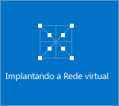
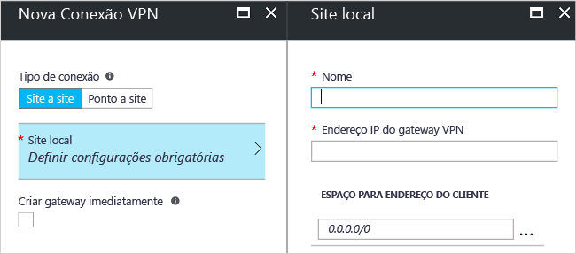

# <a name="create-a-site-to-site-connection-using-the-azure-portal-classic"></a>Criar uma conexão Site a Site usando o portal do Azure (clássico)

[!INCLUDE [deployment models](../../includes/vpn-gateway-classic-deployment-model-include.md)]

Este artigo mostra como usar o portal do Azure para criar uma conexão de gateway de VPN Site a Site de sua rede local para a rede virtual. As etapas deste artigo se aplicam ao modelo de implantação clássico. Você também pode criar essa configuração usando uma ferramenta de implantação ou um modelo de implantação diferente, selecionando uma opção diferente na lista a seguir:

> [!div class="op_single_selector"]
> * [Portal do Azure](vpn-gateway-howto-site-to-site-resource-manager-portal.md)
> * [PowerShell](vpn-gateway-create-site-to-site-rm-powershell.md)
> * [CLI](vpn-gateway-howto-site-to-site-resource-manager-cli.md)
> * [Portal do Azure (clássico)](vpn-gateway-howto-site-to-site-classic-portal.md)
> 
>

Uma conexão de gateway de VPN Site a Site é usada para conectar a rede local a uma rede virtual do Azure por um túnel VPN IPsec/IKE (IKEv1 ou IKEv2). Esse tipo de conexão exige um dispositivo VPN localizado no local que tenha um endereço IP público voltado para o exterior atribuído a ele. Para saber mais sobre os gateways de VPN, veja [Sobre o gateway de VPN](vpn-gateway-about-vpngateways.md).


## <a name="before-you-begin"></a>Antes de começar

Verifique se você atende aos seguintes critérios antes de iniciar a configuração:

* Verifique se você deseja trabalhar no modelo de implantação clássico. Se você deseja trabalhar no modelo de implantação do Gerenciador de Recursos, confira [Criar uma conexão Site a Site (Gerenciador de Recursos)](vpn-gateway-howto-site-to-site-resource-manager-portal.md). Quando possível, recomendamos o uso do modelo de implantação do Gerenciador de Recursos.
* Verifique se você possui um dispositivo VPN compatível e alguém que possa configurá-lo. Para obter mais informações sobre dispositivos VPN compatíveis e a configuração de dispositivo, confira [Sobre dispositivos VPN](vpn-gateway-about-vpn-devices.md).
* Verifique se você possui um endereço IPv4 público voltado para o exterior para seu dispositivo VPN.
* Se não estiver familiarizado com os intervalos de endereços IP localizados na configuração de rede local, você precisará trabalhar em conjunto com alguém que possa lhe fornecer os detalhes. Ao criar essa configuração, você deve especificar os prefixos de intervalo de endereços IP que o Azure roteará para seu local. Nenhuma das sub-redes da rede local podem se sobrepor às sub-redes de rede virtual às quais você deseja se conectar.
* No momento, o PowerShell é necessário para especificar a chave compartilhada e criar a conexão de gateway de VPN. Instale a versão mais recente dos cmdlets do PowerShell do SM (Gerenciamento de Serviços) do Azure. Para obter mais informações, confira [Como instalar e configurar o Azure PowerShell](/powershell/azure/overview). Ao trabalhar com o PowerShell para essa configuração, verifique se você está executando como administrador. 

### <a name="values"></a>Exemplo de valores de configuração para este exercício

Os exemplos neste artigo usam os seguintes valores. Você pode usar esses valores para criar um ambiente de teste ou consultá-los para compreender melhor os exemplos neste artigo.

* **Nome da VNet:** TestVNet1
* **Espaço de endereço:** 
  * 10.11.0.0/16
  * 10.12.0.0/16 (opcional para este exercício)
* **Sub-redes:**
  * FrontEnd: 10.11.0.0/24
  * BackEnd: 10.12.0.0/24 (opcional para este exercício)
* **GatewaySubnet:** 10.11.255.0/27
* **Grupo de recursos:** TestRG1
* **Localização:** Leste dos EUA
* **Servidor DNS:** 10.11.0.3 (opcional para este exercício)
* **Nome do site local:** Site2
* **Espaço de endereço do cliente:** o espaço de endereço localizado no site local.

## <a name="CreatVNet"></a>1. Criar uma rede virtual

Ao criar uma rede virtual a ser usada para uma conexão de S2S, você precisa certificar-se de que os espaços de endereço especificados não coincidam com um dos espaços de endereço de cliente dos sites locais aos quais você deseja se conectar. Se você tiver uma sobreposição de sub-redes, a conexão não funcionará corretamente.

* Se você já tiver uma rede virtual, verifique se as configurações são compatíveis com seu design de gateway de VPN. Preste atenção especial em todas as sub-redes que possam se sobrepor a outras redes. 

* Se você ainda não tiver uma rede virtual, crie uma. Capturas de tela são fornecidas como exemplos. Substitua os valores pelos seus próprios.

### <a name="to-create-a-virtual-network"></a>Para criar uma rede virtual

1. Em um navegador, navegue até o [portal do Azure](https://portal.azure.com) e, se necessário, entre com sua conta do Azure.
2. Clique em **+**. No campo **Pesquisar no Marketplace**, digite "Rede Virtual". Localize a **Rede Virtual** na lista retornada e clique para abrir a página **Rede Virtual**.

   
3. Perto da parte inferior da página Rede Virtual, na lista suspensa **Selecionar um modelo de implantação**, selecione **Clássico** e clique em **Criar**.

   
4. Na página **Criar rede virtual (clássico)**, defina as configurações da VNet. Nessa página, você adiciona o primeiro espaço de endereço e um único intervalo de endereços da sub-rede. Depois de terminar a criação da rede virtual, você poderá voltar e adicionar espaços de endereço e sub-redes adicionais.

   
5. Verifique se a **Assinatura** é a correta. Você pode alterar as assinaturas usando o menu suspenso.
6. Clique em **Grupo de recursos** e selecione um grupo de recursos existente ou crie um novo digitando um nome. Para saber mais sobre grupos de recursos, visite [Visão geral do Gerenciador de Recursos do Azure](../azure-resource-manager/resource-group-overview.md#resource-groups).
7. Em seguida, selecione as configurações do **Local** para sua VNet. O local determina onde ficarão os recursos que você implanta nessa rede virtual.
8. Se quiser ser capaz de encontrar sua VNet facilmente no painel, selecione **Fixar no painel**. Clique em **Criar** para criar a nova VNet.

   
9. Depois de clicar em 'Criar', um bloco aparece no painel refletindo o progresso de sua VNet. O bloco muda à medida que a rede virtual é criada.

   

## <a name="additionaladdress"></a>2. Adicionar espaço de endereço adicional

Depois de criar sua rede virtual, adicione o outro espaço de endereço. A adição do outro espaço de endereço não é uma parte obrigatória de uma configuração de S2S, mas se você precisar de vários espaços de endereço, use as etapas a seguir:

1. Localize as redes virtuais no portal.
2. Na página de rede virtual, na seção **Configurações**, clique em **Espaço de endereço**.
3. Na página Espaço de endereço, clique em **+Adicionar** e insira o espaço de endereço adicional.

## <a name="dns"></a>3. Especificar um servidor DNS

As configurações de DNS não são uma parte obrigatória de uma configuração de S2S, mas o DNS é necessário se você quiser resolução de nomes. A especificação de um valor não cria um novo servidor DNS. O endereço IP do servidor DNS especificado deve ser um servidor DNS que pode resolver os nomes dos recursos aos quais você está se conectando. Nas configurações de exemplo, usamos um endereço IP privado. O endereço IP que usamos provavelmente não é o endereço IP do seu servidor DNS. Use seus próprios valores.

Depois de criar a rede virtual, você pode adicionar o endereço IP de um servidor DNS para lidar com a resolução de nomes. Abra as configurações de sua rede virtual, clique em servidores DNS e adicione o endereço IP do servidor DNS que você deseja usar para resolução de nome.

1. Localize as redes virtuais no portal.
2. Na página de sua rede virtual, na seção **Configurações**, clique em **Servidores DNS**.
3. Adicionar um servidor DNS.
4. Para salvar suas configurações, clique em **Salvar** na parte superior da página.

## <a name="localsite"></a>4. Configurar o site local

O site local normalmente se refere ao seu site local. Ele contém o endereço IP do dispositivo VPN no qual você criará uma conexão e os intervalos de endereços IP que serão roteados através do gateway de VPN para o dispositivo VPN.

1. No portal, navegue até a rede virtual para a qual você deseja criar um gateway.
2. Na página de sua rede virtual, na página **Visão geral**, na seção Conexões VPN, clique em **Gateway** para abrir a página **Nova Conexão VPN**.

   
3. Na página **Nova Conexão VPN**, selecione **Site a site**.
4. Clique em **Site local - Definir configurações necessárias** para abrir a página **Site local**. Defina as configurações e, em seguida, clique em **OK** para salvar as configurações.
   - **Nome:** crie um nome para seu site local a fim de facilitar a identificação.
   - **Endereço IP do gateway de VPN:** esse é o endereço IP público do dispositivo VPN de sua rede local. O dispositivo VPN exige um endereço IP IPv4 público. Especifique um endereço IP público válido para o dispositivo VPN ao qual você deseja se conectar. Ele deve ser acessado pelo Azure. Se você não souber o endereço IP de seu dispositivo VPN, coloque-o em um valor de espaço reservado (desde que esteja no formato de um endereço IP público válido) e depois altere-o.
   - **Espaço de endereço do cliente:** lista os intervalos de endereços IP que você deseja rotear até a rede local por meio deste gateway. Você pode adicionar vários intervalos de espaço de endereço. Certifique-se de que os intervalos especificados aqui não se sobreponham aos intervalos de outras redes as quais sua rede virtual se conecta, ou com os intervalos de endereços da própria rede virtual.

   

## <a name="gatewaysubnet"></a>5. Configurar a sub-rede de gateway

Você deve criar uma sub-rede de gateway para seu gateway de VPN. A sub-rede de gateway contém os endereços IP que os serviços de gateway de VPN usam.

1. Na página **Nova Conexão VPN**, marque a caixa de seleção **Criar gateway imediatamente**. A página 'Configuração de gateway opcional' será exibida. Se você não marcar a caixa de seleção, não verá a página para configurar a sub-rede de gateway.

   
2. Para abrir a página **Configuração de gateway**, clique em **Configuração de gateway opcional - Sub-rede, tamanho e tipo de roteamento**.
3. Na página **Configuração de gateway**, clique em **Subnet - Definir as configurações necessárias** para abrir a página **Adicionar sub-rede**.

   
4. Na página **Adicionar sub-rede**, adicione a sub-rede de gateway. O tamanho da sub-rede de gateway que você especifica depende da configuração do gateway de VPN que deseja criar. Embora seja possível criar uma sub-rede do gateway tão pequena quanto /29, recomendamos que você use /27 ou /28. Isso cria uma sub-rede maior que inclui mais endereços. Usar uma sub-rede de gateway maior permite endereços IP suficientes para acomodar as possíveis configurações futuras.

   

## <a name="sku"></a>6. Especificar o tipo de SKU e VPN

1. Selecionar o **tamanho** do gateway. Este é o gateway SKU que você usa para criar o gateway de rede virtual. No portal, o 'SKU Padrão' = **Básico**. Gateways VPN clássicos usam SKUs de gateway antigos (herdados). Para saber mais sobre os SKUs de gateway antigos, confira [Trabalhar com SKUs de gateway de rede virtual (SKUs antigos)](vpn-gateway-about-skus-legacy.md).

   
2. Selecione o **Tipo de Roteamento** para seu gateway. Isso é também conhecido como o tipo de VPN. É importante selecionar o tipo de gateway correto, pois não é possível converter o gateway de um tipo para outro. Seu dispositivo VPN deve ser compatível com o tipo de roteamento selecionado. Para saber mais sobre o tipo de VPN, confira [Sobre as Configurações de Gateway de VPN](vpn-gateway-about-vpn-gateway-settings.md#vpntype). Você pode ver artigos sobre os tipos de VPN 'RouteBased' e 'PolicyBased'. 'Dinâmico' corresponde a 'RouteBased' e 'Estático' corresponde a 'PolicyBased'.
3. Clique em **OK** para salvar as configurações.
4. Na página **Nova Conexão VPN**, clique em **OK** na parte inferior da página para começar a criar o gateway de rede virtual. Dependendo da SKU selecionada, a criação de um gateway de rede virtual pode levar até 45 minutos.

## <a name="vpndevice"></a>7. Configurar o dispositivo de VPN

As conexões Site a Site para uma rede local exigem um dispositivo VPN. Nesta etapa, você deve configurar seu dispositivo VPN. Ao configurar seu dispositivo VPN, você precisará dos seguintes itens:

- Uma chave compartilhada. Essa é a mesma chave compartilhada especificada ao criar a conexão VPN Site a Site. Em nossos exemplos, usamos uma chave compartilhada básica. Recomendamos gerar uma chave mais complexa para uso.
- O endereço IP público do seu gateway de rede virtual. Você pode exibir o endereço IP público usando o portal do Azure, o PowerShell ou a CLI.

[!INCLUDE [vpn-gateway-configure-vpn-device-rm](../../includes/vpn-gateway-configure-vpn-device-rm-include.md)]

## <a name="CreateConnection"></a>8. Criar a conexão
Nesta etapa, defina a chave compartilhada e crie a conexão. A chave que você define deve ser a mesma chave usada na configuração do dispositivo VPN.

> [!NOTE]
> No momento, essa configuração não está disponível no Portal do Azure. Use a versão de SM (Gerenciamento de Serviço) dos cmdlets do Azure PowerShell.
>

### <a name="step-1-connect-to-your-azure-account"></a>Etapa 1. Conectar-se à sua conta do Azure

1. Abra o console do PowerShell com direitos elevados e conecte-se à sua conta. Use o exemplo a seguir para ajudar a se conectar:

   ```powershell
   Add-AzureAccount
   ```
2. Verificar as assinaturas da conta.

   ```powershell
   Get-AzureSubscription
   ```
3. Se você tiver mais de uma assinatura, selecione a assinatura que deseja usar.

   ```powershell
   Select-AzureSubscription -SubscriptionId "Replace_with_your_subscription_ID"
   ```

### <a name="step-2-set-the-shared-key-and-create-the-connection"></a>Etapa 2. Definir a chave compartilhada e criar a conexão

Ao trabalhar com o PowerShell e com o modelo de implantação clássica, às vezes, os nomes de recursos no portal não são os nomes esperados pelo Azure ao usar o PowerShell. As etapas a seguir ajudam a exportar o arquivo de configuração de rede para obter os valores exatos dos nomes.

1. Crie um diretório em seu computador e exporte o arquivo de configuração de rede para o diretório. Neste exemplo, o arquivo de configuração de rede é exportado para C:\AzureNet.

   ```powershell
   Get-AzureVNetConfig -ExportToFile C:\AzureNet\NetworkConfig.xml
   ```
2. Abra o arquivo de configuração de rede com um editor de xml e verifique os valores de 'Nome de LocalNetworkSite' e 'Nome de VirtualNetworkSite'. Modifique o exemplo para refletir os valores necessários. Ao especificar um nome que contenha espaços, use aspas simples ao redor do valor.

3. Defina a chave compartilhada e crie a conexão. '-SharedKey' é um valor que você pode gerar e especificar. Neste exemplo, usamos ‘abc123’, mas você pode (e deve) gerar e usar algo mais complexo. O importante é que o valor especificado aqui deve ser o mesmo valor especificado ao configurar seu dispositivo VPN.

   ```powershell
   Set-AzureVNetGatewayKey -VNetName 'Group TestRG1 TestVNet1' `
   -LocalNetworkSiteName 'D1BFC9CB_Site2' -SharedKey abc123
   ```
   Quando a conexão é criada, o resultado é: **Status: bem-sucedido**.

## <a name="verify"></a>9. Verificar a conexão

[!INCLUDE [vpn-gateway-verify-connection-azureportal-classic](../../includes/vpn-gateway-verify-connection-azureportal-classic-include.md)]

Se você estiver tendo problemas para se conectar, consulte a seção **Solucionar problemas** do sumário no painel esquerdo.

## <a name="reset"></a>Como redefinir um gateway de VPN

Redefinir um gateway de VPN do Azure é útil se você perde a conectividade VPN entre locais em um ou mais túneis de VPN site a site. Nessa situação, os dispositivos VPN locais estão funcionando corretamente, mas não são capazes de estabelecer túneis IPsec com os gateways de VPN do Azure. Para obter as etapas, consulte [Redefinir um gateway de VPN](vpn-gateway-resetgw-classic.md).

## <a name="changesku"></a>Como alterar uma SKU de gateway

Para obter as etapas para alterar um SKU de gateway, consulte [Redimensionar um SKU de gateway](vpn-gateway-about-SKUS-legacy.md).

## <a name="next-steps"></a>Próximas etapas

* Quando sua conexão for concluída, você poderá adicionar máquinas virtuais às suas redes virtuais. Para saber mais, veja [Máquinas virtuais](https://docs.microsoft.com/azure/).
* Para saber mais sobre Túneis Forçados, confira [Sobre o Túnel Forçado](vpn-gateway-about-forced-tunneling.md).
