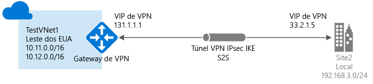

# Criar uma VNet com uma conexão Site a Site usando o Portal do Azure
> [!div class="op_single_selector"]
> * [Resource Manager - Portal do Azure](vpn-gateway-howto-site-to-site-resource-manager-portal.md)
> * [Resource Manager - PowerShell](vpn-gateway-create-site-to-site-rm-powershell.md)
> * [Portal do Azure - Clássico](vpn-gateway-howto-site-to-site-classic-portal.md)
> * [Clássico - Portal Clássico](vpn-gateway-site-to-site-create.md)
>
>

Este artigo mostra como criar uma rede virtual e uma conexão de gateway de VPN Site a Site com sua rede local usando o modelo de implantação do Azure Resource Manager e o Portal do Azure. As conexões Site a Site podem ser usadas para configurações híbridas e entre instalações.

### Modelos e métodos de implantação para conexões Site a Site
[!INCLUDE [deployment models](../../includes/vpn-gateway-deployment-models-include.md)]

A tabela a seguir mostra os modelos de implantação e os métodos de configurações de site a site disponíveis no momento. Quando houver um artigo com etapas de configuração disponível, o vincularemos diretamente desta tabela.

[!INCLUDE [site-to-site table](../../includes/vpn-gateway-table-site-to-site-include.md)]

#### Configurações adicionais
Se você quiser conectar Redes Virtuais, mas não estiver criando uma conexão com uma instalação local, confira [Configurar uma conexão de Rede Virtual para Rede Virtual](vpn-gateway-vnet-vnet-rm-ps.md). Se você deseja adicionar uma conexão Site a Site a uma rede virtual que já tem uma conexão, consulte [Adicionar uma conexão de S2S a uma rede virtual com uma conexão de gateway de VPN existente](vpn-gateway-howto-multi-site-to-site-resource-manager-portal.md).

## Antes de começar
Antes de começar a configurar, verifique se você tem os seguintes itens:

* Um dispositivo VPN compatível e alguém que possa configurá-lo. Confira [Sobre dispositivos VPN](vpn-gateway-about-vpn-devices.md). Se você não estiver familiarizado com a configuração de seu dispositivo VPN ou se não estiver familiarizado com os intervalos de endereços IP localizados em sua configuração de rede local, será necessário coordenar com alguém que possa fornecer os detalhes para você.
* Um endereço IP público voltado para o exterior para seu dispositivo VPN. Esse endereço IP não pode estar localizado atrás de um NAT.
* Uma assinatura do Azure. Se ainda não tiver uma assinatura do Azure, você poderá ativar os [Benefícios do assinante do MSDN](http://azure.microsoft.com/pricing/member-offers/msdn-benefits-details) ou inscrever-se para obter uma [conta gratuita](http://azure.microsoft.com/pricing/free-trial).

### Exemplo de valores de configuração para este exercício
Ao usar estas etapas como um exercício, você poderá usar os valores de configuração de exemplo:

* **Nome da rede virtual:** TestVNet1
* **Espaço de endereço:** 10.11.0.0/16 e 10.12.0.0/16
* **Sub-redes:**
  * FrontEnd: 10.11.0.0/24
  * BackEnd: 10.12.0.0/24
  * GatewaySubnet: 10.12.255.0/27
* **Grupo de recursos:** TestRG1
* **Local:** Leste dos EUA
* **Servidor DNS:** 8.8.8.8
* **Nome do Gateway:** VNet1GW
* **IP público:** VNet1GWIP
* **Tipo de VPN:** baseada em rota
* **Tipo de Conexão:** site a site (IPsec)
* **Tipo de gateway:** VPN
* **Nome do Gateway de Rede Local:** Site2
* **Nome da conexão:** VNet1toSite2

## 1. Criar uma rede virtual
Se você já tiver uma rede virtual, verifique se as configurações são compatíveis com seu design de gateway de VPN. Preste atenção especial em todas as sub-redes que possam se sobrepor a outras redes. Se você tiver uma sobreposição de sub-redes, a conexão não funcionará corretamente. Se a sua Rede Virtual estiver configurada com as definições corretas, poderá começar as etapas na seção [Especificar um servidor DNS](#dns) .

### Para criar uma rede virtual
[!INCLUDE [vpn-gateway-basic-vnet-rm-portal](../../includes/vpn-gateway-basic-vnet-rm-portal-include.md)]

## 2. Adicionar espaço de endereço e sub-redes adicionais
Você pode adicionar um espaço de endereço e sub-redes adicionais para sua rede virtual após sua criação.

[!INCLUDE [vpn-gateway-additional-address-space](../../includes/vpn-gateway-additional-address-space-include.md)]

## 3. Especificar um servidor DNS
### Para especificar um servidor DNS
[!INCLUDE [vpn-gateway-add-dns-rm-portal](../../includes/vpn-gateway-add-dns-rm-portal-include.md)]

## 4. Criar uma sub-rede de gateway
Antes de conectar sua Rede Virtual a um gateway, você precisará criar a sub-rede de gateway para a Rede Virtual à qual você deseja se conectar. Se possível, é melhor criar uma sub-rede de gateway usando um bloco CIDR de /28 ou /27, a fim de fornecer endereços IP suficientes para acomodar requisitos futuros de configuração.

Se a criação dessa configuração fizer parte de um exercício, confira esses [valores](#values) ao criar sua sub-rede de gateway.

### Para criar uma sub-rede de gateway
[!INCLUDE [vpn-gateway-add-gwsubnet-rm-portal](../../includes/vpn-gateway-add-gwsubnet-rm-portal-include.md)]

## 5. Criar um gateway de rede virtual
Se você estiver criando esta configuração como um exercício, consulte estes [valores de exemplo de configuração](#values).

### Para criar um gateway da rede virtual
[!INCLUDE [vpn-gateway-add-gw-rm-portal](../../includes/vpn-gateway-add-gw-rm-portal-include.md)]

## 6. Criar um gateway de rede local
O 'gateway de rede local' se refere ao seu local. Dê um nome ao gateway de rede local ao qual o Azure possa fazer referência. 

Se você estiver criando esta configuração como um exercício, consulte estes [valores de exemplo de configuração](#values).

### Para criar um gateway de rede local
[!INCLUDE [vpn-gateway-add-lng-rm-portal](../../includes/vpn-gateway-add-lng-rm-portal-include.md)]

## 7. Configurar o dispositivo de VPN
[!INCLUDE [vpn-gateway-configure-vpn-device-rm](../../includes/vpn-gateway-configure-vpn-device-rm-include.md)]

## 8. Criar uma conexão VPN site a site
Crie a conexão VPN site a site entre o gateway de rede virtual e o dispositivo VPN. Substitua os valores pelos seus próprios. A chave compartilhada deve corresponder ao valor usado para a configuração do dispositivo VPN. 

Antes de iniciar esta seção, verifique se a criação do gateway de rede virtual e dos gateways de rede local foram concluídas. Se você estiver criando essa configuração como um exercício, consulte esses [valores](#values) ao criar sua conexão.

### Para criar a conexão VPN
[!INCLUDE [vpn-gateway-add-site-to-site-connection-rm-portal](../../includes/vpn-gateway-add-site-to-site-connection-rm-portal-include.md)]

## 9. Verificar a conexão VPN
Você pode verificar a conexão VPN no portal ou usando o PowerShell.

[!INCLUDE [vpn-gateway-verify-connection-rm](../../includes/vpn-gateway-verify-connection-rm-include.md)]

## Próximas etapas
*  Quando sua conexão for concluída, você poderá adicionar máquinas virtuais às suas redes virtuais. Para saber mais, veja [Máquinas virtuais](https://docs.microsoft.com/azure/#pivot=services&panel=Compute).
*  Para obter informações sobre o BGP, consulte a [Visão Geral do BGP](vpn-gateway-bgp-overview.md) e [Como configurar o BGP](vpn-gateway-bgp-resource-manager-ps.md).

