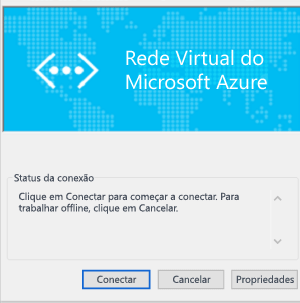

<properties
   pageTitle="Configurar uma conexão de gateway VPN Ponto a Site com uma Rede Virtual do Azure usando o portal clássico| Microsoft Azure"
   description="Conecte com segurança a Rede Virtual do Azure criando uma conexão de gateway VPN Ponto a Site."
   services="vpn-gateway"
   documentationCenter="na"
   authors="cherylmc"
   manager="carmonm"
   editor=""
   tags="azure-service-management"/>

<tags
   ms.service="vpn-gateway"
   ms.devlang="na"
   ms.topic="hero-article"
   ms.tgt_pltfrm="na"
   ms.workload="infrastructure-services"
   ms.date="08/31/2016"
   ms.author="cherylmc"/>

# Configurar uma conexão Ponto a Site em uma VNet usando o portal clássico

> [AZURE.SELECTOR]
- [PowerShell – Resource Manager](vpn-gateway-howto-point-to-site-rm-ps.md)
- [Portal - Clássico](vpn-gateway-point-to-site-create.md)

Uma configuração Ponto a Site (P2S) permite que você crie uma conexão segura de um computador cliente individual com uma rede virtual. Uma conexão P2S é útil quando você deseja se conectar à sua rede virtual de um local remoto, como de casa ou de uma conferência, ou quando há apenas alguns clientes que precisam se conectar a uma rede virtual.

Este artigo fornece uma orientação sobre a criação de uma VNet com uma conexão Ponto a Site no **modelo de implantação clássica** usando o portal clássico. No momento, você não pode criar essa configuração de ponta a ponta para o modelo de implantação clássico no Portal do Azure.

As conexões Ponto a Site não exigem um dispositivo VPN ou um endereço IP voltado para o público para funcionar. Uma conexão VPN é estabelecida por meio do início da conexão do computador cliente. Para saber mais sobre as conexões Ponto a Site, consulte as [Perguntas frequentes sobre o Gateway de VPN](vpn-gateway-vpn-faq.md#point-to-site-connections) e [Planejamento e design](vpn-gateway-plan-design.md).

**Modelos de implantação e ferramentas para conexões Site a Site**

[AZURE.INCLUDE [vpn-gateway-table-point-to-site](../../includes/vpn-gateway-table-point-to-site-include.md)]

**Sobre modelos de implantação do Azure**

[AZURE.INCLUDE [vpn-gateway-clasic-rm](../../includes/vpn-gateway-classic-rm-include.md)]

## Sobre a criação de uma conexão Ponto a Site
 
As etapas a seguir orientarão você durante as etapas para criar uma conexão Ponto a Site segura para uma rede virtual.

A configuração de uma conexão Ponto a Site é dividida em quatro seções. A ordem na qual você configura cada uma dessas seções é importante. Não ignore as etapas ou pule para as seguintes.

- **Seção 1** Criar uma rede virtual e um gateway de VPN.
- **Seção 2** Criar os certificados usados para autenticação e a carregá-los.
- **Seção 3** Exportar e instalar seus certificados de cliente.
- **Seção 4** Configurar seu cliente VPN.

## Seção 1 - Criar uma rede virtual e um gateway de VPN

### Parte 1: criar uma rede virtual.

1. Faça logon no [portal clássico do Azure](https://manage.windowsazure.com/). Estas etapas usam o portal clássico, não o portal do Azure. No momento, você não pode criar uma conexão P2S usando o portal do Azure.

2. No canto inferior esquerdo da tela, clique em **Novo**. No painel de navegação, clique em **Serviços de Rede** e, em seguida, clique em **Rede Virtual**. Clique em **Criação Personalizada** para iniciar o assistente de configuração.

3. Na página **Detalhes da Rede Virtual**, insira as informações a seguir e, em seguida, clique na seta de avanço na parte inferior direita.
	- **Nome**: nome da sua rede virtual. Por exemplo, “VNet1”. Esse é o nome você usará ao implantar as VMs nessa rede virtual.
	- **Local**: o local está diretamente relacionado ao local físico (região) onde você deseja que os recursos (VMs) residam. Por exemplo, se você desejar que as VMs implantadas nesta rede virtual estejam localizadas fisicamente no leste dos EUA, selecione esse local. Você não pode alterar a região associada à sua rede virtual depois de criá-la.

4. Na página **Servidores DNS e Conectividade de VPN**, insira as seguintes informações e, em seguida, clique na seta avançar no canto inferior direito.
	- **Servidores DNS**: insira o nome do servidor DNS e o endereço IP ou selecione um servidor DNS previamente registrado no menu de atalho. Essa configuração não cria um servidor DNS. Ela permite que você especifique os servidores DNS que deseja usar para a resolução de nomes dessa rede virtual. Se você quiser usar o serviço de resolução de nome padrão do Azure, deixe esta seção em branco.
	- **Configurar VPN Ponto a Site**: selecione a caixa de seleção.

5. Na página **Conectividade ponto a site**, especifique o intervalo de endereços IP do qual os seus clientes VPN receberão um endereço IP quando conectados. Há algumas regras sobre os intervalos de endereços que você pode especificar. É importante verificar se o intervalo especificado não coincide com nenhum dos intervalos existentes na rede local.

6. Digite as informações a seguir e, em seguida, clique na seta de avanço.
 - **Espaço de endereço**: inclua o IP Inicial e a Contagem de Endereços (CIDR).
 - **Adicionar espaço de endereço**: adicione o espaço de endereço somente se necessário para seu design de rede.

7. Na página **Espaços de Endereço de Rede Virtual**, especifique o intervalo de endereços que você deseja usar para sua rede virtual. Estes são os endereços IP dinâmicos (DIPS) que serão atribuídos às VMs e a outras instâncias de função que você implantar nessa rede virtual.  É especialmente importante selecionar um intervalo que não se sobreponha a nenhum dos intervalos usados para sua rede local. Você deve trabalhar em conjunto com o administrador da rede, que pode precisar reservar um intervalo de endereços IP de seu espaço de endereço de rede local para que você possa usar para sua rede virtual.

8. Insira as informações a seguir e clique na marca de seleção para iniciar a criação da sua rede virtual.
 - **Espaço de endereço**: adicione o intervalo de endereços IP internos que você deseja usar para essa rede virtual, incluindo IP Inicial e Contagem. É importante selecionar um intervalo que não se sobreponha a qualquer um dos intervalos usados para sua rede local.
 - **Adicionar sub-rede**: não são necessárias sub-redes adicionais, mas convém criar uma sub-rede separada para as VMs que terão DIPS estáticos. Ou então, você pode colocar suas VMs em uma sub-rede separada das outras instâncias de função.
 - **Adicionar sub-rede de gateway**: a sub-rede de gateway é necessária para uma VPN ponto a site. Clique para adicionar a sub-rede de gateway. A sub-rede de gateway é usada apenas para o gateway de rede virtual.

9. Quando sua rede virtual tiver sido criada, você verá a denominação **Criada** listada em **Status** na página de redes no portal clássico do Azure. Depois que sua rede virtual tiver sido criada, você poderá criar o gateway de roteamento dinâmico.

### Parte 2: criar um gateway de roteamento dinâmico

O tipo de gateway deve ser configurado como dinâmico. Os gateways de roteamento estáticos não funcionam com este recurso.

1. No portal clássico do Azure, na página **Redes**, clique na rede virtual que você criou e navegue até a página **Painel**.

2. Clique em **Criar Gateway**, localizado na parte inferior da página **Painel**. Será exibida uma mensagem perguntando se **Você deseja criar um gateway para a rede virtual "VNet1"**. Clique em **Sim** para começar a criar o gateway. Pode levar cerca de 15 minutos para que o gateway seja criado.

## Seção 2 - Gerar e carregar certificados

Os certificados são usados para autenticar clientes VPN para VPNs ponto a site. Você pode usar um certificado raiz gerado por uma solução de certificado corporativo, bem como usar um certificado autoassinado. É possível carregar até 20 certificados raiz no Azure. Uma vez carregado o arquivo .cer, o Azure poderá usar as informações contidas nele para autenticar clientes com um certificado de cliente instalado. O certificado do cliente deve ser gerado desde o mesmo certificado que o arquivo .cer representa.

Nesta seção, você fará o seguinte:

- Obtenha o arquivo .cer de um certificado raiz. Pode ser um certificado autoassinado ou você pode usar o sistema de certificado corporativo.
- Carregue o arquivo .cer no Azure.
- Gere certificados de cliente.

### Parte 1: obter o arquivo .cer do certificado raiz

Se você estiver usando um sistema de certificado corporativo, obtenha o arquivo .cer do certificado raiz que deseja usar. Na [Parte 3](#createclientcert), você gerará os certificados de cliente desde o certificado raiz.

Se você não estiver usando uma solução de certificado corporativo, será preciso gerar um certificado raiz autoassinado. Para obter as etapas para o Windows 10, você pode conferir [Trabalhando com certificados raiz autoassinados para configurações de Ponto a Site](vpn-gateway-certificates-point-to-site.md). O artigo orienta você a usar o makecert para gerar um certificado autoassinado e depois exportar o arquivo .cer.

### Parte 2: Carregar o arquivo .cer do certificado raiz no portal clássico do Azure

Adicione um certificado confiável ao Azure. Quando você adiciona um arquivo X.509 codificado de Base64 (. cer) ao Azure, está dizendo ao Azure para confiar no certificado raiz que o arquivo representa.

1. No portal clássico do Azure, na página **Certificados** de sua rede virtual, clique em **Carregar um certificado raiz**.

2. Na página **Carregar certificado**, procure o certificado raiz .cer e clique na marca de seleção.

### Parte 3: Gerar um certificado de cliente

Em seguida, gere os certificados de cliente. Você pode gerar um certificado exclusivo para cada cliente que se conectará ou pode usar o mesmo certificado em vários clientes. A vantagem da geração de certificados de cliente exclusivos é a capacidade de revogar um único certificado, se necessário. Caso contrário, se todos estiverem usando o mesmo certificado de cliente e se for necessário revogar o certificado para um cliente, você precisará gerar e instalar novos certificados para todos os clientes que usam o certificado para autenticação.

- Se você estiver usando uma solução de certificado corporativo, gere um certificado de cliente com o formato de valor de nome comum 'nome@seudomínio.com.br', em vez do formato NetBIOS 'DOMÍNIO\\nomedeusuário'.

- Se você estiver usando um certificado autoassinado, veja [Trabalhando com certificados raiz autoassinados para configurações Ponto a Site](vpn-gateway-certificates-point-to-site.md) para gerar um certificado de cliente.

## Seção 3 - Exportar e instalar o certificado de cliente

Instale um certificado de cliente em cada computador que você queira conectar à rede virtual. Um certificado de cliente é necessário para autenticação. Você pode automatizar a instalação do certificado de cliente ou pode instalar manualmente. As etapas a seguir guiarão você pela instalação manual do certificado de cliente.

1. Para exportar um certificado do cliente, use *certmgr.msc*. Clique com o botão direito do mouse no certificado de cliente que você deseja exportar, clique em **todas as tarefas** e clique em **exportar**.
2. Exporte o certificado de cliente com a chave privada. Este é um arquivo *.pfx*. Certifique-se de registrar ou se lembrar da senha (chave) que você definiu para esse certificado.
3. Copie o arquivo *.pfx* para o computador cliente. No computador cliente, clique duas vezes no arquivo *.pfx* para instalá-lo. Digite a senha quando solicitado. Não modifique o local de instalação.

## Seção 4 - Configurar seu cliente VPN

Para se conectar à rede virtual, também será necessário configurar um cliente VPN. O cliente requer um certificado de cliente e a configuração adequada do cliente VPN para se conectar. Para configurar seu cliente VPN, execute as etapas a seguir, na ordem.

### Parte 1: criar o pacote de configuração de cliente VPN.

1. No portal clássico do Azure, na página **Painel** da sua rede virtual, navegue até o menu de visão rápida no canto direito. Para obter a lista de sistemas operacionais quer recebem suporte, consulte a seção [Conexões Ponto a Site ](vpn-gateway-vpn-faq.md#point-to-site-connections) das perguntas frequentes sobre o Gateway de VPN. O pacote do cliente VPN contém informações de configuração para configurar o software de cliente VPN integrado ao Windows. O pacote não instala softwares adicionais. As configurações são específicas para a rede virtual a qual você deseja se conectar.  Selecione o pacote de download que corresponde ao sistema operacional cliente no qual ela será instalada:
 - Para clientes de 32 bits, selecione **Baixar o Pacote de Cliente VPN de 32 bits**.
 - Para clientes de 64 bits, selecione **Baixar o Pacote de Cliente VPN de 64 bits**.

2. A criação do pacote de cliente pode demorar um pouco. Depois que o pacote tiver sido concluído, você poderá baixar o arquivo. O arquivo *.exe* baixado pode ser armazenado com segurança no seu computador local.

3. Depois de gerar e baixar o pacote de cliente VPN no portal clássico do Azure, você pode instalar o pacote do cliente no computador cliente por meio do qual deseja se conectar à sua rede virtual. Se você planeja instalar o pacote do cliente VPN em vários computadores cliente, certifique-se de que cada um deles também tenha um certificado de cliente instalado.

### Parte 2: Instalar o pacote de configuração VPN no cliente

1. Copie o arquivo de configuração localmente no computador que você deseja conectar à sua rede virtual e clique duas vezes no arquivo .exe.

2. Depois que o pacote tiver sido instalado, você pode iniciar a conexão VPN. O pacote de configuração não está assinado pela Microsoft. Convém assinar o pacote usando o serviço de assinatura de sua organização ou assiná-lo você mesmo usando [SignTool](http://go.microsoft.com/fwlink/p/?LinkId=699327). Não há problemas em usar o pacote sem assinatura. No entanto, se o pacote não estiver assinado, será exibido um aviso quando você instalar o pacote.

3. No computador cliente, navegue até **Configurações de Rede** e clique em **VPN**. Você verá a conexão listada. Ela mostrará o nome da rede virtual a qual se conectará e terá uma aparência parecida com esta:

	

### Parte 3: Conectar-se ao Azure

1. Para se conectar à sua rede virtual, no computador cliente, navegue até conexões VPN e localize a conexão VPN que você criou. Ele terá o mesmo nome da sua rede virtual. Clique em **Conectar**. Uma mensagem pop-up pode ser exibida sobre o uso do certificado. Se isso acontecer, clique em **Continuar** para usar os privilégios elevados.

2. Na página de status da **Conexão**, clique em **Conectar** para iniciar a conexão. Se for exibida uma tela de **Selecionar certificado**, verifique se o certificado de cliente mostrado é o que você deseja usar para se conectar. Se não for, use a seta suspensa para selecionar o certificado correto e clique em **OK**.

	

3. Sua conexão já deve ter sido estabelecida.

	

### Parte 4: Verificar a conexão VPN

1. Para verificar se a conexão VPN está ativa, abra um prompt de comandos com privilégios elevados e execute *ipconfig/all*.
2. Exiba os resultados. Observe que o endereço IP que você recebeu está dentro do intervalo de endereços de conectividade ponto a site que você especificou quando criou a sua VNet. Os resultados devem ser algo semelhante a isto:

Exemplo:

    PPP adapter VNet1:
		Connection-specific DNS Suffix .:
		Description.....................: VNet1
		Physical Address................:
		DHCP Enabled....................: No
		Autoconfiguration Enabled.......: Yes
		IPv4 Address....................: 192.168.130.2(Preferred)
		Subnet Mask.....................: 255.255.255.255
		Default Gateway.................:
		NetBIOS over Tcpip..............: Enabled

## Próximas etapas

Você pode adicionar máquinas virtuais à sua rede virtual. Veja [Como criar uma máquina virtual personalizada](../virtual-machines/virtual-machines-windows-classic-createportal.md).

Se quiser saber mais sobre Redes Virtuais, consulte a página [Documentação da Rede Virtual](https://azure.microsoft.com/documentation/services/virtual-network/).

<!---HONumber=AcomDC_0907_2016-->