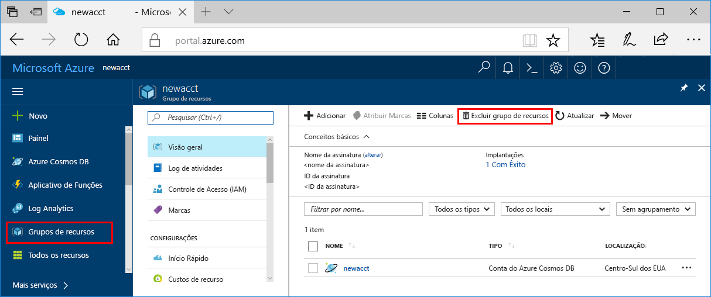

>[!IMPORTANT]
>Os recursos que você criou podem ser usados como pré-requisitos em outros tutoriais e artigos de instruções do Serviço do Azure Machine Learning. 

Se você não planeja usar os recursos que criou aqui, exclua-os para não incorrer em encargos.

1. No portal do Azure, selecione **Grupos de recursos** no canto esquerdo.
 
   

1. Selecione o grupo de recursos criado na lista.

1. Selecione **Excluir grupo de recursos**.

1. Insira o nome do grupo de recursos e selecione **Excluir**.
