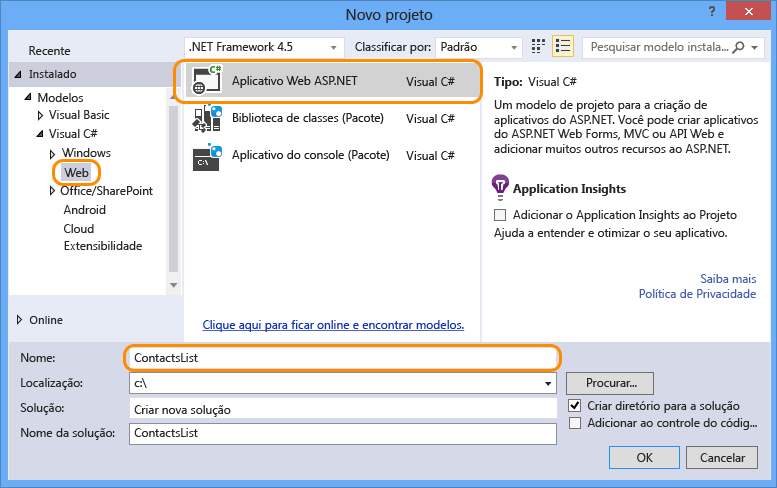
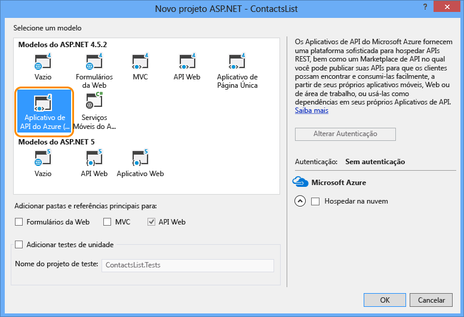

1. Abra o Visual Studio 2015 ou Visual Studio 2013.
2. Selecione **Arquivo > Novo > Projeto**.
3. Selecione o modelo **Aplicativo Web ASP .NET**.
4. Verifique se a caixa de seleção **Adicionar o Application Insights ao Projeto** está desmarcada.
5. Insira um nome para o projeto.
   
    
6. Clique em **OK**.
7. Na caixa de diálogo **Novo Projeto ASP.NET**, selecione o modelo de projeto **Aplicativo de API do Azure**.
   
    
8. Clique em **OK** para criar o projeto.

O Visual Studio cria um projeto de API Web configurado para implantação como um aplicativo de API.

<!---HONumber=Oct15_HO3-->