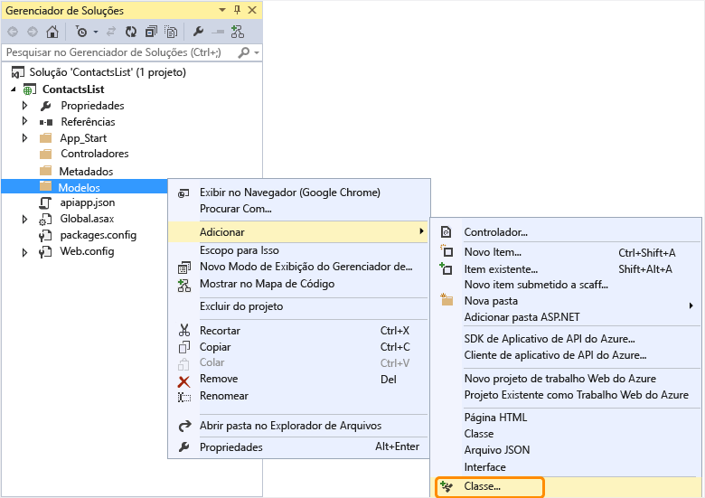
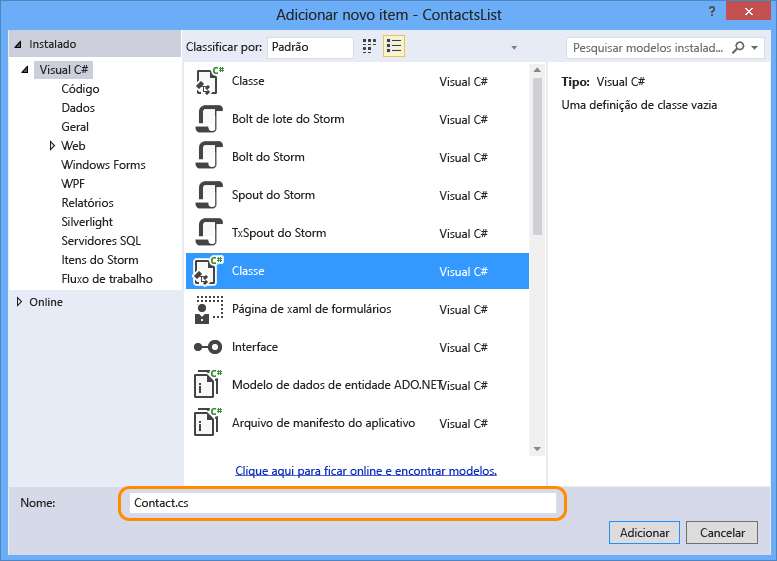
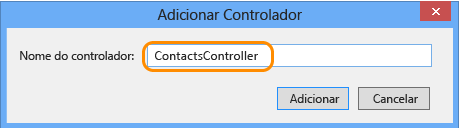

## Adicionar código API Web

Nas etapas a seguir, você adiciona código para um método HTTP Get simples que retorna uma lista de contatos embutida em código.

1. No Gerenciador de Soluções, clique com o botão direito do mouse na pasta **Modelos** e selecione **Adicionar > Classe**. 

	

2. Chame o novo arquivo de *Contact.cs*.

	

3. Clique em **Adicionar**.

4. Depois de criar o arquivo *Contact.cs* substitua todo o conteúdo do arquivo pelo código a seguir.

		namespace ContactsList.Models
		{
			public class Contact
			{
				public int Id { get; set; }
				public string Name { get; set; }
				public string EmailAddress { get; set; }
			}
		}

5. Clique com o botão direito do mouse na pasta **Controladores** e selecione **Adicionar > Controlador**.

	

6. Na caixa de diálogo **Adicionar Scaffold**, selecione a opção **Controlador de API Web 2 - Vazio** e clique em **Adicionar**.

	

7. Nomeie o controlador **ContactsController** e clique em **Adicionar**.

	

8. Depois que o arquivo ContactsController.cs é criado, substitua todo o conteúdo do arquivo pelo código a seguir.

		using ContactsList.Models;
		using System;
		using System.Collections.Generic;
		using System.Linq;
		using System.Net;
		using System.Net.Http;
		using System.Threading.Tasks;
		using System.Web.Http;
		
		namespace ContactsList.Controllers
		{
		    public class ContactsController : ApiController
		    {
		        [HttpGet]
		        public IEnumerable<Contact> Get()
		        {
		            return new Contact[]{
						new Contact { Id = 1, EmailAddress = "barney@contoso.com", Name = "Barney Poland"},
						new Contact { Id = 2, EmailAddress = "lacy@contoso.com", Name = "Lacy Barrera"},
	                	new Contact { Id = 3, EmailAddress = "lora@microsoft.com", Name = "Lora Riggs"}
		            };
		        }
		    }
		}

## Habilitar interface do usuário do Swagger

Por padrão, os projetos de aplicativo de API são habilitados com geração automática de metadados [Swagger](http://swagger.io/ "Informações oficiais do Swagger"), e quando você usa a entrada de menu **Adicionar SDK do Aplicativo de API** para converter um projeto API Web, uma página de teste de API também é habilitada por padrão.

No entanto, o modelo de novo projeto de aplicativo de API do desabilita a página de teste de API. Ao criar o projeto do aplicativo de API usando o modelo de projeto de aplicativo de API, execute as etapas a seguir para habilitar a página de teste.

**Observação:** se você implantar o aplicativo de API como *público anônimo* e com a interface do usuário do Swagger habilitada, qualquer pessoa poderá usar a interface do usuário do Swagger para descobrir e chamar suas APIs.

1. Abra o arquivo *App\_Start/SwaggerConfig.cs*, e pesquise por **EnableSwaggerUI**:

	

2. Remova os comentários das seguintes linhas de código:

	        })
	    .EnableSwaggerUi(c =>
	        {

3. Ao terminar, o arquivo deve ter esta aparência:

	

## Testar a API Web

Para exibir a página de teste da API, execute as etapas a seguir.

1. Execute o aplicativo localmente (CTRL+F5).

	O navegador se abre e exibe um erro HTTP 403 porque a URL base não é uma página da Web ou URL de método de API válidos para este projeto.
 
3.  Navegue até a página do Swagger adicionando `/swagger` ao final da URL base.

	

2. Clique em **Contatos > Obter > Experimentar** e você verá que a API está funcionando e retorna o resultado esperado.

	

3. No Visual Studio, clique em **Depurar > Parar Depuração**.

<!---HONumber=August15_HO8-->