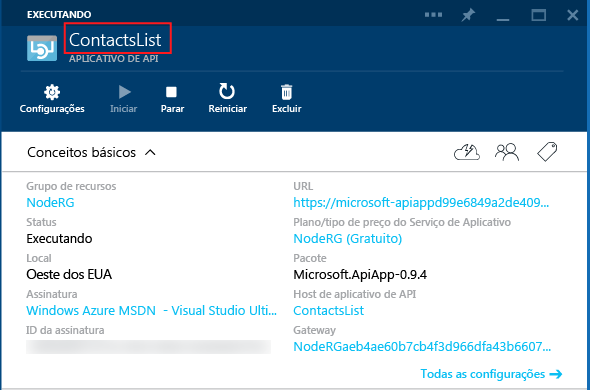

## Metadados do aplicativo de API

Esta seção fornece informações adicionais sobre metadados de aplicativo de API que você pode personalizar.

A maioria das propriedades no arquivo *apiapp.json* e nos arquivos da pasta *Metadata* afetam o modo como um pacote de aplicativos de API é apresentado no Azure Marketplace. As seções a seguir explicam quais arquivos e propriedades afetam os aplicativos de API quando você implanta o código em um aplicativo de API na assinatura do Azure.

### ID do aplicativo de API 

A propriedade `id` determina o nome do aplicativo de API. Por exemplo:

		"id": "ContactsList",

### Namespace

Defina a propriedade `namespace` para o domínio do seu locatário do Active Directory do Azure. Para localizar seu domínio, abra seu navegador no [Portal clássico do Azure](https://manage.windowsazure.com/), procure **Active Directory** e selecione a guia **Domínios**. Por exemplo:

		"namespace": "contoso.onmicrosoft.com",

### Definição de API Swagger dinâmica

Se o aplicativo de API puder retornar uma definição de API [Swagger](http://swagger.io/) dinâmica, armazene a URL relativa para uma solicitação GET que retorna a definição de API JSON na propriedade `endpoints.apiDefinition`. Por exemplo:

		"endpoints": {
		    "apiDefinition": "/swagger/docs/v1"
		}

> **Observação:** se você estiver usando o Swashbuckle para gerar uma definição de API do Swagger, sobrecargas do método HTTP em seus controladores de API da Web resultarão em ids de operação duplicadas. Para obter mais informações, consulte [Personalizar identificadores de operação gerados pelo Swashbuckle](../article/app-service-api/app-service-api-dotnet-swashbuckle-customize.md).
  
### Definição de API Swagger estática

Para fornecer um arquivo de definição de API [Swagger](http://swagger.io/) 2.0 estático, armazene o arquivo na pasta *Metadata* e nomeie o arquivo como *apiDefinition.swagger.json*

Deixe `endpoints.apiDefinition` fora do arquivo *apiapp.json* ou definir seu valor como nulo. Se você incluir uma URL `endpoints.apiDefinition` e um arquivo *apiDefinition.swagger.json*, a URL terá precedência e o arquivo será ignorado.

<!---HONumber=August15_HO6-->