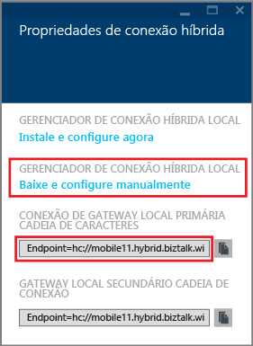
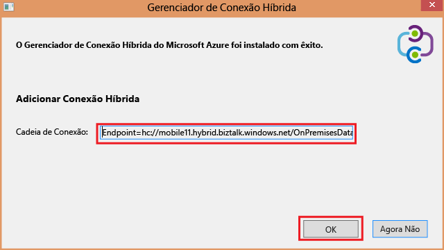
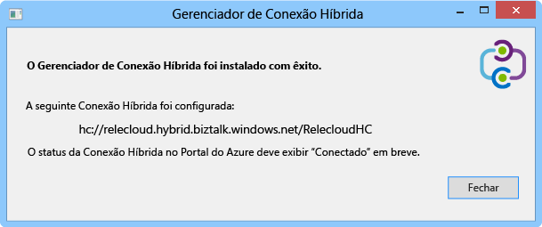
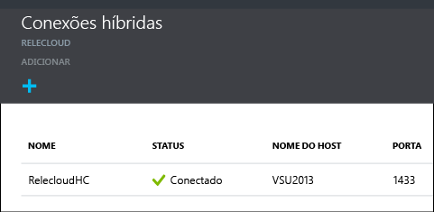

1. Na folha **Conexões híbridas**, clique na conexão híbrida recém-criada e clique em **Configuração de Ouvinte**.
   
    
2. A lâmina **Propriedades da Conexão Híbrida** se abre. Em **Gerenciador de Conexões Híbridas Locais**, escolha **baixar e configurar manualmente**, salve o pacote HybridConnectionManager.msi baixado e copie a cadeia de conexão de gateway.
   
    
3. Em um prompt de comando de administrador, digite o comando a seguir para iniciar o instalador:
   
        start HybridConnectionManager.msi
4. Depois que o instalador for executado, clique em **Agora não**; em seguida, navegue até a pasta %ProgramFiles%\Microsoft\HybridConnectionManager, execute HCMConfigWizard.exe e clique em **Sim** na caixa de diálogo **Controle de Conta de Usuário**.
5. Cole a cadeia de conexão híbrida que você copiou anteriormente e clique em **OK**. 
   
    
6. Quando a instalação é concluída, clique em **Fechar**.
   
    
   
    Na folha **Conexões Híbridas**, a coluna **Status** agora exibe **Conectado**. 
   
    

<!--HONumber=Nov16_HO3-->

