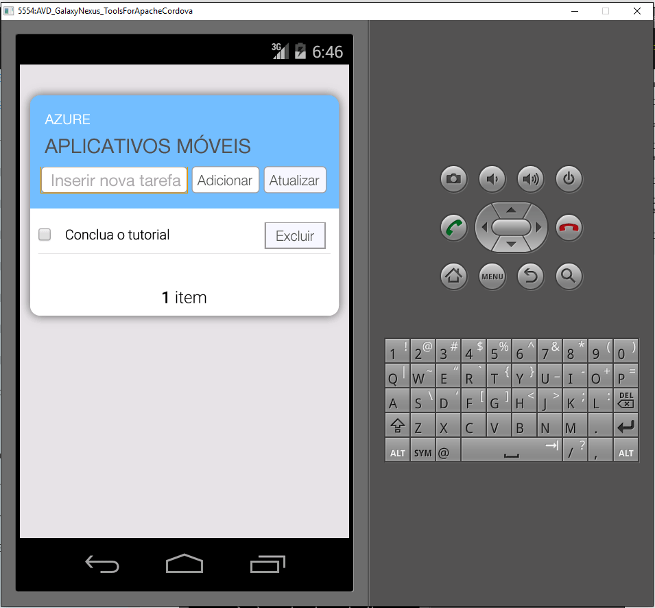

1. Visite o [Portal do Azure]. Clique em **Procurar Tudo** > **Aplicativos Móveis** > o back-end que você acabou de criar. Nas configurações do aplicativo móvel, clique em **Início Rápido** > **Cordova**. Em **Configurar o aplicativo cliente**, selecione **Criar um Novo Aplicativo** e clique em **Baixar**. Isso baixa um projeto completo do Cordova para um aplicativo pré-configurado, para conexão com o back-end.
2. Descompacte o arquivo ZIP baixado para um diretório no disco rígido, navegue até o arquivo de solução (.sln) e abra-o usando o Visual Studio.
3. No Visual Studio, escolha a plataforma de solução (Android, iOS ou Windows) no menu suspenso ao lado da seta de início e selecione um emulador ou dispositivo de implantação específico clicando na lista suspensa na seta verde. Observe que você pode usar a plataforma Android padrão e o emulador Ripple. Tutoriais mais avançados exigirão que você selecione um emulador ou dispositivo com suporte.
4. Pressione F5 ou clique na seta verde para compilar e executar o aplicativo Cordova. Se for mostrada uma caixa de diálogo de segurança no emulador que solicita acesso à rede, aceite-a.
5. Depois que o aplicativo for iniciado no dispositivo ou emulador, digite um texto significativo em **Inserir novo texto**, como *Concluir o tutorial* e, em seguida, clique no botão **Adicionar**. Isso envia uma solicitação POST para o back-end do Azure implantado anteriormente. Os back-end insere dados da solicitação na tabela TodoItem no Banco de Dados SQL e retorna informações sobre os itens armazenados recentemente no aplicativo móvel. O aplicativo móvel exibe esses dados na lista.
   
    
6. Repita as três etapas anteriores para cada plataforma de dispositivo para a qual você planeja oferecer suporte.

[Portal do Azure]: https://portal.azure.com/

<!---HONumber=AcomDC_0817_2016-->