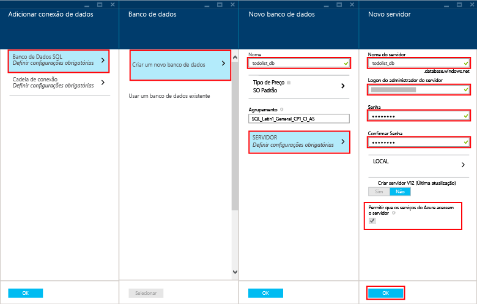

Siga estas etapas para criar um novo aplicativo móvel.

1. Faça logon no [Portal do Azure]. Na parte inferior esquerda da janela, clique em **+NOVO**. Role até ver o item **Aplicativo Móvel**.

    

    Isso exibe a folha **Novo Aplicativo Móvel**.

2. Digite um nome para o seu aplicativo móvel. Esse nome deve ter pelo menos 8 caracteres e ser composto por letras minúsculas de "a" a "z".

7. Selecione uma região. Neste tutorial, usamos a região **Centro-Sul dos EUA**.

    > [AZURE.NOTE]Como parte deste tutorial, você criará um novo servidor e uma nova instância do Banco de Dados SQL. Você pode reutilizar este novo banco de dados e administrá-lo como faria com qualquer outra instância do Banco de Dados SQL. Se você já tiver um banco de dados na mesma região como novo back-end de aplicativo móvel, você poderá escolher **Usar o banco de dados existente** e, em seguida, selecionar esse banco de dados. O uso de um banco de dados em uma região diferente não é recomendado devido a latências maiores e aos custos adicionais de largura de banda.

3. Selecione sua assinatura.

4. Crie um novo grupo de recursos com o mesmo nome que o aplicativo móvel.

5. Em **Configurações do pacote**, selecione **USERDATABASE**; você pode escolher um banco de dados existente ou criar um novo. Para criar um novo banco de dados, digite o nome do novo **banco de dados**, crie um novo **servidor**, digite o nome desse servidor e escolha um **nome de logon**, que é o nome de logon de administrador para o novo servidor de banco de dados SQL; digite e confirme a senha, então clique no botão Ok para concluir o processo. Se você selecionar um banco de dados existente, você precisará fornecer uma **Senha de Administrador do Servidor**.

    

6. Crie um novo plano de hospedagem Web com o mesmo nome que o aplicativo móvel.

    > [AZURE.NOTE]Digite o nome do plano de hospedagem Web, não tente copiar/colar. Haverá validação de nome neste campo que falha se você não digitar o nome. Ele não precisa ter exatamente o mesmo nome do site (mas precisa seguir as mesmas regras).

8. Selecione uma faixa de preço. Neste tutorial, usamos **Padrão 1**.

    A nova página de configurações do aplicativo móvel agora terá uma aparência semelhante a essa:

    

9. Clique no botão **Criar** na parte inferior da folha e você verá essa folha iniciar a implantação na janela de notificações.

Você criou um novo back-end de aplicativo móvel que pode ser usado por seus aplicativos móveis.

> [AZURE.NOTE]Após a criação do seu aplicativo móvel, navegue no portal para o SQL Server que você acabou de criar (certifique-se de selecionar o servidor e não o banco de dados SQL do Azure). Em seguida clique na parte de configurações, expanda a parte de firewall e altere "Permitir acesso aos serviços do Azure". Se você não fizer isso, seu aplicativo não funcionará.

<!-- URLs. -->
[Portal do Azure]: https://portal.azure.com/

<!---HONumber=July15_HO4-->