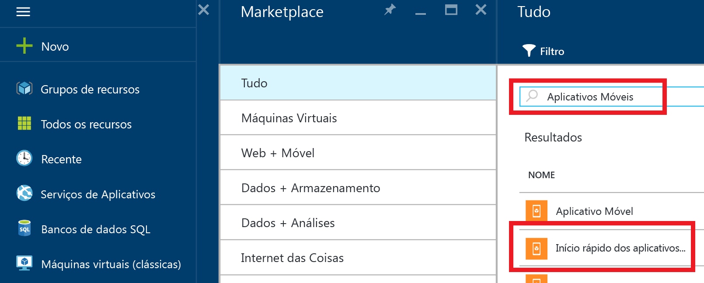

1. Faça logon no [Portal do Azure].
2. Clique em **+NOVO** e digite **Aplicativos Móveis** em *Pesquisar no marketplace*. Selecione **Início Rápido de Aplicativos Móveis** e clique em **Criar**.
   
    
3. Para o **Grupo de Recursos**, selecione um grupo de recursos existente ou crie um novo (usando o mesmo nome que o aplicativo). 
4. Clique em **Criar**. Aguarde alguns minutos para que o serviço seja implantado com êxito antes de continuar.

<!-- URLs. -->
[Portal do Azure]: https://portal.azure.com/
