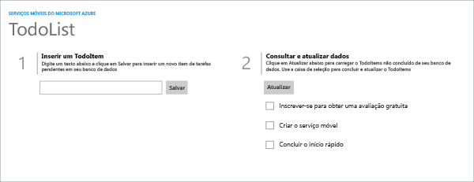

A seguir, há capturas de tela do aplicativo concluído:

  Aplicativo da Windows Store

  Aplicativo da Loja do Windows Phone

A conclusão deste tutorial é um pré-requisito para todos os outros tutoriais de Aplicativos Móveis para aplicativos da Windows Store e da Loja do Windows Phone.

<!----HONumber=Nov15_HO1-->