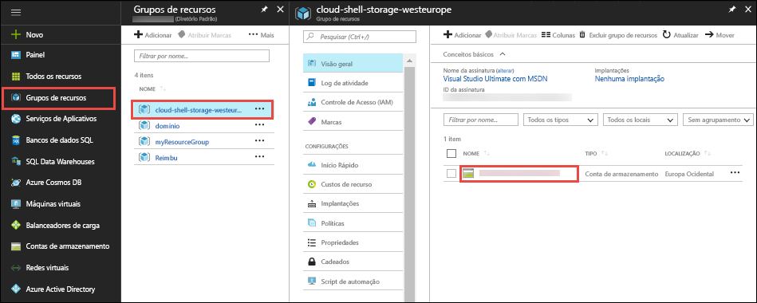
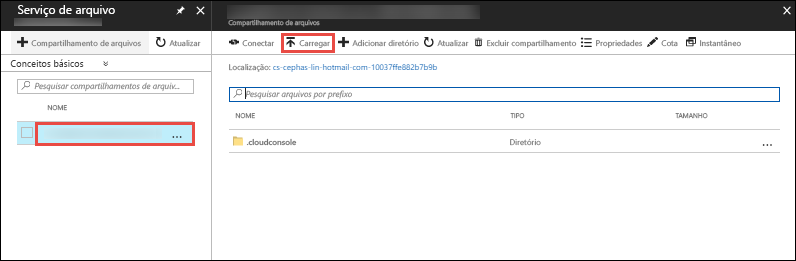

No [portal do Azure](https://portal.azure.com), clique em **Grupo de recursos** > **cloud-shell-storage-\<your_region>** > **\<storage_account_name>**.



Na página **Visão geral** da conta de armazenamento, selecione **Arquivos**.

Selecione o compartilhamento de arquivo gerado automaticamente e selecione **Carregar**. Esse compartilhamento de arquivos está montado no Cloud Shell como `clouddrive`.



Clique no seletor de arquivo, selecione o arquivo ZIP e clique em **Carregar**. 

No Cloud Shell, use `ls` para verificar que você pode ver o arquivo ZIP carregado no compartilhamento `clouddrive` padrão.

```azurecli-interactive
ls clouddrive
```
