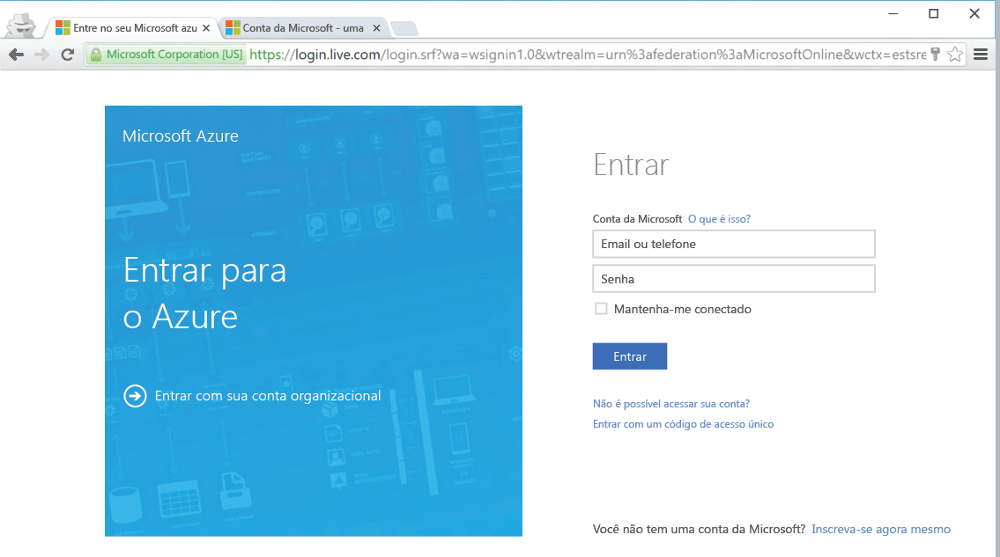

<!--
includes/azure-include-getting-started-v12portal-gettings-an-account.md

Latest Freshness check:  2016-04-11 , carlrab.

As of circa 2016-04-11, the following topics might include this include:
articles/sql-database/sql-database-get-started-tutorial.md

-->
## Conectar-se ao portal do Microsoft Azure com uma assinatura

Para conectar-se ao portal do Microsoft Azure, você deverá ter uma assinatura.

### Obter uma nova conta

Se você não tiver uma conta existente do Microsoft Azure, siga um dos links abaixo para obter uma:

- Obter uma [conta gratuita](https://azure.microsoft.com/get-started/)
- Usar uma [assinatura do MSDN](https://azure.microsoft.com/pricing/member-offers/msdn-benefits/)

###Entrar usando sua conta existente

Usando a [assinatura existente](https://account.windowsazure.com/Home/Index), siga as etapas abaixo para se conectar ao portal do Azure.

1. Abra seu navegador preferido e conecte-se ao [portal do Azure](https://portal.azure.com/).

1. Entre no [Portal do Azure](https://portal.azure.com/).

1. Quando a página de entrada aparecer, forneça as credenciais de sua assinatura

   
   

<!---HONumber=AcomDC_0420_2016-->