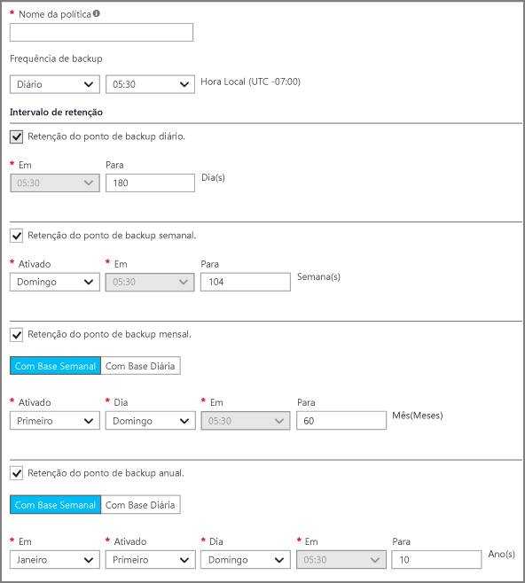
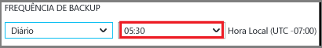
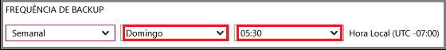

## Definindo uma política de backup

Uma política de backup define uma matriz de quando os instantâneos de dados são obtidos e por quanto tempo esses instantâneos são mantidos. Ao definir uma política para fazer backup de uma VM, você pode disparar um trabalho de backup *uma vez por dia*. Quando você cria uma nova política, ela é aplicada ao cofre. A interface da política de backup fica assim:

Para criar uma política:

1. Insira um nome para **Nome da política**.

2. Podem ser feitos instantâneos dos dados em intervalos Diários ou Semanais. Use o menu suspenso **Frequência do Backup** para escolher se os instantâneos de dados são feitos Diariamente ou Semanalmente.

    - Se você escolher um intervalo Diário, use o controle destacado para selecionar a hora do dia para o instantâneo. Para alterar a hora, cancele a seleção da hora e selecione a nova hora.

      

    - Se você escolher um intervalo Semanal, use os controles destacados para selecionar o(s) dia(s) da semana e a hora do dia para fazer o instantâneo. No menu do dia, selecione um ou vários dias. No menu de hora, selecione uma hora. Para alterar a hora, cancele a seleção da hora escolhida e selecione a nova hora.

    

3. Por padrão, todas as opções de **Intervalo de Retenção** estão selecionadas. Desmarque qualquer limite do intervalo de retenção que você não deseja usar. Em seguida, especifique os intervalos a serem usados.

    Os intervalos de retenção Mensal e Anual permitem que você especifique os instantâneos com base em um incremento diário ou semanal.

    >[AZURE.NOTE] Ao proteger uma VM, um trabalho de backup é executado uma vez por dia. O tempo durante o qual o backup é executado é o mesmo para cada intervalo de retenção.

4. Depois de definir todas as opções para a política, na parte inferior da folha, clique em **Salvar**.

    A nova política será aplicada imediatamente no cofre.

<!---HONumber=AcomDC_0608_2016-->