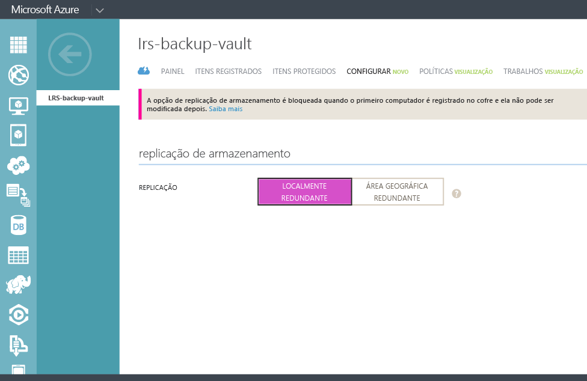

## Criar um cofre de backup
Para fazer backup de arquivos e dados do Windows Server ou Data Protection Manager (DPM) no Azure ou ao fazer backup de VMs de IaaS no Azure, você deverá criar um cofre de backup na região geográfica em que deseja armazenar os dados.

As etapas a seguir guiarão você pela criação do cofre usado para armazenar backups.

1. Entre no [Portal de Gerenciamento](https://manage.windowsazure.com/)
2. Clique em **Novo** > **Serviços de Dados** > **Serviços de Recuperação** > **Cofre de Backup** e escolha **Criação Rápida**.
   
    
3. Para o parâmetro **Nome**, digite um nome amigável para identificar o cofre de backup. Ele precisa ser exclusivo para cada assinatura.
4. No parâmetro **Região**, selecione a região geográfica para o cofre de backup. A escolha determina a região geográfica para a qual os dados de backup são enviados. Ao escolher uma área geográfica próxima à sua localidade, você pode reduzir a latência de rede ao fazer backup no Azure.
5. Clique em **Criar cofre** para concluir o fluxo de trabalho. Pode levar algum tempo para que o cofre de backup seja criado. Para verificar o status, você pode monitorar as notificações na parte inferior do portal.
   
    
6. Depois que o cofre de backup tiver sido criado, uma mensagem informará que o cofre foi criado com êxito. O cofre também é listado nos recursos dos Serviços de Recuperação como **Ativo**.
   
    

### Backup do Azure - Opções de redundância de armazenamento
> [!IMPORTANT]
> O melhor momento para identificar sua opção de redundância de armazenamento é logo após a criação de um cofre e antes de qualquer máquina virtual ser registrada no cofre. Depois que um item tiver sido registrado no cofre, a opção de redundância de armazenamento será bloqueada e não poderá ser modificada.
> 
> 

Suas necessidades comerciais devem determinar a redundância do armazenamento de back-end do Backup do Azure. Se você estiver usando o Azure como ponto de extremidade de armazenamento de backup principal (por exemplo, estiver fazendo backup de um Windows Server no Azure), deverá considerar a possibilidade de escolher a opção de armazenamento com redundância geográfica (padrão). Isso é visto na opção **Configurar** do seu cofre de backup.

#### Armazenamento com redundância geográfica (GRS)
O GRS mantém seis cópias de seus dados. Com o GRS, seus dados são replicados três vezes na região primária e também são replicados três vezes para uma região secundária a centenas de quilômetros de distância da região primária, oferecendo o nível mais alto de durabilidade. Em caso de falha na região primária, ao armazenar os dados no GRS, o Backup do Azure garante que seus dados sejam duráveis em duas regiões separadas.

#### Armazenamento com redundância local (LRS)
O LRS (armazenamento com redundância local) mantém três cópias de seus dados. O LRS é replicado três vezes em uma única instalação, em uma única região. O LRS protege seus dados contra falhas normais de hardware, mas não contra a falha de uma instalação inteira do Azure.

Se você estiver usando o Azure como um ponto de extremidade de armazenamento de backup terciário (por exemplo, estiver usando SCDPM para ter uma cópia de backup local e usando o Azure para suas necessidades de retenção de longo prazo), deverá considerar a possibilidade de escolher Armazenamento com redundância local na opção **Configurar** de seu cofre de backup. Isso reduz o custo de armazenamento de dados no Azure, além de oferecer um nível mais baixo de durabilidade para seus dados que pode ser aceitável para cópias terciárias.

<!---HONumber=AcomDC_0316_2016-->