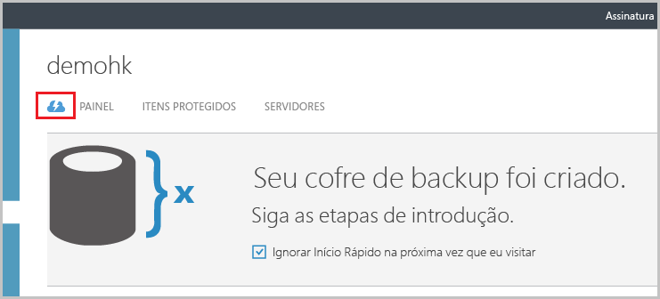
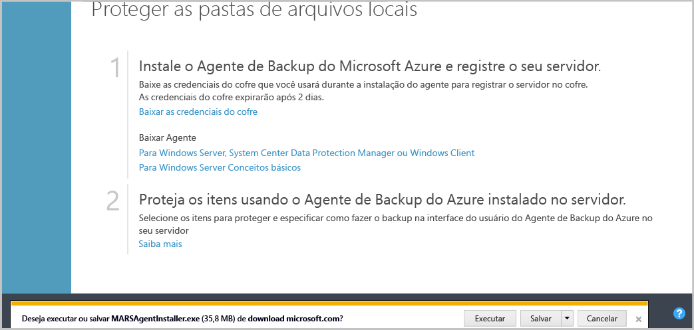

## Baixar, instalar e registrar o agente de Backup do Azure
Após a criação do cofre de Backup do Azure, um agente deverá ser instalado em cada um dos computadores com o Windows (o Windows Server, o cliente do Windows, o servidor do System Center Data Protection Manager ou o computador do Azure Backup Server), o que permitirá o backup de dados e de aplicativos no Azure.

1. Entre no [Portal de Gerenciamento](https://manage.windowsazure.com/)
2. Clique em **Serviços de Recuperação**, em seguida, selecione o cofre de backup que você quer registrar com um servidor. A página de Início Rápido para esse cofre de backup aparece.
   
    
3. Na página Início Rápido, clique na opção **Para Windows Server ou System Center Data Protection Manager ou cliente Windows** em **Baixar Agente**. Clique em **Salvar** para copiá-lo no computador local.
   
    
4. Depois que o agente for instalado, clique duas vezes em MARSAgentInstaller.exe para iniciar a instalação do agente de Backup do Azure. Escolha a pasta de instalação e a pasta de rascunho necessárias para o agente. O local do cache especificado deve ter espaço livre, que é pelo menos 5% dos dados de backup.
5. Se você usar um servidor proxy para se conectar à Internet, na tela **Configuração de Proxy** , insira os detalhes do servidor proxy. Se você usar um proxy autenticado, insira os detalhes de nome de usuário e senha nessa tela.
6. O agente de Backup do Azure instala o .NET Framework 4.5 e o Windows PowerShell (se ele ainda não estiver disponível) para concluir a instalação.
7. Depois que o agente estiver instalado, clique no botão **Prosseguir com o Registro** para continuar com o fluxo de trabalho.
   
   
8. Na tela de credenciais do cofre, procure e selecione o arquivo de credenciais do cofre que foi baixado anteriormente.
   
    
   
    O arquivo de credenciais do cofre é válido somente por 48 horas (após o download do portal). Se você encontrar qualquer erro nessa tela (por exemplo "o arquivo de credenciais do cofre fornecido expirou"), faça logon no Portal do Azure e baixe o arquivo de credenciais do cofre novamente.
   
    Certifique-se de que o arquivo de credenciais do cofre esteja disponível em um local que pode ser acessado pelo aplicativo de instalação. Se você encontrar erros relacionados a acesso, copie o arquivo de credenciais do cofre para um local temporário nesse computador e repita a operação.
   
    Se você encontrar um erro de credencial de cofre inválida (por exemplo, “Credenciais do cofre fornecidas inválidas”), significa que o arquivo está corrompido ou não tem as últimas credenciais associadas ao serviço de recuperação. Repita a operação depois de baixar um novo arquivo de credencial de cofre no portal. Esse erro normalmente será exibido se o usuário clicar na opção **Baixar credencial de cofre** no portal do Azure, em uma sequência rápida. Nesse caso, apenas o segundo arquivo de credencial de cofre é válido.
9. Na tela **Configuração de criptografia** , você pode gerar uma senha ou fornecer uma (mínio de 16 caracteres). Lembre-se de salvar a senha em um local seguro.
   
    
   
   > [!WARNING]
   > Se a senha for perdida ou esquecida, a Microsoft não poderá ajudar na recuperação dos dados de backup. O usuário final é proprietário da senha de criptografia, isto é, a Microsoft não tem visibilidade da senha que é usada pelo usuário final. Salve o arquivo em um local seguro, pois ela é obrigatória durante uma operação de recuperação.
   > 
   > 
10. Depois de clicar no botão **Concluir** , o computador estará registrado com êxito no cofre e agora você estará pronto para iniciar o backup no Microsoft Azure.
11. Ao usar o Backup do Microsoft Azure autônomo, você pode modificar as configurações especificadas durante o fluxo de trabalho de registro clicando na opção **Alterar Propriedades** no snap-in do MMC no Backup do Azure.
    
    
    
    Como alternativa, ao usar o Data Protection Manager, é possível modificar as configurações especificadas durante o fluxo de trabalho de registro clicando na opção **Configurar** ao selecionar **Online** na guia **Gerenciamento**.
    
    

<!--HONumber=Nov16_HO3-->

