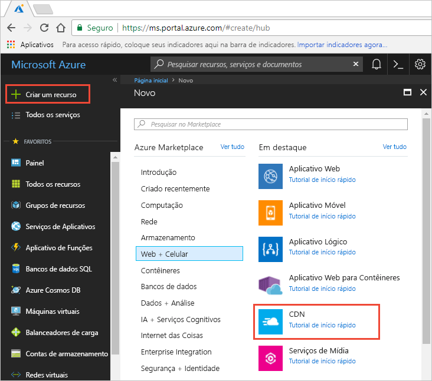

## Criar um novo perfil CDN

Um perfil CDN é um contêiner para pontos de extremidade CDN e especifica um tipo de preço.

1. No Portal do Azure, no canto superior esquerdo, selecione **Criar um recurso**.
    
    O **Novo** painel é exibido.
   
2. Selecione **Web + Celular**, depois **CDN**.
   
    

    O painel **Perfil CDN** é exibido.

    Use as configurações especificadas na tabela que acompanha a imagem.
   
    

    | Configuração  | Valor |
    | -------- | ----- |
    | **Nome** | Insira *my-cdn-profile-123* como nome de perfil. Esse nome deve ser globalmente exclusivo. Se ele já estiver em uso, você pode inserir um diferente. |
    | **Assinatura** | Selecione uma assinatura do Azure na lista suspensa.|
    | **Grupo de recursos** | Selecione **Criar novo** e insira *my-resource-group-123* como o nome para seu novo grupo de recursos. Esse nome deve ser globalmente exclusivo. Se ele já estiver em uso, você pode inserir um diferente. | 
    | **Localização do grupo de recursos** | Selecione **Centro dos EUA** na lista suspensa. |
    | **Tipo de preços** | Selecione **Verizon Standard** na lista suspensa. |
    | **Criar um novo ponto de extremidade CDN** | Deixe não selecionado. |  
   
3. Selecione **Fixar no painel** para salvar o perfil em seu painel após sua criação.
    
4. Selecione **Criar** para criar o perfil. 

