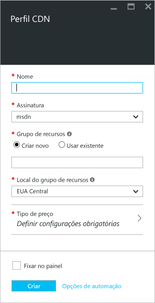
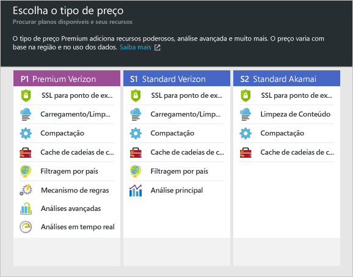

**Para criar um perfil CDN**

1. No [Portal do Azure](https://portal.azure.com), no canto superior esquerdo, clique em **Novo**.  Na folha **Novo**, selecione **Web + Dispositivo móvel** e, em seguida, **CDN**.
   
    A folha do novo perfil CDN é exibida.
   
    
2. Insira um nome para o perfil CDN.
3. Selecione um **Local**.  Esse é o local do Azure onde suas informações de perfil CDN serão armazenadas.  Ele não tem impacto sobre os locais de ponto de extremidade CDN.
4. Selecione ou crie um **Grupo de Recursos**.  Para saber mais sobre Grupos de Recursos, confira [Visão geral do Azure Resource Manager](../articles/azure-resource-manager/resource-group-overview.md#resource-groups).
5. Selecione um **tipo de preço**.  Confira a [Visão geral da CDN](../articles/cdn/cdn-overview.md#azure-cdn-features) para uma comparação de tipos de preço.
   
    
6. Selecione a **Assinatura** para este perfil CDN.
7. Clique no botão **Criar** para criar um novo perfil. 

