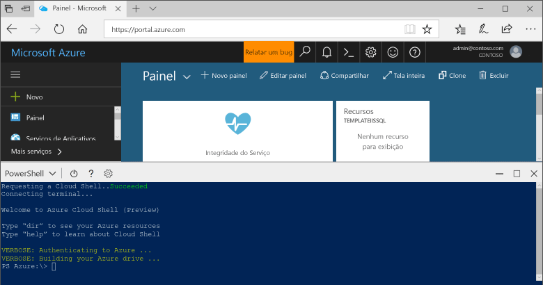

## Iniciar o Azure Cloud Shell

O Azure Cloud Shell é um shell gratuito que pode ser executado diretamente no portal do Azure. Ele tem ferramentas do Azure instaladas e configuradas para usar com sua conta. Clique no botão **Cloud Shell** no menu no canto superior direito do [portal do Azure](https://portal.azure.com).

O botão inicia um shell interativo que você pode usar para executar todas as etapas neste tópico:

