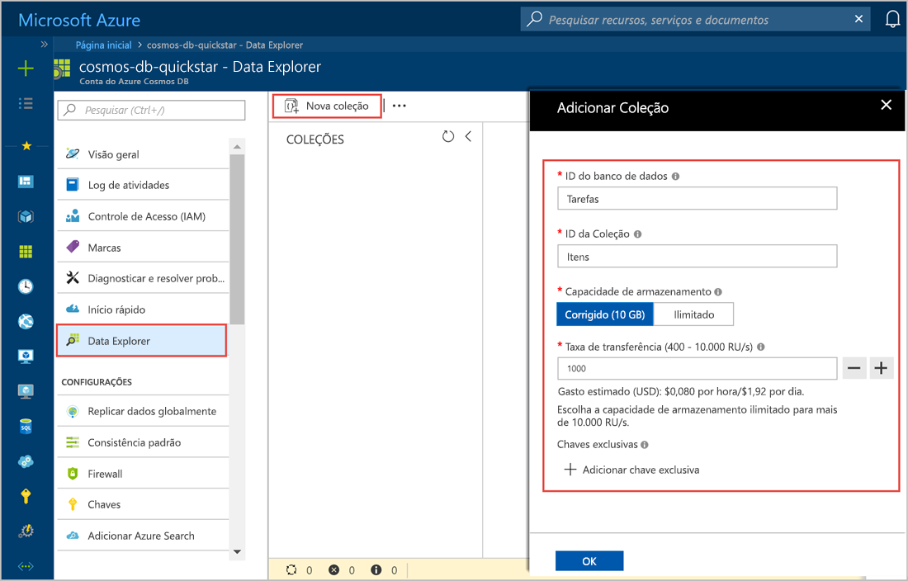
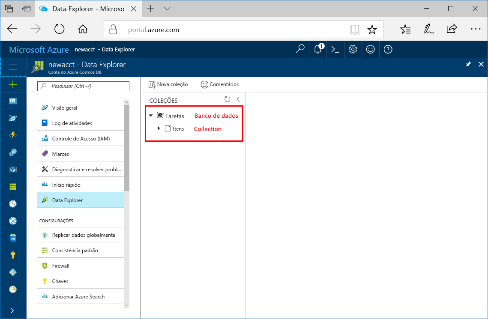

Agora, você pode usar a ferramenta Data Explorer no Portal do Azure para criar um banco de dados e uma coleção. 

1. Clique em **Data Explorer** > **Nova Coleção**. 
    
    A área **Adicionar Coleção** é exibida à direita, talvez seja necessário rolar para a direita para vê-la.

    

2. Na página **Adicionar coleção**, insira as configurações da nova coleção.

    Configuração|Valor sugerido|Descrição
    ---|---|---
    ID do banco de dados|Tarefas|Digite *Tarefas* como o nome do novo banco de dados. Os nomes de banco de dados devem conter de 1 a 255 caracteres e não podem conter /, \\, #, ?, ou um espaço à direita.
    ID da coleção|Itens|Insira *Itens* como o nome da nova coleção. As IDs de coleção têm os mesmos requisitos de caracteres que os nomes de banco de dados.
    Capacidade de armazenamento| Fixo (10 GB)|Altere o valor para **Fixo (10 GB)**. Esse valor é a capacidade de armazenamento do banco de dados.
    Taxa de transferência|400 RU|Altere a taxa de transferência para 400 unidades de solicitação por segundo (RU/s). Se quiser reduzir a latência, você poderá escalar verticalmente a taxa de transferência mais tarde.
    Chave de partição|/category|Uma chave de partição que distribui dados uniformemente para cada partição. É importante selecionar a chave de partição correta ao criar uma coleção de alto desempenho. Para saber mais, veja [Design de particionamento](../articles/cosmos-db/partition-data.md#designing-for-partitioning).

    Clique em **OK**.

    O Data Explorer exibe o novo banco de dados e a coleção.

    