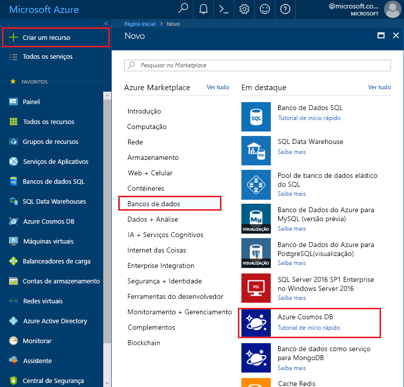
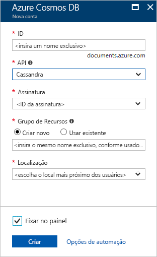

1. Em uma nova janela do navegador, entre no [Portal do Azure](https://portal.azure.com/).
2. Clique em **Criar um recurso** > **Bancos de dados** > **Azure Cosmos DB**.
   
   

3. Na página **Nova conta**, insira as configurações da nova conta do Azure Cosmos DB. 
 
    Configuração|Valor sugerido|DESCRIÇÃO
    ---|---|---
    ID|*Insira um nome exclusivo*|Insira um nome exclusivo para identificar essa conta do Azure Cosmos DB. Como *cassandra.cosmosdb.azure.com* é acrescentado à ID fornecida para criar seu ponto de contato, use uma ID exclusiva mas identificável.  A ID pode conter apenas letras minúsculas, números e hifens (-), e deve conter de três a 50 caracteres.
    API|Cassandra|A API determina o tipo de conta a ser criada. O Azure Cosmos DB fornece cinco APIs para atender às necessidades de seu aplicativo: SQL (banco de dados de documentos), Gremlin (banco de dados de gráfico), MongoDB (banco de dados de documentos), Tabela do Azure e Cassandra, cada um atualmente exigindo uma conta separada.   Selecione **Cassandra**, porque neste guia de início rápido você está criando um banco de dados de toda a coluna que é passível de consulta com a sintaxe CQL.  Se o Cassandra (toda a coluna) não for exibido na lista, você precisará [solicitar sua participação](../articles/cosmos-db/cassandra-introduction.md#sign-up-now) no programa de versão prévia da API do Cassandra.   [Saiba mais sobre a API do Cassandra](../articles/cosmos-db/cassandra-introduction.md)|
    Assinatura|*Sua assinatura*|Selecione a assinatura do Azure que você deseja usar para essa conta do Azure Cosmos DB. 
    Grupo de recursos|Criar Novo  *Em seguida, Insira o mesmo nome exclusivo como fornecido acima na ID*|Selecione **Criar Novo**, em seguida, insira um novo nome de grupo de recursos para sua conta. Para simplificar, você pode usar um nome igual à sua ID. 
    Local padrão|*Selecione a região mais próxima de seus usuários*|Selecione a localização geográfica na qual hospedar a sua conta do Azure Cosmos DB. Use o local mais próximo dos usuários para fornecer a eles acesso mais rápido aos dados.
    Fixar no painel | Selecionar | Marque esta caixa para que a sua nova conta de banco de dados seja adicionada ao seu painel do portal para fácil acesso.

    Em seguida, clique em **Criar**.

    

4. A criação da conta leva alguns minutos. Aguarde até que o portal exiba a página **Parabéns! Sua conta do Azure Cosmos DB foi criada**.

