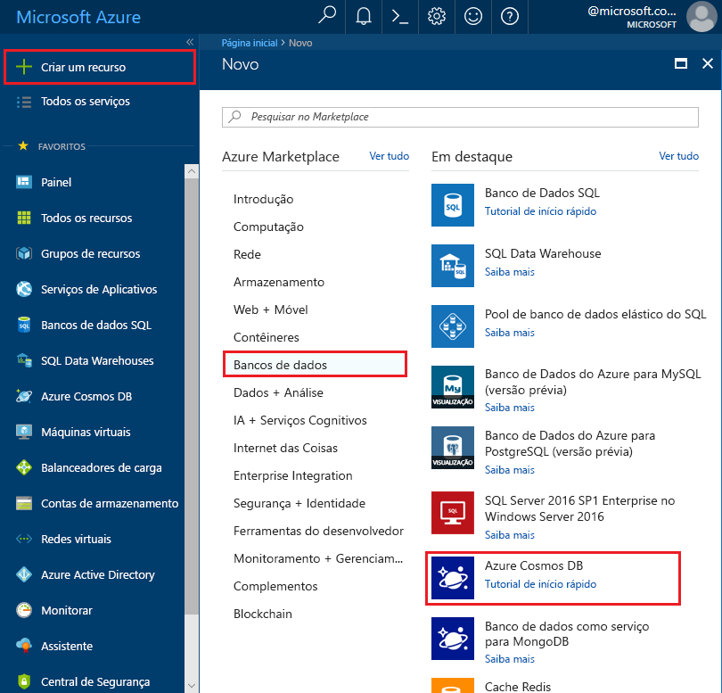

1. Em uma nova janela, entre no [portal do Azure](https://portal.azure.com/).
2. No painel esquerdo, clique em **Novo**, clique em **Bancos de Dados** e então clique em **Azure Cosmos DB**.
   
   

3. Na folha **Nova conta**, especifique a configuração desejada para a conta do BD Cosmos do Azure. 

    Com o BD Cosmos do Azure, você pode escolher um dos quatro modelos de programação: Gremlin (gráfico), MongoDB, SQL (DocumentDB) e Tabela (chave-valor).  
       
    Neste artigo de início rápido, programaremos a API do Graph de modo que você escolherá **Gremlin (gráfico)** quando preencher o formulário. Se você tiver dados de documento de um aplicativo de catálogo, dados de chave/valor (tabela) ou dados migrados de um aplicativo do MongoDB, perceba que o Azure Cosmos DB pode fornecer uma plataforma de serviço de banco de dados altamente disponível, distribuída globalmente para todos os aplicativos críticos.

    Na folha **Nova conta**, preencha os campos com as informações da seguinte captura de tela apenas como um guia. Como seus próprios valores não corresponderão a eles na captura de tela, escolha valores exclusivos ao configurar sua conta. 
 
    

    Configuração|Valor sugerido|Descrição
    ---|---|---
    ID|*Valor exclusivo*|Um nome exclusivo que você escolhe para identificar a conta do Azure Cosmos DB. Como *documents.Azure.com* é acrescentado à ID que você fornece para criar o URI, use uma ID exclusiva mas identificável. A ID deve conter apenas letras minúsculas, números e hifens (-), e deve conter de 3 a 50 caracteres.
    API|Gremlin (gráfico)|Nós programaremos a [API do Graph](../articles/cosmos-db/graph-introduction.md) posteriormente neste artigo.|
    Assinatura|*Sua assinatura*|A assinatura do Azure que você deseja usar para a conta do BD Cosmos do Azure. 
    Grupo de recursos|*O mesmo valor que a ID*|O novo nome de grupo de recursos para sua conta. Para simplificar, você pode usar um nome igual à sua ID. 
    Local|*A região mais próxima de seus usuários*|A localização geográfica na qual hospedar a sua conta do BD Cosmos do Azure. Escolha o local mais próximo dos usuários para fornecer a eles acesso mais rápido aos dados.

4. Clique em **Criar** para criar a conta.
5. Na barra de ferramentas, clique em **Notificações** para monitorar o processo de implantação.

    

6.  Quando a implantação for concluída, abra a nova conta no bloco **Todos os Recursos**. 

    