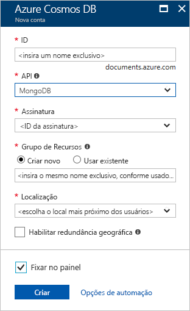
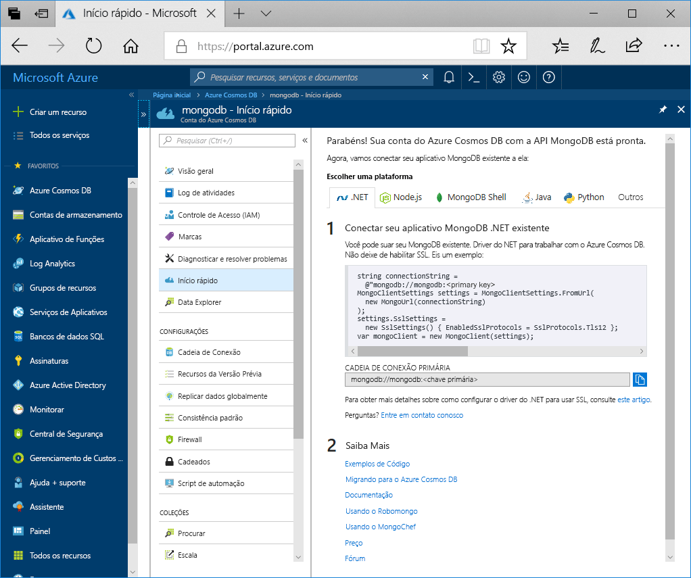

1. Em uma nova janela, entre no [portal do Azure](https://portal.azure.com/).
2. No menu à esquerda, clique em **Criar um recurso**, clique em **Bancos de dados** e depois em **Azure Cosmos DB**, clique em **Criar**.
   
   

3. Na página **Criar Conta do Azure Cosmos DB**, insira as configurações da nova conta do Azure Cosmos DB. 
 
    Configuração|Valor|DESCRIÇÃO
    ---|---|---
    Assinatura|Sua assinatura|Selecione a assinatura do Azure que você deseja usar para essa conta do Azure Cosmos DB. 
    Grupo de recursos|Criar Novo  Em seguida, insira o mesmo nome exclusivo fornecido na ID|Selecione **Criar novo**. Insira o novo nome do grupo de recursos para sua conta. Para simplificar, use um nome igual à sua ID. 
    Nome da conta|Insira um nome exclusivo|Insira um nome exclusivo para identificar a conta do Azure Cosmos DB. Como *documents.Azure.com* é acrescentado à ID que você fornece para criar o URI, use uma ID exclusiva.  A ID deve conter apenas letras minúsculas, números e o caractere de hífen (-). Ela precisa ter entre 3 e 31 caracteres.
    API|API do Azure Cosmos DB para MongoDB|A API determina o tipo de conta a ser criada. O Azure Cosmos DB fornece cinco APIs: Core (SQL) para bancos de dados de documentos, Gremlin para o bancos de dados de grafos, API para MongoDB do Azure Cosmos DB para bancos de dados de documentos, Tabela do Azure e Cassandra. No momento, você deve criar uma conta separada para cada API.   Selecione **MongoDB**, porque neste guia de início rápido você está criando uma tabela que funciona com o MongoDB.|
    Local padrão|Selecione a região mais próxima de seus usuários|Selecione uma localização geográfica para hospedar a sua conta do Azure Cosmos DB. Use o local mais próximo dos usuários para fornecer a eles acesso mais rápido aos dados.

    Selecione **Revisar + Criar**. Você pode ignorar as seções **Rede** e **Marcas**. 

    

4. A criação da conta leva alguns minutos. Aguarde até que o portal exiba a página **Parabéns! Sua conta do Cosmos com a compatibilidade de protocolo de transmissão para o MongoDB está pronta**.

    
