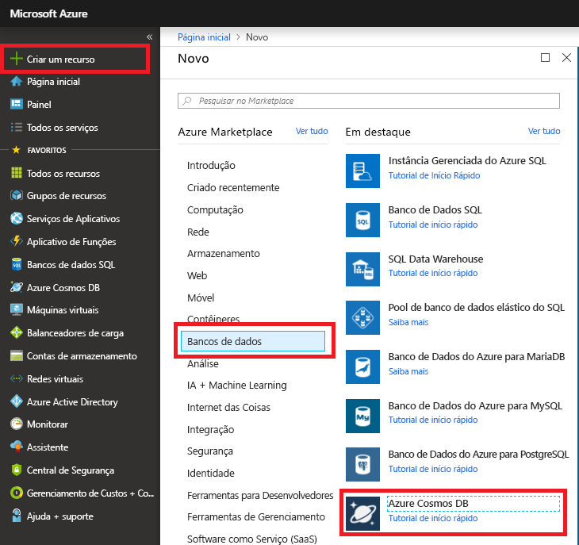
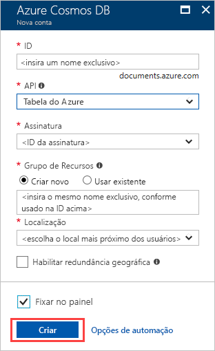
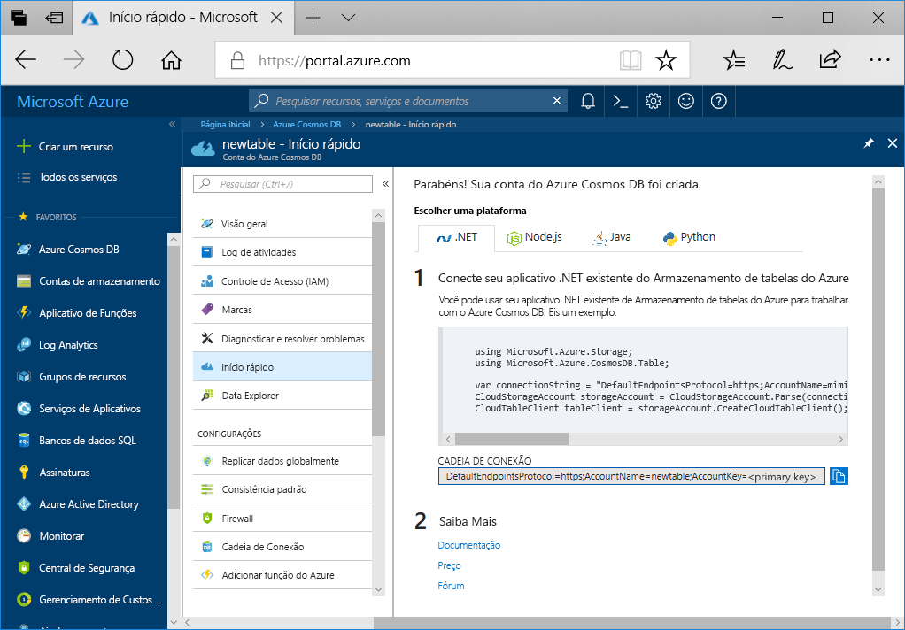

1. Em uma nova janela do navegador, entre no [Portal do Azure](https://portal.azure.com/).
2. No painel de navegação esquerdo, selecione **Criar um recurso**. Selecione **Bancos de dados** e, em seguida, selecione **Azure Cosmos DB**.
   
   

3. Na página **Criar Conta do Azure Cosmos DB**, insira as configurações da nova conta do Azure Cosmos DB:
 
    Configuração|Valor|DESCRIÇÃO
    ---|---|---
    Assinatura|Sua assinatura|Selecione a assinatura do Azure que você deseja usar para essa conta do Azure Cosmos DB. 
    Grupo de recursos|Criar Novo  Em seguida, insira o mesmo nome exclusivo fornecido na ID|Selecione **Criar novo**. Em seguida, insira um novo nome de grupo de recursos para a conta. Para simplificar, use um nome igual à sua ID. 
    Nome da conta|Insira um nome exclusivo|Insira um nome exclusivo para identificar a conta do Azure Cosmos DB.  A ID deve conter apenas letras minúsculas, números e o caractere de hífen (-). Deve ter entre 3 e 31 caracteres.
    API|tabela do Azure|A API determina o tipo de conta a ser criada. O Azure Cosmos DB fornece cinco APIs: Core(SQL) para bancos de dados de documentos, Gremlin para o bancos de dados de grafos, MongoDB para bancos de dados de documentos, Tabela do Azure e Cassandra. No momento, você deve criar uma conta separada para cada API.   Selecione **Tabela do Azure** porque neste início rápido você está criando uma tabela que funciona com a API de Tabela.   [Saiba mais sobre a API de Tabela](../articles/cosmos-db/table-introduction.md).|
    Local padrão|Selecione a região mais próxima de seus usuários|Selecione uma localização geográfica para hospedar a sua conta do Azure Cosmos DB. Use a localização mais próxima dos usuários para fornecer a eles acesso mais rápido aos dados.

    Você pode manter as opções **Replicação Geográfica** e **Gravações de Várias Regiões** com os valores padrão (**Desabilitar**) para evitar encargos de RU adicionais. Você pode ignorar as seções **Rede** e **Marcas**.

5. Selecione **Revisar + Criar**. Após a concluir a validação, selecione **Criar** para criar a conta. 
 
   

6. São necessários alguns minutos para criar a conta. Um mensagem informando **A implantação está em andamento** será exibida. Aguarde a conclusão da implantação e selecione **Ir para o recurso**.

    
