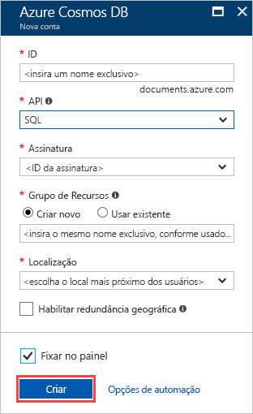
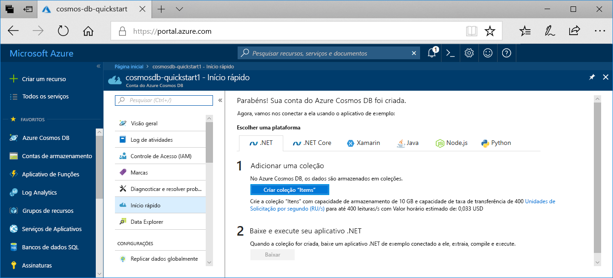

1. Entre no [Portal do Azure](https://portal.azure.com/).
1. Selecione **Criar um recurso** > **Bancos de dados** > **Azure Cosmos DB**.
   
   

1. Na página **Criar Conta do Azure Cosmos DB**, insira as configurações básicas da nova conta do Azure Cosmos. 
 
    |Configuração|Valor|DESCRIÇÃO |
    |---|---|---|
    |Assinatura|Nome da assinatura|Selecione a assinatura do Azure que você deseja usar para essa conta do Azure Cosmos. |
    |Grupo de recursos|Nome do grupo de recursos|Selecione um grupo de recursos ou selecione **Criar novo**, então insira um nome exclusivo para o novo grupo de recursos. |
    | Nome da conta|Insira um nome exclusivo|Insira um nome para identificar a conta do Azure Cosmos. Como *documents.Azure.com* é acrescentado à ID que você fornece para criar o URI, use uma ID exclusiva.  A ID pode conter apenas letras minúsculas, números e o caractere de hífen (-). Ela deve ter entre 3 e 31 caracteres.|
    | API|Núcleo (SQL)|A API determina o tipo de conta a ser criada. O Azure Cosmos DB fornece cinco APIs: Núcleo (SQL) e MongoDB para dados de documento, Gremlin para dados de grafo, Tabela do Azure e Cassandra. No momento, você deve criar uma conta separada para cada API.   Selecione **Núcleo (SQL)** para criar uma consulta e um banco de dados de documento usando a sintaxe SQL.   [Saiba mais sobre a API do SQL](../articles/cosmos-db/documentdb-introduction.md).|
    | Local padrão|Selecione a região mais próxima de seus usuários|Selecione uma localização geográfica para hospedar a sua conta do Azure Cosmos DB. Use a localização mais próxima dos usuários para fornecer a eles acesso mais rápido aos dados.|
   
   

1. Selecione **Examinar + criar**. Você pode ignorar as seções **Rede** e **Marcas**. 

1. Examine as configurações da conta e selecione **Criar**. São necessários alguns minutos para criar a conta. Aguarde até que a página do portal exiba **Sua implantação está concluída**. 

    

1. Selecione **Ir para recurso** para ir para a página da conta do Azure Cosmos DB. 

    
