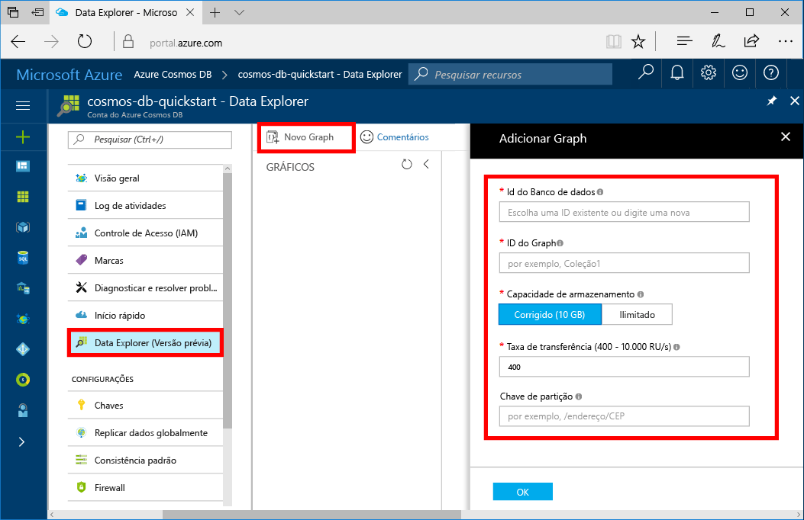

Agora, você pode usar a ferramenta Data Explorer no portal do Azure para criar um banco de dados de gráfico. 

1. No portal do Azure, no menu à esquerda, selecione **Data Explorer (Visualização)**.

2. Em **Data Explorer (Visualização)**, selecione **Novo Gráfico**. Em seguida, preencha a página usando as seguintes informações:

    

    Configuração|Valor sugerido|Descrição
    ---|---|---
    ID do banco de dados|banco de dados de exemplo|A ID do novo banco de dados. Os nomes de banco de dados devem ter entre um e 255 caracteres e não podem conter `/ \ # ?` nem espaços à direita.
    Id do Gráfico|gráfico de exemplo|A ID do novo gráfico. Os nomes de gráfico têm os mesmos requisitos de caractere do que as IDs de banco de dados.
    Capacidade de armazenamento| 10 GB|Mantenha o valor padrão. Essa é a capacidade de armazenamento do banco de dados.
    Taxa de transferência|400 RUs|Mantenha o valor padrão. Você pode escalar verticalmente a taxa de transferência mais tarde se desejar reduzir a latência.
    Chave de partição|/userid|Uma chave de partição que distribui dados uniformemente para cada partição. É importante selecionar a chave de partição correta ao criar um gráfico de alto desempenho. Para saber mais, veja [Projeto para o particionamento](../articles/cosmos-db/partition-data.md#designing-for-partitioning).

3. Depois que o formulário é preenchido, selecione **OK**.