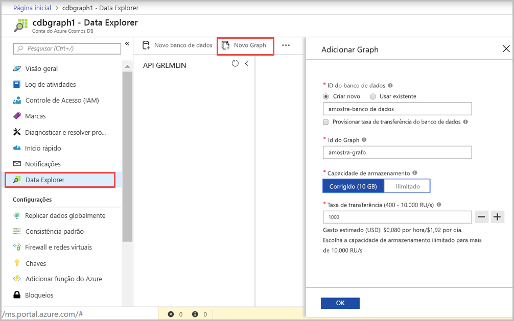

Agora, você pode usar a ferramenta Data Explorer no portal do Azure para criar um banco de dados de grafo. 

1. Clique em **Data Explorer** > **Novo Grafo**.

    A área **Adicionar Grafo** é exibida à direita, talvez seja necessário rolar para a direita para vê-la.

    

2. Na página **Adicionar Grafo**, insira as configurações do novo grafo.

    Configuração|Valor sugerido|DESCRIÇÃO
    ---|---|---
    ID do banco de dados|banco de dados de exemplo|Digite *banco de dados de exemplo* como o nome do novo banco de dados. Os nomes de banco de dados devem ter entre um e 255 caracteres e não podem conter `/ \ # ?` nem espaços à direita.
    ID do Grafo|grafo de exemplo|Digite *grafo de exemplo* como o nome da nova coleção. Os nomes de grafo têm os mesmos requisitos de caractere do que as IDs de banco de dados.
    Capacidade de Armazenamento|Fixo (10 GB)|Deixe o valor padrão de **Fixo (10 GB)**. Esse valor é a capacidade de armazenamento do banco de dados.
    Throughput|400 RUs|Altere a taxa de transferência para 400 unidades de solicitação por segundo (RU/s). Se quiser reduzir a latência, você poderá escalar verticalmente a taxa de transferência mais tarde.

3. Quando o formulário estiver preenchido, clique em **OK**.
