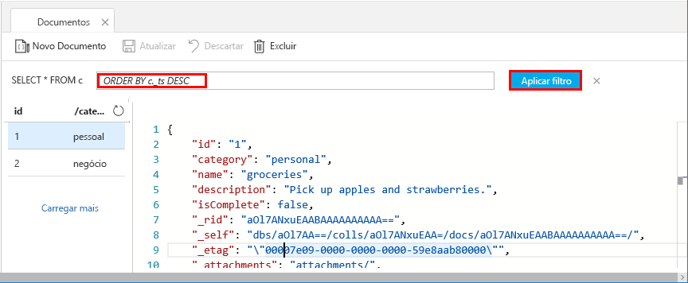

Agora você pode usar consultas no Data Explorer para recuperar e filtrar os dados.

1. Veja que por padrão, a consulta está definida como `SELECT * FROM c`. Essa consulta padrão recupera e exibe todos os documentos na coleção. 

    

2. Permaneça na guia **Documentos** e altere a consulta clicando no botão **Editar Filtro**, adicionando `ORDER BY c._ts DESC` à caixa de predicado de consulta e depois clicando em **Aplicar Filtro**.

    

Essa consulta modificada lista os documentos em ordem decrescente com base em seu carimbo de data/hora, portanto, agora o segundo documento é listado primeiro. Se você estiver familiarizado com a sintaxe do SQL, poderá inserir quaisquer [consultas SQL](../articles/cosmos-db/sql-api-sql-query.md) nesta caixa. 

Isso conclui nosso trabalho no Data Explorer. Antes de prosseguirmos para trabalhar com código, observe que você também pode usar o Data Explorer para criar procedimentos armazenados, UDFs e gatilhos para executar a lógica de negócios do servidor, além de dimensionar a taxa de transferência. O Data Explorer expõe todo o acesso a dados interno via programação disponível nas APIs, mas oferece acesso fácil aos dados no Portal do Azure.