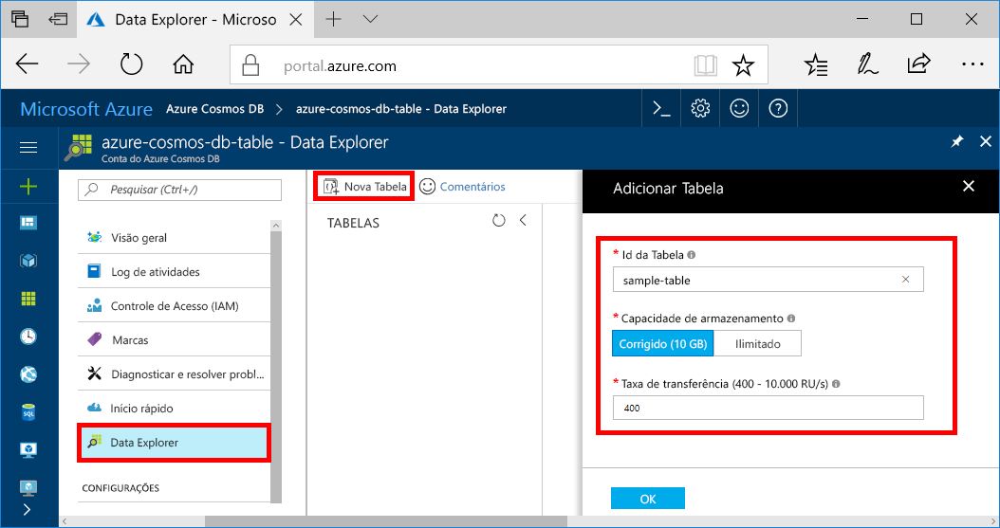

Agora você pode usar o Data Explorer para criar uma tabela e adicionar dados ao banco de dados. 

1. No Portal do Azure, no menu de navegação, clique em **Data Explorer (Versão prévia)**. 
2. Na folha Data Explorer, clique em **Nova Tabela** e, em seguida, preencha a página usando as informações a seguir.

    

    Configuração|Valor sugerido|Descrição
    ---|---|---
    Id da Tabela|tabela de exemplo|A ID da nova tabela. Os nomes de tabela possuem os mesmos requisitos de caractere que os ids de banco de dados. Os nomes de banco de dados devem ter entre um e 255 caracteres e não podem conter `/ \ # ?` nem espaços à direita.
    Capacidade de armazenamento| 10 GB|Mantenha o valor padrão. Essa é a capacidade de armazenamento do banco de dados.
    Taxa de transferência|400 RUs|Mantenha o valor padrão. Você pode escalar a [taxa de transferência](../articles/cosmos-db/request-units.md) verticalmente mais tarde se desejar reduzir a latência.

3. Quando o formulário estiver preenchido, clique em **OK**.