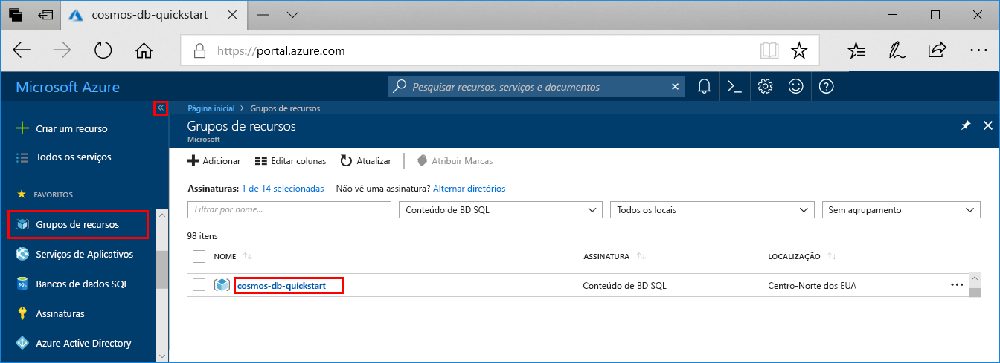
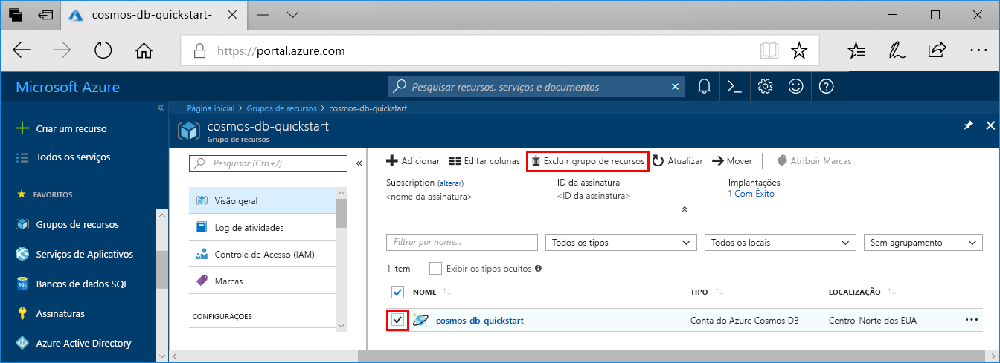

Quando você concluir seu aplicativo Web e a conta do Azure Cosmos DB, poderá excluir os recursos do Azure criados para não incorrer em mais cobranças. Para excluir os recursos:

1. No portal do Azure, selecione **Grupos de recursos** no canto esquerdo. Se o menu esquerdo estiver recolhido, selecione  para expandi-lo.

2. Selecione o grupo de recursos que você criou para este início rápido.  

    

2. Na nova janela, selecione **Excluir grupo de recursos**.

       

3. Na próxima janela, digite o nome do grupo de recursos a ser excluído e selecione **Excluir**.