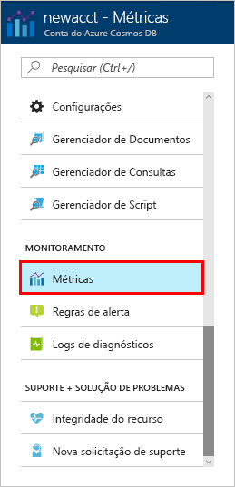
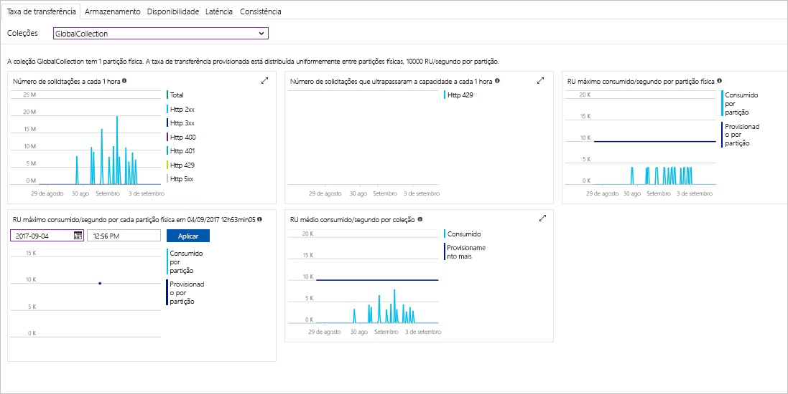

A taxa de transferência, o armazenamento, a disponibilidade, a latência e a consistência dos recursos na conta são monitorados no Portal do Azure. Vamos analisar rapidamente essas métricas. 

1. Clique em **Métricas** no menu de navegação.

   

2. Clique em cada uma das guias para que você esteja ciente das métricas que o Azure Cosmos DB fornece. 

    Cada gráfico que é associado aos [SLAs (Contratos de Nível de Serviço) do Azure Cosmos DB](https://azure.microsoft.com/support/legal/sla/cosmos-db/) fornece uma linha que mostra se um dos SLAs foi violado. O Azure Cosmos DB torna o monitoramento dos SLAs transparente com seu pacote de métricas. 

   