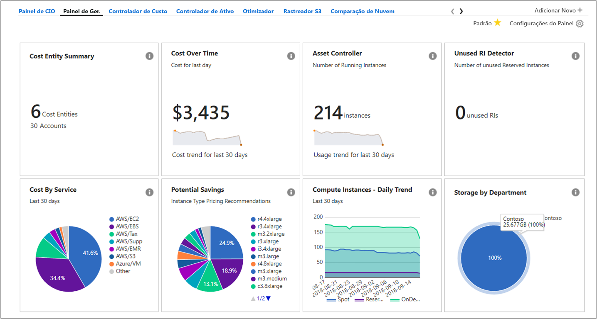
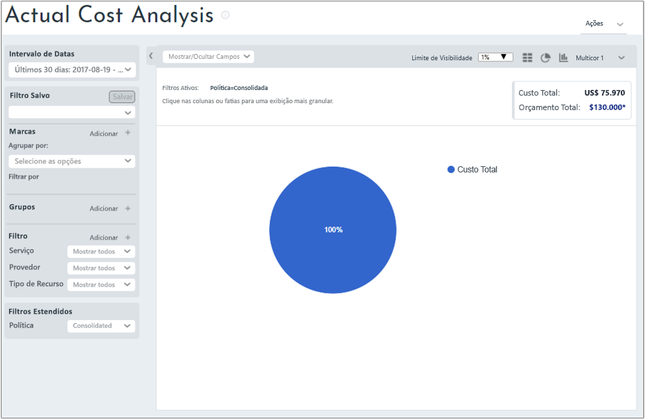
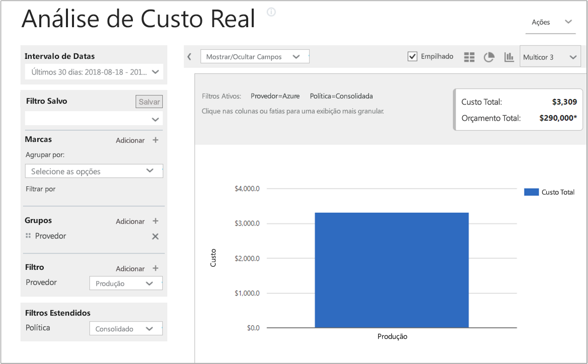
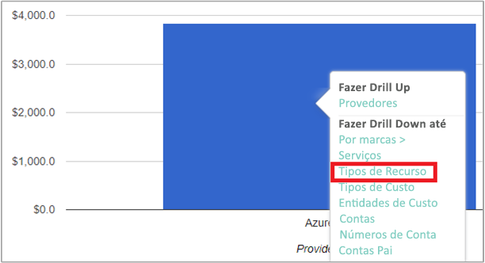
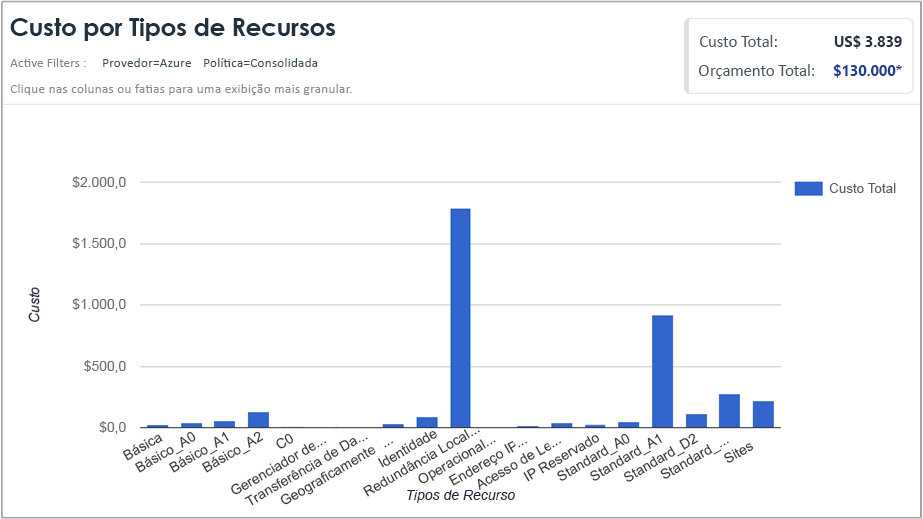
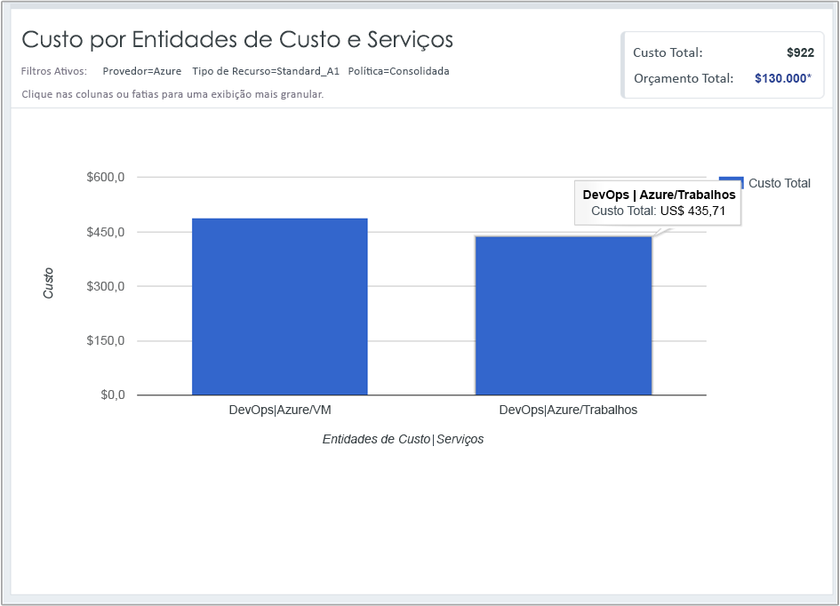

## Exibir dados de custo

O Gerenciamento de Custos do Azure por Cloudyn fornece acesso a todos os seus dados de recursos de nuvem. Dos relatórios de painel, você pode encontrar relatórios padrão e personalizados em uma exibição com guias. A seguir, exemplos de um painel popular e de um relatório que mostram dados de custo imediatamente.

Neste exemplo, o painel de gerenciamento mostra custos consolidados para a empresa Contoso em todos os seus recursos de nuvem. A Contoso usa o Azure, o AWS e o Google. Os painéis fornecem informações gerais e são uma forma rápida de navegar em relatórios.  

Se você não tiver certeza da finalidade do relatório em um painel, focalize o símbolo **i** para ver uma explicação. Clique em qualquer relatório em um painel para exibir o relatório completo.

Você também pode exibir relatórios usando o menu de relatórios na parte superior do portal. Vamos dar uma olhada nos gastos do recurso do Azure da Contoso nos últimos 30 dias. Clique em **Custo** > **Análise de Custo** > **Análise de Custo Real**. Desmarque quaisquer valores, se houver qualquer conjunto de marcas, grupos ou filtros em seu relatório.

Neste exemplo, US$ 75.970 é o custo total e o orçamento é US$ 130.000.

Agora, vamos modificar o formato de relatório e definir grupos e filtros para restringir os resultados para os custos do Azure. Defina o **Intervalo de Datas** dos últimos 30 dias. No canto superior direito, clique no símbolo de coluna para formatar como um gráfico de barras e em grupos, selecione **Provedor**. Em seguida, defina um filtro para **Provedor** como **Azure**.

Neste exemplo, o custo total de recursos do Azure foi de US$ 3.839 nos últimos 30 dias.

Clique com botão direito do mouse na barra do provedor (Azure) e faça drilldown até **Tipos de recurso**.

A imagem a seguir mostra os custos de recursos do Azure incorridos pela Contoso. O total foi US$ 3.839. Neste exemplo, cerca de metade dos custos foram para o armazenamento redundante localmente e sobre a outra metade dos custos foram para várias instâncias de VM.

Clique com o botão direito do mouse em um tipo de recurso e selecione **Entidades de Custo** para exibir entidades e os serviços que consumiram o recurso. Os serviços de VM e de Trabalho em DevOps consumiram US$ 486,60 e US$ 435,71 neste exemplo. O total de ambos é US$ 922.

Para assistir a um vídeo de tutorial sobre como exibir seus dados de cobrança de nuvem, consulte [Analisar seus dados de cobrança de nuvem com o Gerenciamento de Custos do Azure por Cloudyn](https://youtu.be/G0pvI3iLH-Y).
