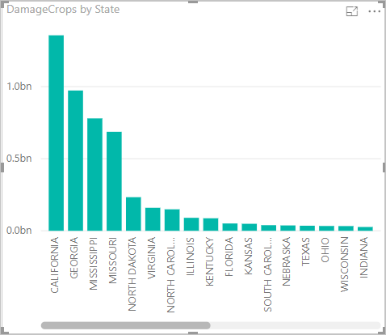

Agora que você tem dados no Power BI Desktop, crie relatórios com base neles. Você criará um relatório simples com um gráfico de colunas que mostra danos na safra por estado.

1. No lado esquerdo da janela principal do Power BI, selecione a exibição de relatório.

    

1. No painel **VISUALIZAÇÕES**, selecione o gráfico de coluna em cluster.

    

    Um gráfico em branco é adicionado à tela.

    

1. Na lista **CAMPOS**, selecione **DamageCrops** e **State**.

    

    Agora, você tem um gráfico que mostra o dano nas safras nas primeiras 1000 linhas da tabela.

    

1. Salve o relatório.