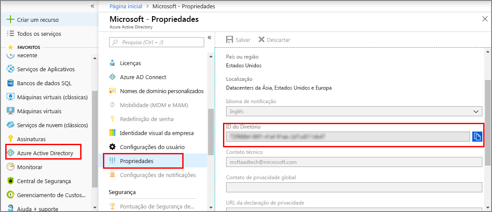
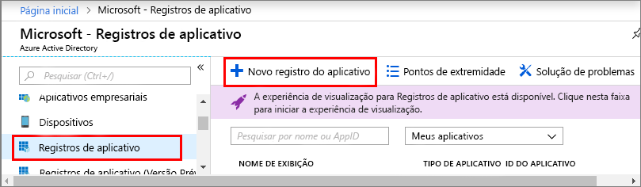
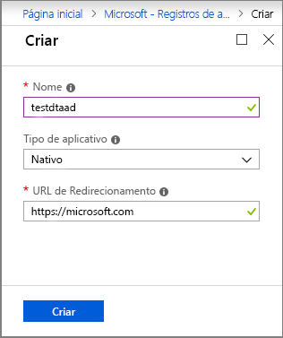
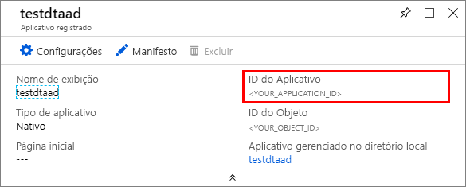

1. No [portal do Azure](https://portal.azure.com), abra **Azure Active Directory** no painel de navegação à esquerda e, em seguida, abra o painel **Propriedades**. Cópia da **ID de diretório** em um arquivo temporário. Você usará esse valor para configurar o aplicativo de exemplo na seção a seguir.

    

1. Abra o painel **Registros de aplicativo** e, em seguida, clique no botão **Novo registro de aplicativo**.
    
    

1. Dê um nome amigável para esse registro de aplicativo no campo **Nome**. Escolha **tipo de aplicativo** como **_Nativo_** e **URI de redirecionamento** como **_https://microsoft.com_**. Clique em **Criar**.

    

1. Abra o aplicativo registrado e copie o valor do campo **ID do aplicativo** em um arquivo temporário; esse valor identifica seu aplicativo do Azure Active Directory. Você usará esse ID do aplicativo para configurar o aplicativo de exemplo nas seções a seguir.

    

1. Abra o painel de registro de aplicativo e clique em **Configurações** > **Permissões necessárias**:
    - Clique em **Adicionar** na parte superior esquerda para abrir o painel **Adicionar acesso à API**.
    - Clique em **Selecionar uma API** e pesquise por **Gêmeos Digitais do Azure**. Se sua pesquisa não localizar a API, pesquise por **Espaços Inteligentes do Azure** em vez disso.
    - Selecione a opção **Gêmeos Digitais do Azure (Serviço de Espaços Inteligentes do Azure)** e clique em **Selecionar**.
    - Clique em **Selecionar permissões**. Marque a caixa de permissões delegadas de **Acesso de leitura/gravação** e clique em **Selecionar**.
    - Clique em **Concluído** no painel **Adicionar acesso à API**.
    - No painel **Permissões necessárias**, clique no botão **Conceder permissões** e, em seguida, aceite a confirmação que aparece.

       
